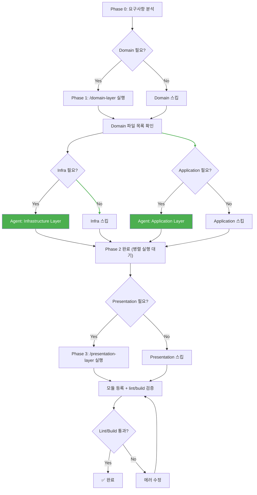

# 전체 DDD 레이어 병렬 오케스트레이터

## ⚠️ IMPORTANT: Claude 자동 실행 지시사항

**Claude는 사용자가 다음과 같은 요청을 하면 이 스킬 사용을 고려해야 합니다:**

### 실행 트리거 (Invoke Triggers)

- "기능 생성", "전체 기능 구현"
- "전체 레이어 생성", "모든 레이어 구현"
- "요구사항 문서로 자동 생성"
- "generate feature", "implement all layers"
- "create full feature"

**실행 방법:**

```typescript
// 요구사항 문서 경로와 함께 호출
Skill({ skill: 'generate-feature', args: 'docs/requirements/feature.md' });
```

**이 스킬의 역할:**

- ✅ Phase 1: domain-layer 스킬 호출 (단독 실행)
- ✅ Phase 2: infrastructure-layer + application-layer **병렬 실행** (Agent 도구)
- ✅ Phase 3: presentation-layer 스킬 호출 (단독 실행)
- ✅ 완료 후: NestJS 모듈 등록 + `npm run lint && npm run build` 검증

**권장 사항:**

- ✅ 완전히 새로운 기능을 처음부터 끝까지 구현할 때 사용
- ✅ 요구사항 문서가 있을 때 가장 효과적

---

요구사항 문서를 기반으로 DDD Clean Architecture의 전체 레이어를 **Phase 기반 병렬 실행**으로 자동 생성합니다.

## 🎯 목표

하나의 요구사항 문서(마크다운)를 입력받아 다음 Phase 순서로 레이어별 코드를 생성:

```
Phase 1: Domain Layer (단독)
    ↓
Phase 2: Infrastructure Layer + Application Layer (병렬!)
    ↓
Phase 3: Presentation Layer (단독)
    ↓
완료: NestJS 모듈 등록 + lint/build 검증
```

**병렬 실행의 이점**: Phase 2에서 Infra와 Application이 동시에 실행되어 전체 소요 시간이 단축됩니다.

각 레이어는 구현할 내용이 없으면 자동으로 스킵합니다.

## 📋 실행 프로세스

### 사전 준비

1. **요구사항 문서 작성**

요구사항 문서는 다음 형식으로 작성되어야 합니다:

```markdown
# 기능 요구사항: {기능명}

## 비즈니스 요구사항

- 목표 및 기능 설명
- 주요 유즈케이스

## 도메인 모델

### Entity: {EntityName}

- 필드명: 타입, 설명, 제약사항
- 관계: 다른 엔티티와의 관계

### Value Objects

- {VOName}: 설명, 유효성 규칙

## Repository 메서드

- save()
- findById()
- 기타 필요한 메서드

## API 엔드포인트

### POST /{entity}

- 설명: {Entity} 생성
- 권한: 관리자
- Request Body: ...
- Response: ...

### GET /{entity}/:id

- 설명: {Entity} 상세 조회
- 권한: ...
```

2. **요구사항 문서 위치 확인**

문서는 프로젝트 루트 기준으로 경로를 지정합니다:

- `docs/requirements/{feature-name}.md`
- `requirements/{feature-name}.md`
- 또는 사용자 지정 경로

### Phase 0: 요구사항 문서 읽기 및 분석

사용자가 제공한 요구사항 문서 경로를 읽고 다음을 분석합니다:

**분석 항목:**

- 모듈명 (module-name)
- 주요 Entity/Aggregate Root
- Value Objects
- Repository 메서드
- Domain Services 필요 여부
- Domain Events 필요 여부
- UseCase 목록
- API 엔드포인트 목록
- 권한 (Role) 정보

**출력 예시:**

```
📄 요구사항 분석 완료

모듈명: instructor
주요 Entity: Instructor
Value Objects: InstructorCode, InstructorName
Repository: InstructorRepository
Domain Service: InstructorCreationService
UseCase: CreateInstructor, FindInstructorDetail, FindInstructorList
API: POST /admin/instructors (관리자), GET /admin/instructors/:id (관리자)
```

**⚠️ CRITICAL: 분석 결과를 반드시 메모해두세요. Phase 2에서 Agent에게 전달할 컨텍스트로 사용됩니다.**

### Phase 1: Domain Layer 구현 (단독 실행)

**실행 방법:** `/domain-layer` 스킬 호출

**구현 내용:**

- Aggregate Root 생성
- Value Objects 생성
- Repository 인터페이스 정의
- Domain Services 작성
- Domain Events 정의
- Query Model 정의
- Query Repository 인터페이스 정의

**스킵 조건:**

- 새로운 Entity나 Value Object가 필요 없는 경우
- 기존 도메인 모델만 사용하는 경우

**⚠️ CRITICAL: Phase 1 완료 후 반드시 생성된 Domain 파일 목록을 확인하세요.**
다음 명령어로 확인:

```bash
find src/module/{module-name}/domain -type f -name "*.ts" 2>/dev/null
```

이 파일 목록이 Phase 2 Agent들의 컨텍스트로 필요합니다.

### Phase 2: Infrastructure + Application 병렬 실행 ⚡

**⚠️ CRITICAL: 이 Phase가 병렬 오케스트레이터의 핵심입니다.**

Phase 1에서 생성된 Domain Layer 결과물을 기반으로, Infrastructure Layer와 Application Layer를 **Agent 도구를 사용하여 동시에 병렬 실행**합니다.

**실행 방법: 반드시 하나의 메시지에서 Agent 도구 2개를 동시 호출합니다.**

```
Agent 호출 1 (Infrastructure Layer):
  - description: "Infrastructure Layer 구현"
  - prompt: 아래 [Infrastructure Agent 프롬프트 템플릿] 사용
  - subagent_type: "general-purpose"

Agent 호출 2 (Application Layer):
  - description: "Application Layer 구현"
  - prompt: 아래 [Application Agent 프롬프트 템플릿] 사용
  - subagent_type: "general-purpose"
```

**⚠️ 반드시 두 Agent를 하나의 응답에서 동시에 호출해야 병렬 실행됩니다!**

---

#### [Infrastructure Agent 프롬프트 템플릿]

Agent에게 전달할 프롬프트를 아래 템플릿을 기반으로 구성하세요.
`{...}` 부분을 실제 값으로 치환합니다:

```
너는 DDD Infrastructure Layer 구현 전문가다.
모든 주석과 JSDoc은 한국어로 작성한다.

## 대상 모듈
- 모듈명: {module-name}
- Aggregate Root: {AggregateRootName}
- Value Objects: {VO 목록}
- Repository 인터페이스: {Repository 이름과 메서드 목록}

## Domain Layer 파일 (Phase 1에서 생성됨)
{생성된 Domain 파일 경로 목록}

## 작업 지시
1. 먼저 `.claude/skills/infrastructure-layer/SKILL.md` 파일을 읽고 전체 프로세스를 파악하라.
2. SKILL.md의 "패턴 문서 참조" 단계에 명시된 patterns/*.md 파일들을 읽어라.
3. 위에 나열된 Domain Layer 파일들을 읽어서 Entity 구조, Value Objects, Repository 인터페이스를 파악하라.
4. SKILL.md와 patterns/*.md의 패턴을 참조하여 Infrastructure Layer를 구현하라:
   - Mapper 생성
   - Repository 구현체 생성
   - Query Service 생성 (필요시)
   - Domain Service 구현체 생성 (필요시)
5. Domain 파일을 참조하여 실제 비즈니스 로직을 구현하라.
6. 완료 후 생성된 파일 목록을 보고하라.

## 주의사항
- 반드시 SKILL.md와 patterns/*.md의 패턴을 따를 것
- Domain Layer 파일의 실제 필드명/메서드명을 정확히 사용할 것
- FK 관계는 UncheckedCreateInput + FK ID 직접 설정 (connect 사용 금지)
- Value Objects는 toDomain()에서 unsafeCreate() 사용
```

---

#### [Application Agent 프롬프트 템플릿]

Agent에게 전달할 프롬프트를 아래 템플릿을 기반으로 구성하세요.
`{...}` 부분을 실제 값으로 치환합니다:

```
너는 DDD Application Layer 구현 전문가다.
모든 주석과 JSDoc은 한국어로 작성한다.

## 대상 모듈
- 모듈명: {module-name}
- Aggregate Root: {AggregateRootName}
- Value Objects: {VO 목록}
- Repository 인터페이스: {Repository 이름과 메서드 목록}
- UseCase 목록: {UseCase 이름 목록}

## Domain Layer 파일 (Phase 1에서 생성됨)
{생성된 Domain 파일 경로 목록}

## 작업 지시
1. 먼저 `.claude/skills/application-layer/SKILL.md` 파일을 읽고 전체 프로세스를 파악하라.
2. SKILL.md의 "패턴 문서 참조" 단계에 명시된 patterns/*.md 파일들을 읽어라.
3. 위에 나열된 Domain Layer 파일들을 읽어서 Entity 구조, Value Objects, Repository 인터페이스를 파악하라.
4. SKILL.md와 patterns/*.md의 패턴을 참조하여 Application Layer를 구현하라:
   - Application DTOs 생성
   - UseCase 생성
   - Event Handler 생성 (필요시)
5. Domain 파일을 참조하여 실제 비즈니스 로직을 구현하라.
6. 완료 후 생성된 파일 목록을 보고하라.

## 주의사항
- 반드시 SKILL.md와 patterns/*.md의 패턴을 따를 것
- Entity.create() 정적 팩토리 메서드 사용 (new Entity() 금지)
- Value Objects는 UseCase에서 create() 메서드로 생성
- 조회는 Query Service + ReadModel 반환
- 수정 시 도메인 메서드 호출 (직접 props 수정 금지)
- Application DTO에 Value Objects 사용 금지 (primitive types만)
```

---

**Phase 2 스킵 처리:**

- Infra만 필요하면 → Infra Agent만 호출, Application은 스킵
- Application만 필요하면 → Application Agent만 호출, Infra는 스킵
- 둘 다 불필요하면 → Phase 2 전체 스킵

**Phase 2 완료 확인:**
두 Agent의 결과가 모두 반환되면 Phase 3로 진행합니다.

### Phase 3: Presentation Layer 구현 (단독 실행)

**실행 방법:** `/presentation-layer` 스킬 호출

**사전 조건:** Phase 2의 Application Layer가 완료되어야 합니다 (UseCase, Application DTO가 필요).

**구현 내용:**

- Controller 생성 (역할별)
- Request DTOs 정의
- Response DTOs 정의
- Transformer 작성

**스킵 조건:**

- 새로운 API 엔드포인트가 필요 없는 경우

### 완료: NestJS 모듈 등록 + lint/build 검증

Phase 3까지 완료되면 다음을 수행합니다:

1. **NestJS 모듈 파일 생성/업데이트**
   - Core 모듈: Repository provide/useClass 등록, Domain/Infra Service 등록
   - 역할별 모듈: UseCase providers, Controller 등록
   - App 모듈: 역할별 모듈 import 추가

2. **lint/build 검증**

   ```bash
   npm run lint && npm run build
   ```

3. **병렬 실행 결과 일관성 확인**
   - Phase 2에서 두 Agent가 독립 작업했으므로 import 경로, 타입 일관성 확인
   - Repository 인터페이스와 구현체의 메서드 시그니처 일치 확인

**완료 조건:**

- `npm run lint` 통과
- `npm run build` 통과

## 🔄 실행 플로우



## 📝 사용 예시

### 예시 1: 전체 레이어 생성 (병렬)

```
사용자: 기능 생성 시작해줘. 요구사항 문서는 docs/requirements/instructor.md야.
```

**실행 순서:**

1. `docs/requirements/instructor.md` 읽기 및 분석
2. **Phase 1**: `/domain-layer` 실행 → Instructor 엔티티 생성
3. **Phase 2**: Agent 2개 병렬 실행 ⚡
   - Agent A: Infrastructure Layer → Repository 구현체, Mapper 생성
   - Agent B: Application Layer → CreateInstructor UseCase 생성
4. **Phase 3**: `/presentation-layer` 실행 → AdminInstructorController 생성
5. **완료**: NestJS 모듈 등록 + lint/build 검증

### 예시 2: 일부 레이어만 생성

```
사용자: 기능 생성 시작해줘. 요구사항 문서는 requirements/notification.md야.
```

**분석 결과:**

- Domain: 기존 User 엔티티 사용 → 스킵
- Infrastructure: 기존 UserRepository 사용 → 스킵
- Application: SendNotificationUseCase 생성 필요 → 실행
- Presentation: 엔드포인트 없음 (백그라운드 작업) → 스킵

**실행 순서:**

1. `requirements/notification.md` 읽기 및 분석
2. **Phase 1**: Domain Layer 스킵
3. **Phase 2**: Application Agent만 실행 (Infra 스킵)
4. **Phase 3**: Presentation Layer 스킵
5. **완료**: NestJS 모듈 등록 + lint/build 검증

## ✅ 최종 체크리스트

각 Phase 완료 후 다음을 확인합니다:

### Phase 1: Domain Layer

- [ ] Aggregate Root 생성됨
- [ ] Value Objects 생성됨
- [ ] Repository 인터페이스 정의됨
- [ ] Domain Services 작성됨 (필요 시)
- [ ] Domain Events 정의됨 (필요 시)
- [ ] **생성된 파일 목록 확인됨 (Phase 2 컨텍스트용)**

### Phase 2: Infrastructure + Application (병렬)

- [ ] **두 Agent가 하나의 메시지에서 동시 호출됨**
- [ ] Repository 구현체 생성됨
- [ ] Mapper 작성됨
- [ ] Query Repository 구현체 생성됨 (필요 시)
- [ ] UseCase 생성됨
- [ ] Application DTOs 정의됨
- [ ] Event Handler 작성됨 (필요 시)
- [ ] **두 Agent 모두 완료됨**

### Phase 3: Presentation Layer

- [ ] Controller 생성됨 (역할별)
- [ ] Request DTOs 정의됨
- [ ] Response DTOs 정의됨
- [ ] Transformer 작성됨

### 완료: 모듈 등록 + 검증

- [ ] Core 모듈 등록 완료
- [ ] 역할별 모듈 등록 완료
- [ ] App 모듈에 역할별 모듈 import 추가
- [ ] **병렬 실행된 코드 간 일관성 확인됨**
- [ ] `npm run lint` 통과
- [ ] `npm run build` 통과

## 🚨 에러 처리

### 에러 1: 요구사항 문서를 찾을 수 없음

```
❌ 요구사항 문서를 찾을 수 없습니다: docs/requirements/instructor.md

해결:
1. 파일 경로가 정확한지 확인하세요
2. 파일이 존재하는지 확인하세요
3. 프로젝트 루트 기준 상대 경로를 사용하세요
```

### 에러 2: Phase 1 (Domain Layer) 실행 실패

```
❌ Domain Layer 구현 중 에러가 발생했습니다.

해결:
1. 요구사항 문서에 도메인 모델 정보가 충분한지 확인
2. 기존 도메인 모델과 충돌이 없는지 확인
3. /domain-layer 스킬을 직접 실행하여 상세 에러 확인
```

### 에러 3: Phase 2 Agent 실행 실패

```
❌ Infrastructure/Application Agent 실행 중 에러가 발생했습니다.

해결:
1. Domain Layer 파일이 정상적으로 생성되었는지 확인
2. Agent에게 전달한 컨텍스트(모듈명, Entity명, 파일 경로)가 정확한지 확인
3. 실패한 레이어의 스킬을 직접 호출하여 재시도:
   - /infrastructure-layer
   - /application-layer
```

### 에러 4: Lint 또는 Build 실패

```
❌ Lint/Build 검증에 실패했습니다.

해결:
1. 병렬 실행으로 인한 불일치가 없는지 확인:
   - Repository 인터페이스와 구현체의 메서드 시그니처 일치
   - UseCase에서 사용하는 Repository 메서드명 일치
   - import 경로 정확성
2. npm run lint 출력을 확인하여 에러 위치 파악
3. 에러 수정 후 다시 npm run lint && npm run build 실행
```

## 🎨 진행 상황 추적

이 스킬은 진행 상황을 다음과 같이 표시합니다:

```
🚀 전체 DDD 레이어 병렬 생성 시작

📄 Phase 0: 요구사항 분석 완료
모듈명: instructor

1️⃣ Phase 1: Domain Layer 구현 중...
   ✅ Domain Layer 구현 완료
   📁 생성된 파일: domain/models/instructor/instructor.ts, ...

⚡ Phase 2: Infrastructure + Application 병렬 실행 중...
   🔄 Agent A: Infrastructure Layer 실행 중...
   🔄 Agent B: Application Layer 실행 중...
   ✅ Infrastructure Layer 구현 완료
   ✅ Application Layer 구현 완료

3️⃣ Phase 3: Presentation Layer 구현 중...
   ✅ Presentation Layer 구현 완료

4️⃣ NestJS 모듈 등록 + 검증 중...
   ✅ Core 모듈 등록 완료
   ✅ 역할별 모듈 등록 완료
   ✅ Lint 통과
   ✅ Build 통과

🎉 전체 레이어 구현 완료! (Phase 2 병렬 실행으로 시간 단축)
```

## 💡 팁

### 1. 요구사항 문서 품질이 중요합니다

명확하고 상세한 요구사항 문서를 작성할수록 더 정확한 코드가 생성됩니다:

✅ **좋은 예:**

```markdown
### Entity: Instructor

- id: ULID, 강사 고유 식별자
- code: InstructorCode (Value Object), 강사 코드 (3-20자, 영문+숫자)
- name: InstructorName (Value Object), 강사 이름 (1-100자)
- email: Email, 이메일 주소
- status: InstructorStatus (Enum), 상태 (ACTIVE, INACTIVE)
```

❌ **나쁜 예:**

```markdown
### Entity: Instructor

- 강사 정보를 저장함
```

### 2. Phase 2 병렬 실행의 원리

Infra와 Application은 **둘 다 Domain Layer에만 의존**합니다:

- Infra: Domain Entity/VO → Mapper, Repository 인터페이스 → 구현체
- Application: Domain Entity/VO → UseCase, Repository 인터페이스 → 주입

서로 의존하지 않기 때문에 **안전하게 병렬 실행** 가능합니다.

### 3. 병렬 실행 후 검증이 중요한 이유

병렬 실행 후에는 두 Agent가 독립적으로 작업했기 때문에:

- Repository 구현체의 메서드 시그니처와 UseCase의 호출이 일치하는지
- import 경로가 정확한지
- 타입이 일관성 있는지

반드시 `npm run lint && npm run build`로 확인해야 합니다.

## 🔗 관련 스킬

이 오케스트레이터는 다음 스킬들을 호출합니다:

1. **domain-layer**: 도메인 레이어 구현 (Phase 1, 단독)
2. **infrastructure-layer**: 인프라 레이어 구현 (Phase 2, 병렬)
3. **application-layer**: 애플리케이션 레이어 구현 (Phase 2, 병렬)
4. **presentation-layer**: 프레젠테이션 레이어 구현 (Phase 3, 단독)

각 스킬은 독립적으로도 실행 가능하므로, 특정 레이어만 다시 생성하고 싶다면 해당 스킬을 직접 호출할 수 있습니다.

## 📚 참고 자료

### 프로젝트 구조 (DDD)

```
src/module/{module-name}/
├── domain/              # 비즈니스 로직
│   ├── models/          # Entity, Value Objects
│   ├── repositories/    # Repository 인터페이스
│   ├── services/        # Domain Services
│   └── events/          # Domain Events
├── application/         # 유즈케이스
│   ├── usecases/
│   └── dtos/
├── infra/              # 인프라 구현
│   ├── repositories/    # Repository 구현
│   └── mappers/         # Mapper
├── presentation/        # API 레이어
│   ├── controllers/
│   ├── dtos/
│   └── transformers/
└── *.module.ts         # NestJS 모듈
```

### 기술 스택

- **Framework**: NestJS
- **ORM**: Prisma + MySQL
- **Architecture**: DDD + Clean Architecture
- **Language**: TypeScript

### Path Aliases

```typescript
"@lib/*": ["src/lib/*"]                           # Domain foundation
"@shared/*": ["src/shared/*"]                     # Shared utilities
"@prisma/generated/*": ["../prisma/generated/prisma/*"]
```

---

**작성일**: 2026-03-18
**버전**: 2.1.0 (스크립트 제거, 패턴 문서 기반)
