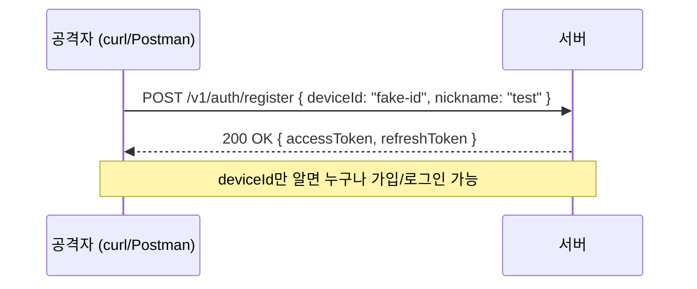
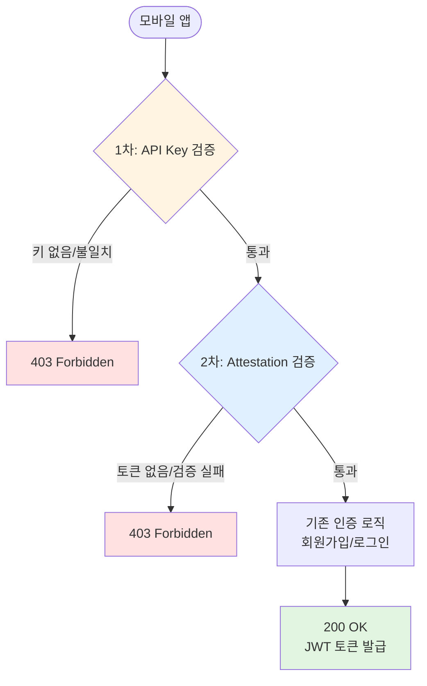
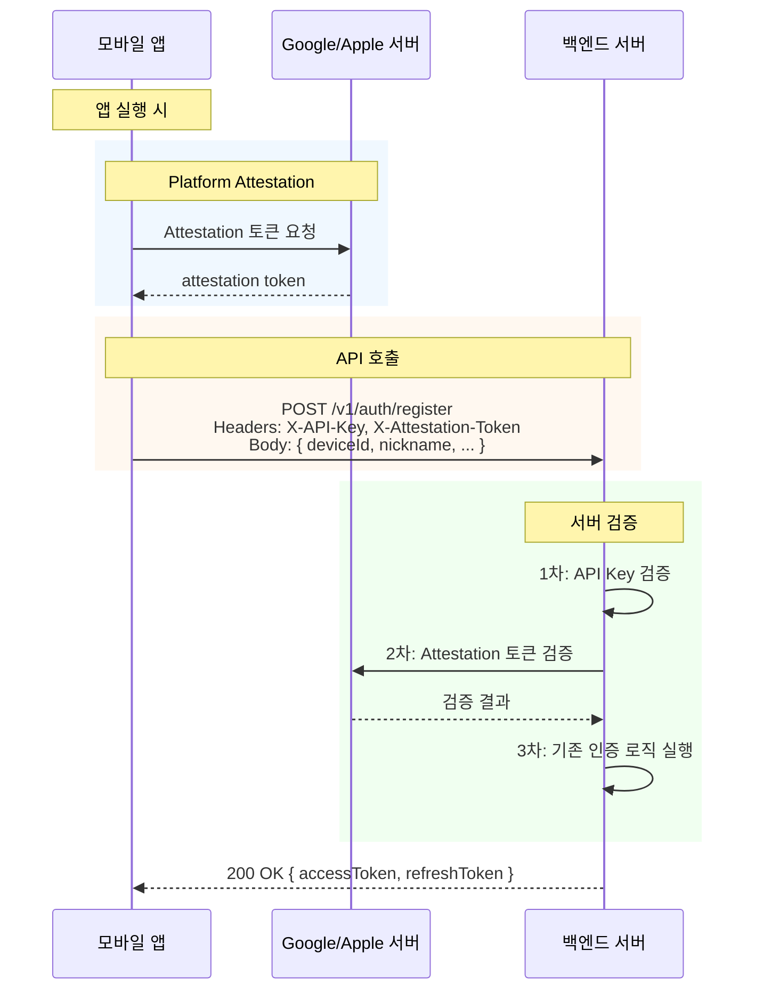
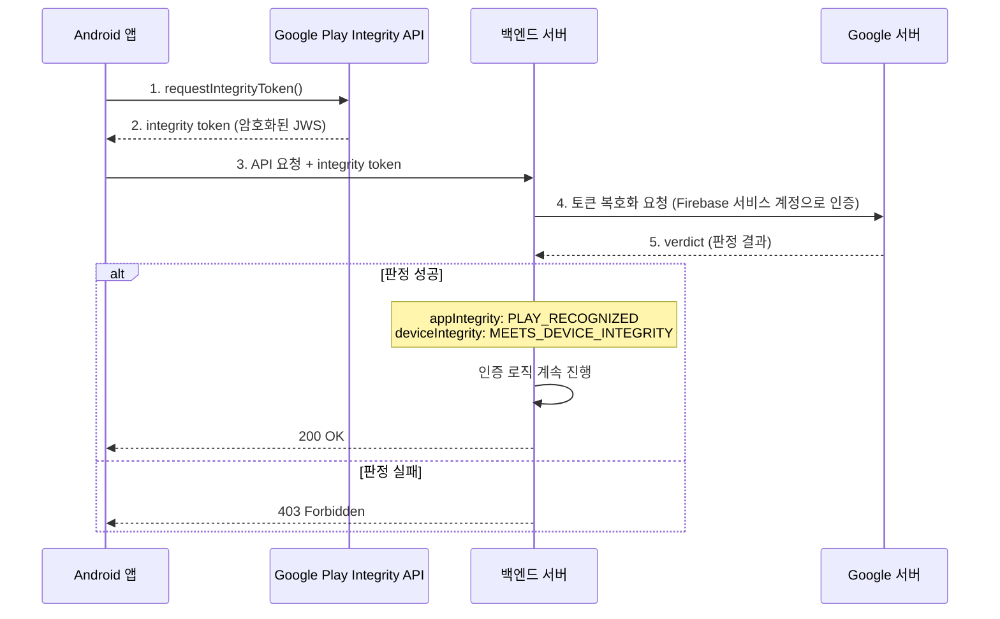
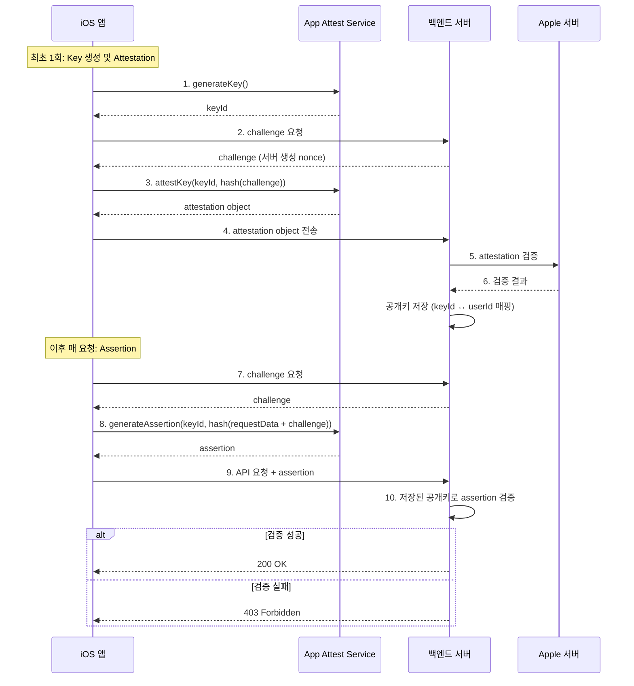
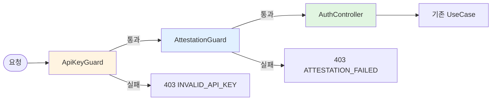

# 인증 보안 강화 설계: API Key + Platform Attestation

## 개요

현재 시스템은 `deviceId`만으로 회원가입/로그인이 가능하여, 외부에서 API를 직접 호출하면 누구나 계정을 생성하거나 탈취할 수 있는 보안 결함이 존재합니다.

**개인정보 최소화 원칙을 유지하면서** 이 문제를 해결하기 위해 다음 두 가지 방어 계층을 도입합니다.

| 계층         | 방안                    | 역할                                         |
| ------------ | ----------------------- | -------------------------------------------- |
| **1차 방어** | API Key (Client Secret) | 가벼운 필터. 키 없는 요청 즉시 거부          |
| **2차 방어** | Platform Attestation    | 핵심 방어. 요청이 정품 앱에서 온 것인지 검증 |

---

## 현재 문제점

### 취약한 인증 플로우



### 구체적 위협

| 위협               | 설명                                                  | 위험도 |
| ------------------ | ----------------------------------------------------- | ------ |
| 무차별 계정 생성   | 스크립트로 대량 가짜 계정 생성                        | 높음   |
| 계정 탈취          | 타인의 deviceId를 알면 해당 계정으로 로그인           | 높음   |
| deviceId 추측 공격 | iOS IDFV, Android SSAID는 패턴이 있어 브루트포스 가능 | 중간   |
| API 남용           | 인증 없이 서버 리소스 소모                            | 중간   |

---

## 개선 설계

### 전체 아키텍처



### 개선된 인증 플로우



---

## 1차 방어: API Key

### 개념

앱에 내장된 고정 시크릿 키를 모든 API 요청의 헤더에 포함시킵니다. 서버는 이 키가 없거나 일치하지 않으면 요청을 즉시 거부합니다.

### 요청 형식

```
Headers:
  X-API-Key: {앱에 내장된 시크릿 키}
```

### 적용 범위

| 대상                    | 적용 여부 | 이유                              |
| ----------------------- | --------- | --------------------------------- |
| 인증 API (`/v1/auth/*`) | 적용      | 비인증 상태에서 호출되는 공개 API |
| 인증 필요 API           | 미적용    | JWT 토큰 자체가 인증 역할 수행    |

> 인증 API는 JWT 없이 호출되므로 API Key가 최소한의 진입장벽 역할을 합니다.
> 인증 후 API는 이미 JWT 검증이 있으므로 API Key를 중복 적용할 필요가 없습니다.

### 서버 구현 방향

```
Guard 체인: ApiKeyGuard → (기존 인증 로직)
```

- NestJS Guard로 구현
- 환경변수에서 API Key 로드
- `@Public()` 등 데코레이터로 적용 대상 API에 선택적으로 부착
- 불일치 시 `403 Forbidden` 즉시 반환

### 한계

- 앱 디컴파일 시 키 노출 가능
- **단독으로는 보안 수단이 될 수 없음** → 반드시 Attestation과 함께 사용
- 역할: Attestation 검증 전에 불필요한 요청을 걸러내는 **비용/성능 최적화 필터**

---

## 2차 방어: Platform Attestation

### 개념

Google/Apple의 플랫폼 API를 사용하여 **"이 요청이 정품 앱, 정품 기기에서 왔는가"**를 검증합니다.

### 플랫폼별 API

| 플랫폼      | API                                                                                                                 | 검증 대상                               |
| ----------- | ------------------------------------------------------------------------------------------------------------------- | --------------------------------------- |
| **Android** | [Play Integrity API](https://developer.android.com/google/play/integrity)                                           | 앱 무결성 + 기기 무결성 + 라이선스 상태 |
| **iOS**     | [App Attest (DeviceCheck)](https://developer.apple.com/documentation/devicecheck/establishing-your-app-s-integrity) | 앱이 변조되지 않았음을 Apple이 증명     |

> SafetyNet은 Deprecated 되었으므로 Play Integrity API를 사용합니다.

### Android - Play Integrity API 플로우



**Play Integrity 판정 항목:**

| 항목              | 값                       | 의미                           |
| ----------------- | ------------------------ | ------------------------------ |
| `appIntegrity`    | `PLAY_RECOGNIZED`        | Google Play에서 설치된 정품 앱 |
| `deviceIntegrity` | `MEETS_DEVICE_INTEGRITY` | 루팅되지 않은 정품 기기        |
| `accountDetails`  | `LICENSED`               | Google Play 라이선스 있음      |

### iOS - App Attest 플로우



**App Attest 특징:**

- 최초 1회 키 등록(attestation) 후, 이후 요청은 assertion으로 검증
- 기기의 Secure Enclave에서 키 생성 → 추출 불가능
- Assertion에 요청 데이터 해시가 포함되어 중간자 변조 방지

---

## API 변경사항

### 요청 헤더 추가

기존 인증 API에 다음 헤더가 추가됩니다:

```
Headers:
  X-API-Key: {고정 시크릿 키}
  X-Platform: "android" | "ios"
  X-Attestation-Token: {플랫폼별 attestation/integrity 토큰}
```

### 영향받는 API 목록

| API                          | 변경 사항                       |
| ---------------------------- | ------------------------------- |
| `GET /v1/auth/check-account` | API Key + Attestation 헤더 필수 |
| `POST /v1/auth/register`     | API Key + Attestation 헤더 필수 |
| `POST /v1/auth/login`        | API Key + Attestation 헤더 필수 |
| `POST /v1/auth/transfer`     | API Key + Attestation 헤더 필수 |
| 기타 인증 필요 API           | 변경 없음 (JWT로 충분)          |

### 에러 응답

| HTTP Status | 에러 코드              | 상황                                   |
| ----------- | ---------------------- | -------------------------------------- |
| 403         | `INVALID_API_KEY`      | API Key 누락 또는 불일치               |
| 403         | `ATTESTATION_REQUIRED` | Attestation 토큰 누락                  |
| 403         | `ATTESTATION_FAILED`   | Attestation 검증 실패 (위변조 앱/기기) |
| 403         | `UNSUPPORTED_PLATFORM` | 지원하지 않는 플랫폼                   |

---

## 서버 아키텍처 (DDD 관점)

### Guard 체인 설계



### 모듈 구조

```
src/module/auth/
├── guards/
│   ├── api-key.guard.ts              # [신규] API Key 검증 Guard
│   ├── attestation.guard.ts          # [신규] Attestation 검증 Guard
│   ├── user-jwt-auth.guard.ts        # [기존] JWT 검증 Guard
│   ├── jwt-blacklist-check.guard.ts  # [기존] 블랙리스트 Guard
│   └── user-refresh-token.guard.ts   # [기존] 리프레시 토큰 Guard
├── decorators/
│   ├── public-auth.decorator.ts      # [신규] @PublicAuth() - API Key + Attestation 적용
│   ├── user-auth.decorator.ts        # [기존] @UserAuth() - JWT 인증 적용
│   └── ...
├── services/
│   ├── attestation.service.ts        # [신규] Attestation 검증 서비스 (인터페이스)
│   └── ...
└── infra/
    ├── services/
    │   ├── play-integrity.service.ts  # [신규] Google Play Integrity 검증 구현
    │   └── app-attest.service.ts      # [신규] Apple App Attest 검증 구현
    └── ...
```

### 데코레이터 사용 예시

```typescript
// 기존: 인증 없이 호출 가능 (취약)
@Post('register')
async register(@Body() dto: RegisterRequestDto) { ... }

// 개선: API Key + Attestation 검증 후 호출 가능
@PublicAuth()  // = @UseGuards(ApiKeyGuard, AttestationGuard)
@Post('register')
async register(@Body() dto: RegisterRequestDto) { ... }
```

---

## 개발 환경 대응

### 문제

개발/테스트 환경에서는 실제 모바일 기기가 없으므로 Attestation 검증이 불가능합니다.

### 해결 방안

| 환경            | API Key       | Attestation                         |
| --------------- | ------------- | ----------------------------------- |
| **Production**  | 검증 활성화   | 검증 활성화                         |
| **Development** | 검증 활성화   | **검증 비활성화** (환경변수로 제어) |
| **Test**        | 검증 비활성화 | 검증 비활성화                       |

```
# .env.development
ATTESTATION_ENABLED=false

# .env.production
ATTESTATION_ENABLED=true
```

> 주의: Production에서는 반드시 `ATTESTATION_ENABLED=true`여야 합니다.

---

## 구현 순서

### Phase 1: API Key Guard

1. `ApiKeyGuard` 구현
2. `@PublicAuth()` 데코레이터 생성
3. 인증 API에 적용 (`/v1/auth/*`)
4. 환경변수에 API Key 등록

### Phase 2: Attestation 인프라

1. `AttestationService` 인터페이스 정의
2. `PlayIntegrityService` 구현 (Android)
3. `AppAttestService` 구현 (iOS)
4. `AttestationGuard` 구현
5. 환경별 활성화/비활성화 설정

### Phase 3: 통합 및 테스트

1. `@PublicAuth()` 데코레이터에 `AttestationGuard` 추가
2. 단위 테스트 작성
3. 프론트엔드(앱)와 통합 테스트

---

## 보안 고려사항

### API Key 보안

- 앱 바이너리에 하드코딩하되, **난독화(obfuscation)** 적용
- 주기적 키 로테이션을 위해 **앱 버전별 API Key** 관리 고려
- 노출 감지 시 즉시 키 변경 가능한 구조

### Attestation 보안

- **토큰 만료 시간 검증**: 오래된 attestation 토큰 거부 (verdict의 timestampMillis 활용)
- **Play Integrity 한계 인지**: Magisk 등 우회 도구 존재 → 100% 방어는 아님
- **App Attest 키 관리**: 서버에 등록된 공개키와 assertion의 일관성 검증

### 전반적 보안 원칙

- **심층 방어 (Defense in Depth)**: API Key + Attestation 이중 방어
- **서버 사이드 검증**: 모든 검증은 서버에서 수행. 클라이언트를 절대 신뢰하지 않음
- **Fail Closed**: 검증 실패 시 기본적으로 거부 (허용이 아닌 차단이 기본값)
- **로깅 및 모니터링**: Attestation 실패 건 로깅으로 공격 시도 탐지

---

## 외부 서비스 설정 가이드

### Google 생태계 구조

Play Integrity API를 사용하기 위해서는 Google의 세 가지 콘솔이 연결되어야 합니다.

```
Google Play Console  ←──── 연결 ────→  Google Cloud Console
(앱 배포/관리)                         (API/서비스 관리)
                                            │
                                            │ Firebase 프로젝트 =
                                            │ Google Cloud 프로젝트
                                            │
                                      Firebase Console
                                      (푸시 알림 등)
```

> Firebase 프로젝트 = Google Cloud 프로젝트입니다. Firebase Console에서 프로젝트를 만들면 Google Cloud Console에도 동일한 프로젝트가 자동 생성됩니다.

**각 콘솔의 역할:**

| 콘솔                     | Play Integrity에서의 역할                                         |
| ------------------------ | ----------------------------------------------------------------- |
| **Google Play Console**  | 앱 서명 키를 보유 → "이 앱이 진짜인지" 판단의 기준                |
| **Google Cloud Console** | Play Integrity API를 활성화하는 곳 (스위치)                       |
| **Firebase Console**     | 서비스 계정 자격증명 제공 → 서버에서 Google API 호출 시 인증 수단 |

### 1단계: Google Cloud Console - Play Integrity API 활성화

1. [Google Cloud Console](https://console.cloud.google.com) 접속
2. **Firebase 프로젝트와 동일한 Cloud 프로젝트** 선택
3. 좌측 메뉴 → **API 및 서비스** → **라이브러리**
4. `Play Integrity API` 검색
5. **사용** 버튼 클릭

### 2단계: Google Play Console - Cloud 프로젝트 연결

1. [Google Play Console](https://play.google.com/console) 접속
2. 앱 선택 → 좌측 메뉴 → **앱 무결성** (App Integrity)
3. **Play Integrity API** 탭 선택
4. **Google Cloud 프로젝트 연결** 클릭
5. 1단계에서 API를 활성화한 프로젝트 (= Firebase 프로젝트) 선택
6. 응답 암호화: **Google에서 관리하는 키 (권장)** 선택

> Google 관리 키를 선택하면 서버에서 Google API를 호출하여 토큰을 복호화합니다.
> 이것이 서버의 `decodeIntegrityToken()` 메서드에 해당합니다.

### 3단계: 서버 환경변수 설정

```bash
# Play Integrity 관련
ATTESTATION_ENABLED=true                    # 프로덕션에서만 true
GOOGLE_PACKAGE_NAME=com.yourapp.package     # Play Console에서 확인 가능한 앱 패키지명

# API Key 관련
APP_API_KEY=your-secret-api-key             # 앱에 내장할 시크릿 키

# Firebase 자격증명 (기존 설정 재활용 - 추가 설정 불필요)
# FIREBASE_PROJECT_ID=...
# FIREBASE_CLIENT_EMAIL=...
# FIREBASE_PRIVATE_KEY=...
```

> Firebase 서비스 계정(`FIREBASE_CLIENT_EMAIL`, `FIREBASE_PRIVATE_KEY`)이 이미 설정되어 있다면 Play Integrity API 인증에 그대로 재활용됩니다. 별도의 인증 설정이 필요 없습니다.

### 4단계: 프론트엔드 (Android 앱) 통합

Play Console의 **앱 무결성 → Play Integrity API → 통합** 버튼은 [Android 개발자 문서](https://developer.android.com/google/play/integrity/setup)로 연결됩니다. 이 문서를 참고하여 앱에서 integrity token을 발급받는 코드를 구현합니다.

```kotlin
// Android 앱 코드 (Kotlin) 예시
val integrityManager = IntegrityManagerFactory.create(context)
val request = IntegrityTokenRequest.builder()
    .setCloudProjectNumber(CLOUD_PROJECT_NUMBER)  // Google Cloud 프로젝트 번호
    .build()
val response = integrityManager.requestIntegrityToken(request)
val token = response.token()

// API 호출 시 헤더에 포함
headers["X-API-Key"] = BuildConfig.API_KEY
headers["X-Platform"] = "android"
headers["X-Attestation-Token"] = token
```

### 비용

- Play Integrity API는 **무료**입니다.
- 일일 요청 제한: 기본 **10,000건/일**
- 초과 시 Play Console에서 할당량 증가 무료 요청 가능

### 설정 완료 체크리스트

- [ ] Google Cloud Console에서 Play Integrity API 활성화
- [ ] Google Play Console에서 Cloud 프로젝트 연결
- [ ] 응답 암호화: Google 관리 키 선택
- [ ] 서버 환경변수 설정 (`ATTESTATION_ENABLED`, `GOOGLE_PACKAGE_NAME`, `APP_API_KEY`)
- [ ] Android 앱에 Play Integrity 라이브러리 통합
- [ ] 앱에서 API 호출 시 `X-API-Key`, `X-Platform`, `X-Attestation-Token` 헤더 포함

---

## 참고 자료

- [Google Play Integrity API 공식 문서](https://developer.android.com/google/play/integrity)
- [Apple App Attest 공식 문서](https://developer.apple.com/documentation/devicecheck/establishing-your-app-s-integrity)
- [OWASP Mobile Application Security](https://mas.owasp.org/MASTG/0x04e-Testing-Authentication-and-Session-Management/)
- [Firebase Anonymous Auth Best Practices](https://firebase.blog/posts/2023/07/best-practices-for-anonymous-authentication/)
- [Mobile App Security Best Practices 2025](https://nextnative.dev/blog/mobile-authentication-best-practices)
