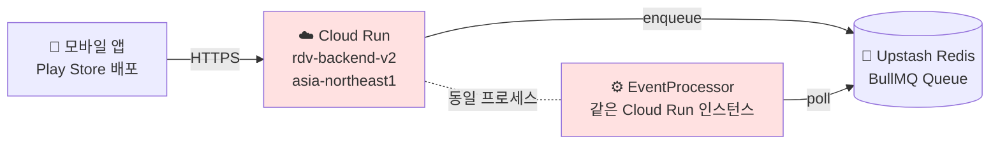
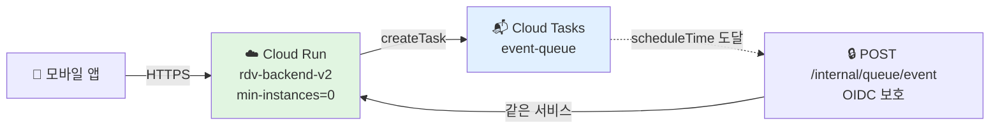

# BullMQ → Cloud Tasks 전환 계획

## 📋 목차

1. [개요 (TL;DR)](#개요-tldr)
2. [배경 및 문제 정의](#배경-및-문제-정의)
3. [의사결정 근거](#의사결정-근거)
4. [현재 BullMQ 사용 분석](#현재-bullmq-사용-분석)
5. [전환 후 아키텍처](#전환-후-아키텍처)
6. [구현 계획 (Phase별)](#구현-계획-phase별)
7. [상세 구현 방법](#상세-구현-방법)
8. [비용 시뮬레이션](#비용-시뮬레이션)
9. [리스크 및 완화 방안](#리스크-및-완화-방안)
10. [롤백 전략](#롤백-전략)
11. [체크리스트](#체크리스트)

---

## 개요 (TL;DR)

> **월 7만원 → ~0원**, API URL 유지, cold start 1~3초 감수

### 핵심 결정 사항

1. **BullMQ(Redis)** 기반 비동기 작업 처리 → **Google Cloud Tasks**로 전환
2. **Cloud Run `min-instances`: 1 → 0** (스케일 제로 허용)
3. **Cloud Run `cpu-throttling`: false → true** (요청 처리 중에만 CPU 할당)

### 영향 범위

- ✅ **API URL 변경 없음** (Play Store 배포된 앱 영향 없음)
- ✅ **도메인 이벤트 흐름 유지** (CQRS EventBus 기반 구조 그대로)
- ⚠️ Cold start 1~3초 발생 (토이 프로젝트 특성상 허용)
- ✅ Redis 의존성 제거 가능 (원할 경우)

---

## 배경 및 문제 정의

### 현재 아키텍처



### 현재 Cloud Run 설정 (2026-04-17 기준)

| 항목               | 값                            | 비용 영향              |
| ------------------ | ----------------------------- | ---------------------- |
| 서비스명           | `rdv-backend-v2`              | -                      |
| 리전               | `asia-northeast1` (도쿄)      | Tier 1                 |
| CPU                | 1000m (1 vCPU)                | 상시 과금 대상         |
| Memory             | 1 GiB                         | 상시 과금 대상         |
| **minScale**       | **1** 🔴                      | **상시 1대 과금**      |
| maxScale           | 10                            | -                      |
| Concurrency        | 80 req/instance               | -                      |
| **cpu-throttling** | **false** 🔴                  | **CPU 상시 할당 모드** |
| Startup CPU boost  | true                          | cold start 완화        |
| Timeout            | 300초                         | -                      |
| 실행 환경          | gen2                          | -                      |
| 배포 방식          | GitHub Actions (CI/CD 구성됨) | -                      |

### 월 7만원 발생 원인

```
minScale=1 + cpu-throttling=false 조합
  = CPU 1 vCPU + Memory 1 GiB 상시 할당 (항상 1대 살아있음)

계산 (asia-northeast1, Tier 1 CPU always-allocated 가격):
  - CPU:    $0.000018  × 2,592,000초 = $46.66/월
  - Memory: $0.000002  × 2,592,000초 = $5.18/월
  - 합계:   $51.84/월 ≈ 약 70,000원/월 (1,350원/달러 기준)
```

### 왜 min-instances=1을 뗄 수 없었는가?

**BullMQ 워커가 Redis를 폴링해야 하기 때문**.

- Cloud Run은 요청이 없으면 인스턴스를 종료시킴
- BullMQ `@Processor`는 **워커 프로세스가 살아있어야만** 큐에서 잡을 가져감
- 워커가 죽으면 → 예약된 참여자 체크, 일정 시작, 일정 종료 잡이 **모두 실행 안 됨**
- 따라서 `minScale=1`로 강제로 1대 유지 → 월 7만원 상시 과금

### 제약사항

1. **API URL 변경 불가**: 앱이 Play Store에 배포되어 있음 → 기존 URL `rdv-backend-v2-213001418399.asia-northeast1.run.app` 유지 필수
2. **GCP 크레딧 10일 잔여**: 이후 실제 과금 발생 → **즉시 최적화 필요**
3. **서비스 무중단**: 현재 사용자가 존재하는 상태에서 마이그레이션

---

## 의사결정 근거

### 대안 비교

| 방안                          | 월 비용          | URL 유지 | 운영 부담          | 코드 변경량 | 판정                            |
| ----------------------------- | ---------------- | -------- | ------------------ | ----------- | ------------------------------- |
| 현재 유지                     | **70,000원**     | ✅       | 낮음               | 없음        | ❌ 비용 문제                    |
| min-instances=0 + BullMQ 유지 | ~0원             | ✅       | 낮음               | 없음        | ❌ **잡 처리 불가** (워커 죽음) |
| GCE e2-micro 워커 분리        | ~0원 (무료 티어) | ✅       | **높음** (VM 관리) | 중간        | ⚠️ 관리 부담                    |
| **Cloud Tasks 전환**          | **~0원**         | ✅       | **낮음**           | 중간        | ✅ **채택**                     |
| 다른 클라우드 이전            | 변동             | ❌       | 높음               | 높음        | ❌ URL 변경 필요                |

### Cloud Tasks 선택 이유

1. **GCP 네이티브** → 현재 Cloud Run 배포 환경에 자연스럽게 통합
2. **Push 방식 HTTP 전달** → Cloud Run이 요청 받을 때만 깨어남 → **min-instances=0 가능**
3. **완전 서버리스** → VM/Redis 관리 부담 제로
4. **매우 관대한 무료 티어** → 월 100만 operations 무료 (실사용량 대비 50배 이상)
5. **기존 추상화 활용** → `QueueService` 인터페이스가 이미 존재 → 교체 용이
6. **재시도/딜레이 기능 네이티브 지원** → BullMQ의 주요 기능 1:1 대체 가능

### 트레이드오프

| 항목                      | 영향                  | 판단                    |
| ------------------------- | --------------------- | ----------------------- |
| Cold start 1~3초          | 첫 요청 지연          | ✅ 토이 프로젝트 → 허용 |
| Cloud Tasks API 호출 비용 | 월 수만 건 규모       | ✅ 무료 티어 내         |
| Cloud Tasks 학습 곡선     | 신규 기술             | ✅ 문서 잘 되어 있음    |
| HTTP 엔드포인트 보안      | 내부 잡 처리 URL 노출 | ✅ OIDC 토큰으로 방어   |

---

## 현재 BullMQ 사용 분석

### 큐/Processor 현황

| 항목      | 개수    | 상세                                                                      |
| --------- | ------- | ------------------------------------------------------------------------- |
| Queue     | **1개** | `EVENT_QUEUE` (`src/module/event/event.constants.ts`)                     |
| Processor | **1개** | `EventProcessor` (`src/module/event/infra/processors/event.processor.ts`) |
| Job 타입  | **3개** | `PARTICIPANT_CHECK`, `LOCATION_SHARING_START`, `END`                      |

### Job 특성

| Job                      | 트리거 시점     | 동작                                       |
| ------------------------ | --------------- | ------------------------------------------ |
| `PARTICIPANT_CHECK`      | 일정 시간 -20분 | 참여자 2명 미만이면 일정 취소              |
| `LOCATION_SHARING_START` | 일정 시간 -15분 | `RECRUITING → IN_PROGRESS` 전환            |
| `END`                    | 일정 endTime    | `IN_PROGRESS → ENDED` 전환, 출석 결과 생성 |

### 사용하지 않는 BullMQ 기능

- ❌ Repeatable / Cron 잡 → **Cloud Scheduler 불필요**
- ❌ Job Progress 추적
- ❌ Flow / Parent-Child 관계
- ❌ 우선순위 기반 처리 (`priority` 옵션 선언만 되어 있고 실사용 X)

### 추상화 현황 ✅

```typescript
// src/module/core/queue/queue.service.ts
export abstract class QueueService {
  abstract scheduleJobAt<T = any>(
    queueName: string,
    jobName: string,
    data: T,
    date: Date,
    options?: JobOptions,
  ): Promise<QueueJob<T>>;

  abstract removeJob(queueName: string, jobId: string): Promise<void>;
}
```

**이미 추상화되어 있음** → `CloudTasksQueueService` 구현체만 추가하면 교체 가능.

### 도메인 이벤트 흐름 (변경 없음)

```
Processor → Repository.save() → DomainEvents 발행
                                      ↓
                              @nestjs/cqrs EventBus
                                      ↓
                          EventHandler (푸시, 상태 전환 등)
```

BullMQ는 **작업 예약/트리거**만 담당. 실제 비즈니스 로직 분기는 **CQRS EventBus가 전담**하므로 큐 엔진 교체 영향 없음.

---

## 전환 후 아키텍처

### Target 다이어그램



**핵심**: 워커 HTTP 엔드포인트는 **같은 Cloud Run 서비스 내**에 있음.
→ 요청 있을 때만 깨어남 → `min-instances=0` 가능.

### BullMQ ↔ Cloud Tasks 기능 매핑

| 현재 (BullMQ)                              | 전환 후 (Cloud Tasks)                       |
| ------------------------------------------ | ------------------------------------------- |
| `scheduleJobAt(date)`                      | `createTask({ scheduleTime })`              |
| 커스텀 `jobId: event-{id}-{job}`           | Task `name` (중복 방지 + 취소 키)           |
| `removeJob(jobId)`                         | `deleteTask(taskName)`                      |
| `attempts: 3`                              | Queue의 `retryConfig.maxAttempts`           |
| `backoff: exponential 2000ms`              | Queue의 `retryConfig.minBackoff/maxBackoff` |
| `@Processor` 클래스                        | `@Controller('internal/queue/event')`       |
| `drainDelay`, `skipStalledCheck` 등 최적화 | ❌ 불필요 (Push 방식)                       |
| Redis 의존성                               | ❌ 제거 가능                                |

### 유지되는 구조

- ✅ DDD 레이어 (Domain / Application / Infra / Presentation)
- ✅ Domain Event + CQRS EventBus
- ✅ Event Handler들 (`ParticipantsCheckPassedEventHandler` 등)
- ✅ `QueueService` 추상 인터페이스
- ✅ `EventQueueService` (상위 서비스)

---

## 구현 계획 (Phase별)

### Phase 1: 코드 작업 (로컬 개발)

**목표**: BullMQ와 Cloud Tasks를 **환경변수로 스위치** 가능하게 구현 (롤백 안전성).

**작업 항목**:

1. `CloudTasksQueueService` 구현 (`QueueService` 인터페이스 준수)
2. `EventQueueController` 작성 (`POST /internal/queue/event` HTTP 엔드포인트)
3. OIDC 토큰 검증 Guard 추가 (`CloudTasksAuthGuard`)
4. `QueueModule` 수정: `QUEUE_DRIVER` 환경변수로 `BullQueueService` / `CloudTasksQueueService` 분기
5. 기존 `EventProcessor`는 유지 (BullMQ 모드용)

**완료 조건**:

- [ ] 로컬에서 `QUEUE_DRIVER=bullmq`로 동작 (기존과 동일)
- [ ] 로컬에서 `QUEUE_DRIVER=cloud-tasks`로 동작 (Cloud Tasks 에뮬레이터 또는 실제 Queue)
- [ ] 단위 테스트 통과

### Phase 2: GCP 인프라 설정

**목표**: Cloud Tasks 인프라 구성 + 권한 설정.

**작업 항목**:

1. Cloud Tasks API 활성화 (`cloudtasks.googleapis.com`)
2. Cloud Tasks Queue 생성: `event-queue` (asia-northeast1)
   - `maxAttempts: 3`
   - `minBackoff: 2s`, `maxBackoff: 60s`
3. OIDC 인증용 Service Account 생성: `cloud-tasks-invoker@...`
4. 권한 부여:
   - Cloud Run 서비스 계정에 `roles/cloudtasks.enqueuer`
   - `cloud-tasks-invoker` SA에 `roles/run.invoker` (Cloud Run 호출 권한)
5. Cloud Run 환경변수 추가 (GitHub Actions workflow 수정):
   - `QUEUE_DRIVER=cloud-tasks`
   - `GCP_PROJECT_ID=exalted-gamma-485513-e4`
   - `GCP_LOCATION=asia-northeast1`
   - `CLOUD_TASKS_QUEUE_NAME=event-queue`
   - `CLOUD_TASKS_INVOKER_SA=cloud-tasks-invoker@...`
   - `CLOUD_TASKS_TARGET_URL=https://rdv-backend-v2-.../internal/queue/event`

**완료 조건**:

- [ ] Cloud Tasks Queue에서 수동으로 Task 생성 → Cloud Run 엔드포인트 호출 성공
- [ ] OIDC 토큰 검증 동작 확인

### Phase 3: 스테이징 검증

**목표**: 프로덕션 전환 전 실서비스 시나리오 검증.

**작업 항목** (프로덕션에서 `QUEUE_DRIVER=cloud-tasks`로 배포하되 `min-instances=1` 유지):

1. 일정 생성 → 3개 Job이 Cloud Tasks에 등록되는지 확인
2. 예약된 시간에 정확히 트리거되는지 확인
3. 일정 취소 → Task 삭제 동작 확인
4. 재시도 동작 확인 (일부러 에러 발생시키기)
5. 실패 알림/모니터링 동작 확인

**완료 조건**:

- [ ] 실제 일정 5개 이상 end-to-end 동작 확인
- [ ] 48시간 모니터링 이상 없음

### Phase 4: 프로덕션 전환 (비용 절감 적용)

**목표**: min-instances=0 적용으로 월 7만원 과금 종료.

**작업 항목**:

1. Cloud Run 설정 변경:
   - `min-instances=0`
   - `cpu-throttling=true` (`--no-cpu-throttling` 제거)
2. 24~48시간 모니터링
3. 이상 없으면 BullMQ 제거 (Phase 5)

**완료 조건**:

- [ ] `gcloud run services describe`에서 `minScale: '0'` 확인
- [ ] 월 과금 추이 그래프에서 비용 감소 확인
- [ ] Play Store 앱 정상 동작 유지

### Phase 5: BullMQ 정리 (선택)

**목표**: 코드 단순화.

**작업 항목**:

1. `BullQueueService`, `EventProcessor` 삭제
2. `@nestjs/bullmq`, `bullmq` 패키지 제거
3. `QUEUE_DRIVER` 스위치 제거
4. Redis 연결 설정 제거 (Redis를 다른 용도로 쓰지 않는 경우)
5. Upstash Redis 구독 해지

**완료 조건**:

- [ ] `npm run lint`, `npm run build` 통과
- [ ] 배포 후 정상 동작 확인

---

## 상세 구현 방법

### 1. `CloudTasksQueueService` 구현 (스케치)

```typescript
// src/module/core/queue/cloud-tasks-queue.service.ts
import { CloudTasksClient } from '@google-cloud/tasks';
import { Injectable, Logger } from '@nestjs/common';
import { ConfigService } from '@nestjs/config';
import { QueueService } from './queue.service';
import { JobOptions, QueueJob } from './type';

@Injectable()
export class CloudTasksQueueService implements QueueService {
  private readonly logger = new Logger(CloudTasksQueueService.name);
  private readonly client = new CloudTasksClient();
  private readonly projectId: string;
  private readonly location: string;
  private readonly targetUrl: string;
  private readonly invokerSaEmail: string;

  constructor(private readonly config: ConfigService) {
    this.projectId = config.getOrThrow('GCP_PROJECT_ID');
    this.location = config.getOrThrow('GCP_LOCATION');
    this.targetUrl = config.getOrThrow('CLOUD_TASKS_TARGET_URL');
    this.invokerSaEmail = config.getOrThrow('CLOUD_TASKS_INVOKER_SA');
  }

  async scheduleJobAt<T>(
    queueName: string,
    jobName: string,
    data: T,
    date: Date,
    options?: JobOptions,
  ): Promise<QueueJob<T>> {
    const parent = this.client.queuePath(
      this.projectId,
      this.location,
      queueName,
    );
    const taskName = options?.jobId
      ? `${parent}/tasks/${options.jobId}`
      : undefined;

    const [response] = await this.client.createTask({
      parent,
      task: {
        name: taskName,
        scheduleTime: { seconds: Math.floor(date.getTime() / 1000) },
        httpRequest: {
          httpMethod: 'POST',
          url: this.targetUrl,
          headers: { 'Content-Type': 'application/json' },
          body: Buffer.from(JSON.stringify({ jobName, data })).toString(
            'base64',
          ),
          oidcToken: {
            serviceAccountEmail: this.invokerSaEmail,
            audience: this.targetUrl,
          },
        },
      },
    });

    return {
      id: response.name ?? '',
      data,
    };
  }

  async removeJob(queueName: string, jobId: string): Promise<void> {
    const taskName = this.client.taskPath(
      this.projectId,
      this.location,
      queueName,
      jobId,
    );
    try {
      await this.client.deleteTask({ name: taskName });
    } catch (error: any) {
      if (error.code === 5) return; // NOT_FOUND → 이미 실행됨/삭제됨 → 무시
      throw error;
    }
  }
}
```

### 2. `EventQueueController` 구현 (스케치)

```typescript
// src/module/event/presentation/controllers/event-queue.controller.ts
import { Body, Controller, Post, UseGuards, Logger } from '@nestjs/common';
import { CloudTasksAuthGuard } from '@core/auth/guards/cloud-tasks-auth.guard';
import { EVENT_QUEUE, EventJobName } from '../../event.constants';
import { EventJobData } from '../../infra/services/event-queue.service';

interface EventJobPayload {
  jobName: EventJobName;
  data: EventJobData;
}

@Controller('internal/queue/event')
@UseGuards(CloudTasksAuthGuard)
export class EventQueueController {
  private readonly logger = new Logger(EventQueueController.name);

  constructor() {
    // EventProcessor와 동일한 의존성 주입
    // (Repository들, 또는 Processor를 직접 주입해서 메서드 위임)
  }

  @Post()
  async handle(@Body() payload: EventJobPayload): Promise<void> {
    this.logger.log(
      `Cloud Task 수신: ${payload.jobName}, eventId=${payload.data.eventId}`,
    );

    switch (payload.jobName) {
      case EVENT_QUEUE.JOBS.PARTICIPANT_CHECK:
        await this.handleParticipantCheck(payload.data.eventId);
        break;
      case EVENT_QUEUE.JOBS.LOCATION_SHARING_START:
        await this.handleLocationSharingStart(payload.data.eventId);
        break;
      case EVENT_QUEUE.JOBS.END:
        await this.handleEventEnd(payload.data.eventId);
        break;
    }
  }

  // handleXxx 메서드는 기존 EventProcessor에서 복사 (혹은 서비스로 추출해서 공유)
}
```

### 3. OIDC 인증 Guard (스케치)

```typescript
// src/module/core/auth/guards/cloud-tasks-auth.guard.ts
import {
  CanActivate,
  ExecutionContext,
  Injectable,
  UnauthorizedException,
} from '@nestjs/common';
import { OAuth2Client } from 'google-auth-library';

@Injectable()
export class CloudTasksAuthGuard implements CanActivate {
  private readonly oauth = new OAuth2Client();

  async canActivate(context: ExecutionContext): Promise<boolean> {
    const req = context.switchToHttp().getRequest();
    const token = req.headers.authorization?.split('Bearer ')[1];
    if (!token) throw new UnauthorizedException('Missing OIDC token');

    try {
      const ticket = await this.oauth.verifyIdToken({
        idToken: token,
        audience: process.env.CLOUD_TASKS_TARGET_URL,
      });
      const payload = ticket.getPayload();
      if (payload?.email !== process.env.CLOUD_TASKS_INVOKER_SA) {
        throw new UnauthorizedException('Invalid invoker');
      }
      return true;
    } catch {
      throw new UnauthorizedException('Invalid OIDC token');
    }
  }
}
```

### 4. GCP 인프라 설정 명령어

```bash
# 프로젝트 설정
PROJECT_ID=exalted-gamma-485513-e4
REGION=asia-northeast1
QUEUE_NAME=event-queue
INVOKER_SA=cloud-tasks-invoker
SERVICE_URL=https://rdv-backend-v2-213001418399.asia-northeast1.run.app

# 1. API 활성화
gcloud services enable cloudtasks.googleapis.com --project=$PROJECT_ID

# 2. Cloud Tasks Queue 생성
gcloud tasks queues create $QUEUE_NAME \
  --project=$PROJECT_ID \
  --location=$REGION \
  --max-attempts=3 \
  --min-backoff=2s \
  --max-backoff=60s \
  --max-doublings=5

# 3. OIDC 인보커 서비스 계정 생성
gcloud iam service-accounts create $INVOKER_SA \
  --project=$PROJECT_ID \
  --display-name="Cloud Tasks OIDC Invoker"

# 4. Cloud Run 호출 권한 부여
gcloud run services add-iam-policy-binding rdv-backend-v2 \
  --project=$PROJECT_ID \
  --region=$REGION \
  --member="serviceAccount:${INVOKER_SA}@${PROJECT_ID}.iam.gserviceaccount.com" \
  --role="roles/run.invoker"

# 5. Cloud Run SA에 Cloud Tasks enqueue 권한 부여
# (Cloud Run이 실행 중 사용하는 SA 확인 필요)
RUN_SA=$(gcloud run services describe rdv-backend-v2 \
  --project=$PROJECT_ID --region=$REGION \
  --format='value(spec.template.spec.serviceAccountName)')

gcloud projects add-iam-policy-binding $PROJECT_ID \
  --member="serviceAccount:${RUN_SA}" \
  --role="roles/cloudtasks.enqueuer"

# 6. (Phase 4) Cloud Run 설정 변경 - min-instances=0 전환
gcloud run services update rdv-backend-v2 \
  --project=$PROJECT_ID \
  --region=$REGION \
  --min-instances=0 \
  --cpu-throttling
```

### 5. 환경변수 추가 (GitHub Actions)

```yaml
# .github/workflows/deploy.yml 예시
env:
  QUEUE_DRIVER: cloud-tasks
  GCP_PROJECT_ID: exalted-gamma-485513-e4
  GCP_LOCATION: asia-northeast1
  CLOUD_TASKS_QUEUE_NAME: event-queue
  CLOUD_TASKS_INVOKER_SA: cloud-tasks-invoker@exalted-gamma-485513-e4.iam.gserviceaccount.com
  CLOUD_TASKS_TARGET_URL: https://rdv-backend-v2-213001418399.asia-northeast1.run.app/internal/queue/event
```

---

## 비용 시뮬레이션

### 가격 기준 (2026년 4월, asia-northeast1)

| 리소스                       | 단가              | 프리티어        |
| ---------------------------- | ----------------- | --------------- |
| Cloud Run CPU (on-demand)    | $0.000024/vCPU·초 | 180,000 vCPU·초 |
| Cloud Run Memory (on-demand) | $0.0000025/GiB·초 | 360,000 GiB·초  |
| Cloud Run Requests           | $0.40/백만        | 2,000,000 req   |
| Cloud Tasks Operations       | $0.40/백만        | 1,000,000 ops   |
| Network Egress (북미 외)     | $0.12/GiB         | 1 GiB           |

### 시나리오별 월 비용

#### 🏠 소규모 (현재 예상)

- 일 활성 이벤트 ~100개, 앱 요청 월 30만 req

| 리소스           | 사용량       | 비용    |
| ---------------- | ------------ | ------- |
| Cloud Run 요청   | 30만 req     | 무료    |
| Cloud Run CPU    | ~6만 vCPU·초 | 무료    |
| Cloud Run Memory | ~3만 GiB·초  | 무료    |
| Cloud Tasks      | ~2만 ops     | 무료    |
| Egress           | ~500MB       | 무료    |
| **합계**         |              | **0원** |

#### 🏢 중규모

- 일 활성 이벤트 ~500개, 앱 요청 월 150만 req

| 리소스      | 비용               |
| ----------- | ------------------ |
| Cloud Run   | ~0원 (프리티어 내) |
| Cloud Tasks | 무료               |
| Egress      | ~500원             |
| **합계**    | **~500원/월**      |

#### 🏙 대규모

- 일 활성 이벤트 ~1,000개, 앱 요청 월 300만 req

| 리소스           | 비용            |
| ---------------- | --------------- |
| Cloud Run 초과분 | ~3,000원        |
| Cloud Tasks      | 무료 (20만 ops) |
| Egress           | ~1,000원        |
| **합계**         | **~5,000원/월** |

### 절감액 총정리

| 구조             | 월 비용      | 연간 비용 | 절감액        |
| ---------------- | ------------ | --------- | ------------- |
| **현재 (min=1)** | **70,000원** | 840,000원 | -             |
| 전환 후 (소규모) | 0원          | 0원       | **840,000원** |
| 전환 후 (대규모) | 5,000원      | 60,000원  | **780,000원** |

→ **연간 78~84만원 절감** 💰

---

## 리스크 및 완화 방안

### 1. Cold Start 지연

**리스크**: min-instances=0일 때 첫 요청 1~3초 지연

**완화**:

- `startup-cpu-boost=true` 유지 (이미 활성화됨)
- 중요 API에만 향후 필요 시 `min-instances=1` 부분 적용 검토
- 현재 토이 프로젝트 특성상 **허용 범위 내**

### 2. Cloud Tasks 장애

**리스크**: GCP Cloud Tasks 서비스 장애 시 잡 예약 실패

**완화**:

- Cloud Tasks SLA: 99.95% 이상
- 잡 예약 실패 시 에러 로깅 및 알림
- 치명적이지 않음 (일정 관련 자동 처리만 영향, 서비스 자체는 동작)

### 3. 내부 엔드포인트 노출

**리스크**: `/internal/queue/event`가 외부에서 호출될 위험

**완화**:

- **OIDC 토큰 검증** 필수 (`CloudTasksAuthGuard`)
- 토큰 발급자(`iss`) 및 SA 이메일 검증
- 미인증 요청 전량 401 거부

### 4. 잡 중복 실행

**리스크**: Cloud Tasks는 at-least-once 전달 보장 (중복 가능)

**완화**:

- 각 Job 핸들러에 **멱등성 확보**:
  - `handleLocationSharingStart`: 이미 `event.canStart()` 체크로 중복 방지됨
  - `handleEventEnd`: 이미 `event.canEnd()` 체크로 중복 방지됨
  - `handleParticipantCheck`: 상태 검증 필요 (현재 코드 재확인 필요)

### 5. 트래픽 폭주

**리스크**: maxScale=10 도달 시 요청 거부

**완화**:

- 현재 maxScale 유지 (10대면 80 concurrency × 10 = 800 동시 처리)
- 필요 시 `maxScale` 조정

### 6. 롤백 필요 상황

**리스크**: 전환 후 문제 발생

**완화**: **[롤백 전략](#롤백-전략)** 참조

---

## 롤백 전략

### 핵심 원칙

**환경변수 1개로 즉시 원복**: `QUEUE_DRIVER=bullmq|cloud-tasks`

### 롤백 시나리오

#### Phase 1~3 롤백 (코드만 변경됨)

```bash
# GitHub Actions workflow 환경변수 변경 + 재배포
QUEUE_DRIVER=bullmq
```

→ BullMQ 코드 경로 재활성화

#### Phase 4 롤백 (min-instances=0 적용 후)

```bash
# 1. 환경변수 원복
QUEUE_DRIVER=bullmq

# 2. Cloud Run 설정 원복
gcloud run services update rdv-backend-v2 \
  --project=exalted-gamma-485513-e4 \
  --region=asia-northeast1 \
  --min-instances=1 \
  --no-cpu-throttling
```

#### Phase 5 롤백 (BullMQ 제거 후)

- 기본적으로 불가 (코드가 없음) → **Phase 5는 충분한 안정화 후 실행**
- 최소 2주 이상 Phase 4 상태 유지 후 Phase 5 진행 권장

### 모니터링 포인트

- Cloud Run 메트릭: 요청 수, 에러율, p95/p99 레이턴시
- Cloud Tasks 메트릭: 큐 깊이, 실패율, 재시도 횟수
- 애플리케이션 로그: `EventQueueController` 성공/실패

---

## 체크리스트

### 📝 코드 작업 (Phase 1)

- [ ] `CloudTasksQueueService` 구현 (`src/module/core/queue/cloud-tasks-queue.service.ts`)
- [ ] `EventQueueController` 구현 (`src/module/event/presentation/controllers/event-queue.controller.ts`)
- [ ] `CloudTasksAuthGuard` 구현 (OIDC 검증)
- [ ] Job 핸들러 로직 공유 (Processor ↔ Controller 중복 제거)
- [ ] `QueueModule` 수정: `QUEUE_DRIVER` 환경변수 분기
- [ ] `EventCoreModule` 수정: `QUEUE_DRIVER=cloud-tasks`일 때 `BullModule.registerQueue` 스킵
- [ ] 환경변수 스키마 업데이트 (`EnvironmentConfig`)
- [ ] `@google-cloud/tasks`, `google-auth-library` 패키지 설치
- [ ] 단위 테스트 추가
- [ ] `npm run lint`, `npm run build` 통과

### ☁️ 인프라 작업 (Phase 2)

- [ ] Cloud Tasks API 활성화
- [ ] `event-queue` Queue 생성 (retry 정책 포함)
- [ ] `cloud-tasks-invoker` 서비스 계정 생성
- [ ] Cloud Run에 `roles/run.invoker` 권한 부여
- [ ] Cloud Run SA에 `roles/cloudtasks.enqueuer` 권한 부여
- [ ] GitHub Actions workflow에 환경변수 추가
- [ ] 수동 Task 생성 테스트 (Queue → Cloud Run 호출 검증)

### 🧪 검증 작업 (Phase 3)

- [ ] 일정 생성 → 3개 Job Cloud Tasks 등록 확인
- [ ] 예약 시간 도달 → 정확한 실행 확인 (±5초 허용)
- [ ] 일정 취소 → Task 삭제 동작 확인
- [ ] 에러 발생 시 재시도 동작 확인
- [ ] OIDC 토큰 없는 요청 401 거부 확인
- [ ] 48시간 프로덕션 모니터링 (`min-instances=1` 유지 상태)

### 💸 비용 절감 적용 (Phase 4)

- [ ] Cloud Run `min-instances=0` 변경
- [ ] Cloud Run `cpu-throttling=true` 변경
- [ ] 설정 반영 확인 (`gcloud run services describe`)
- [ ] 24시간 이상 모니터링
- [ ] GCP Billing 대시보드에서 비용 감소 확인

### 🧹 정리 작업 (Phase 5, 선택)

- [ ] `BullQueueService`, `EventProcessor` 삭제
- [ ] `@nestjs/bullmq`, `bullmq` 패키지 제거
- [ ] `QUEUE_DRIVER` 스위치 제거
- [ ] Redis 연결 설정 제거 (선택)
- [ ] Upstash Redis 구독 해지 (선택)
- [ ] 관련 문서 업데이트 (`queue-processor-pattern.md`)

---

## 참고 자료

- [Cloud Tasks pricing](https://cloud.google.com/tasks/pricing)
- [Cloud Run pricing](https://cloud.google.com/run/pricing)
- [Cloud Tasks HTTP Target OIDC 인증](https://cloud.google.com/tasks/docs/creating-http-target-tasks)
- [Cloud Run minInstances 설정](https://cloud.google.com/run/docs/configuring/min-instances)
- 현재 프로젝트 관련 문서:
  - [`docs/architecture/queue-processor-pattern.md`](./queue-processor-pattern.md)
  - [`docs/requirements/EVENT_FLOW.md`](../requirements/EVENT_FLOW.md)
