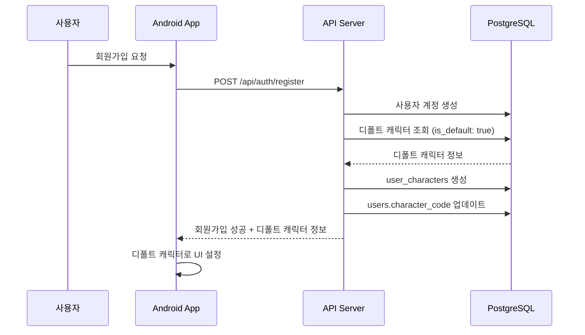
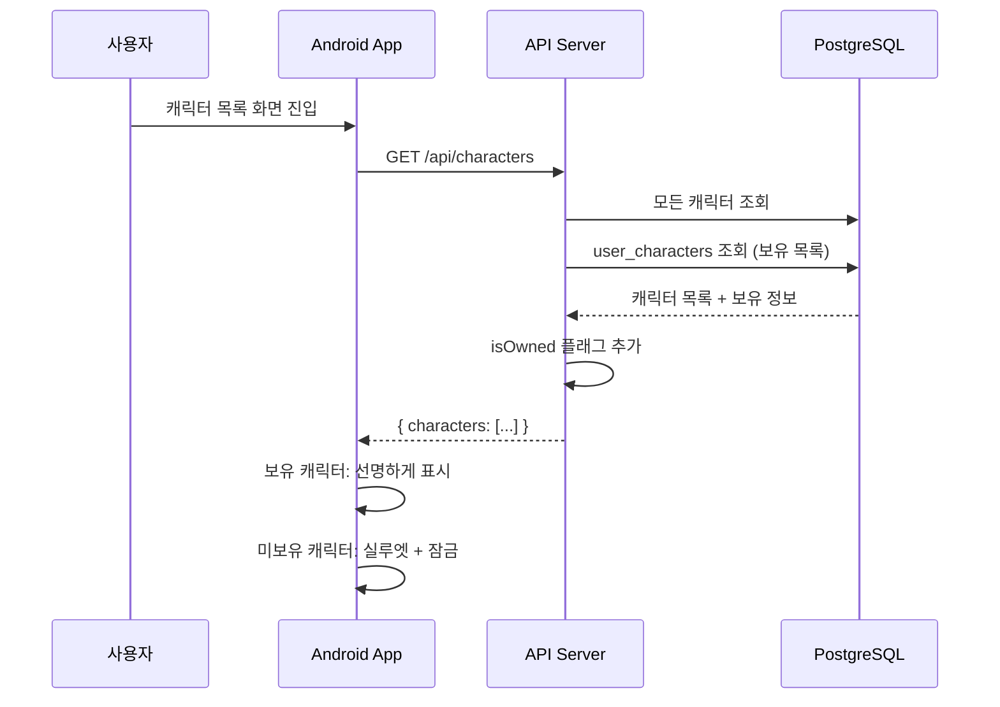
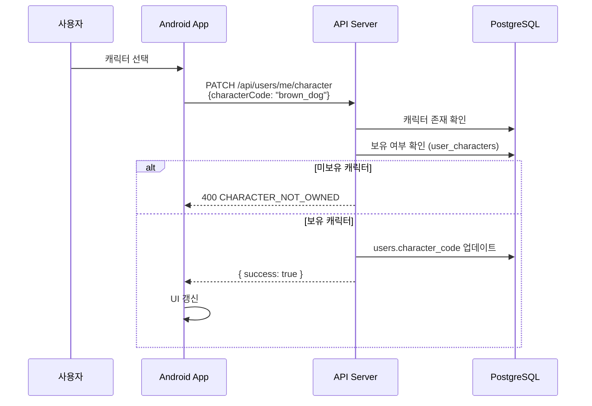
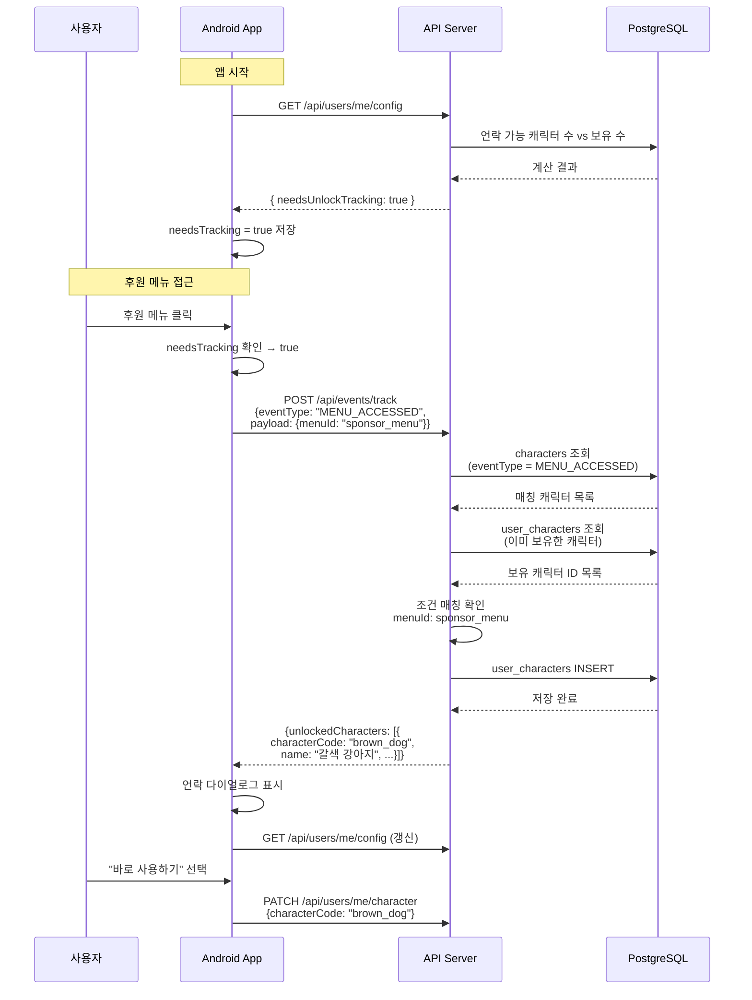

# 캐릭터 시스템 아키텍처

## 개요

캐릭터 시스템은 **사용자가 여러 캐릭터를 수집하고 선택하여 사용할 수 있는 시스템**입니다. 캐릭터 언락은 **이벤트 기반 아키텍처(Event-Driven Architecture)**를 활용하여 특정 조건 달성 시 자동으로 지급됩니다.

### 핵심 원칙

| 원칙                              | 설명                                                       |
| --------------------------------- | ---------------------------------------------------------- |
| **서버 권위 (Server Authority)**  | 서버가 진실의 원천. 언락 조건과 검증은 서버에서만 수행     |
| **조건 숨김 (Hidden Conditions)** | 어떤 캐릭터가 언락되는지는 서버만 앎, 클라이언트 노출 금지 |
| **트래킹 최적화**                 | 서버 설정 기반으로 불필요한 API 호출 최소화                |
| **별도 이벤트 API**               | 기존 비즈니스 API와 분리하여 관심사 분리 유지              |

---

## 시스템 구조

### 전체 API 목록

| API                             | Method | 설명                              |
| ------------------------------- | ------ | --------------------------------- |
| `/api/characters`               | GET    | 전체 캐릭터 목록 (보유 여부 포함) |
| `/api/characters/unlock-config` | GET    | 트래킹 필요 여부 조회             |
| `/api/characters/unlock`        | POST   | 언락 이벤트 전송                  |
| `/api/users/me/character`       | PATCH  | 사용 캐릭터 변경                  |

---

## 클라이언트 vs 서버 역할 분리

### 명확한 역할 구분

| 구분                 | 위치                  | 설명                             | 예시                                     |
| -------------------- | --------------------- | -------------------------------- | ---------------------------------------- |
| **이벤트 발생 코드** | 클라이언트 (하드코딩) | 어디서 이벤트를 보낼지           | `track("MENU_ACCESSED", "sponsor_menu")` |
| **언락 조건 매핑**   | 서버 DB               | 어떤 이벤트 → 어떤 캐릭터        | `sponsor_menu → 갈색 강아지`             |
| **트래킹 필요 여부** | 서버 → 클라이언트     | 아직 언락 가능한 캐릭터가 있는지 | `needsTracking: true/false`              |

### 클라이언트가 아는 것 vs 모르는 것

```
✅ 클라이언트가 아는 것:
   - "후원 메뉴 들어가면 이벤트 보내야 함"
   - "아직 트래킹이 필요한지 여부"

❌ 클라이언트가 모르는 것:
   - "후원 메뉴 가면 어떤 캐릭터가 언락되는지"
   - "총 몇 개의 언락 조건이 있는지"
```

### 새 언락 조건 추가 시

```
1. 서버 DB characters 테이블의 unlock_condition 필드에 조건 추가
2. 클라이언트 해당 화면에 track() 코드 추가 → 앱 업데이트 필요

※ 이벤트 발생 코드는 클라이언트 하드코딩 필수 (피할 수 없음)
```

---

## 데이터 모델

### Prisma 스키마

```prisma
// 캐릭터 정의
model characters {
  id               String            @id @default(dbgenerated("gen_random_uuid()")) @db.Uuid
  character_code   String            @unique
  name             String
  description      String
  unlock_condition Json?             // ← 언락 조건 (JSON), null이면 디폴트 또는 특수 캐릭터
  unlock_hint      String?           // ← 언락 힌트 (클라이언트에 표시)
  is_default       Boolean           // ← 디폴트 캐릭터 여부
  created_at       DateTime          @default(now()) @db.Timestamptz(6)
  updated_at       DateTime          @db.Timestamptz(6)
  user_characters  user_characters[]

  @@schema("public")
}

// 유저-캐릭터 보유 관계 (N:M)
model user_characters {
  id           String       @id @default(dbgenerated("gen_random_uuid()")) @db.Uuid
  user_id      String       @db.Uuid
  character_id String       @db.Uuid
  unlocked_at  DateTime     @default(now()) @db.Timestamptz(6)
  characters   characters   @relation(fields: [character_id], references: [id], onDelete: Cascade)
  users        public_users @relation(fields: [user_id], references: [id], onDelete: Cascade)

  @@unique([user_id, character_id], map: "idx_user_character_unique")  // ← 중복 보유 방지
  @@schema("public")
}

// 유저
model public_users {
  id              String            @id @db.Uuid
  character_code  String            // ← 현재 사용 중인 캐릭터
  user_characters user_characters[]
  // ... 기타 필드

  @@map("users")
  @@schema("public")
}
```

### unlock_condition JSON 구조

```typescript
// characters.unlock_condition 에 저장되는 JSON 구조
interface UnlockCondition {
  eventType: string;       // 이벤트 타입
  [key: string]: any;      // 추가 조건
}

// 예시
{
  "eventType": "MENU_ACCESSED",
  "menuId": "sponsor_menu"
}

{
  "eventType": "LEVEL_REACHED",
  "level": 10
}

{
  "eventType": "FIRST_ACTION",
  "action": "create_meeting"
}
```

### 테이블 관계도

```
┌─────────────────────┐
│     characters      │
├─────────────────────┤
│ id                  │
│ character_code      │◄─────────────────────┐
│ name                │                      │
│ description         │                      │
│ unlock_condition    │  (JSON)              │
│ unlock_hint         │                      │
│ is_default          │                      │
└─────────────────────┘                      │
         │                                   │
         │ 1:N                               │
         ▼                                   │
┌─────────────────────┐                      │
│   user_characters   │                      │
├─────────────────────┤                      │
│ id                  │                      │
│ user_id             │──────┐               │
│ character_id        │──────┼───────────────┘
│ unlocked_at         │      │
└─────────────────────┘      │
         ▲                   │
         │ N:1               │
         │                   │
┌─────────────────────┐      │
│       users         │      │
├─────────────────────┤      │
│ id                  │◄─────┘
│ character_code      │ (현재 사용 중인 캐릭터)
│ ...                 │
└─────────────────────┘
```

---

## 이벤트 타입 정의

### UnlockEventType

```typescript
// 서버 & 클라이언트 공통
enum UnlockEventType {
  MENU_ACCESSED = 'MENU_ACCESSED', // 특정 메뉴 접근
  SCREEN_VIEWED = 'SCREEN_VIEWED', // 특정 화면 조회
  LEVEL_REACHED = 'LEVEL_REACHED', // 특정 레벨 도달
  FIRST_ACTION = 'FIRST_ACTION', // 최초 특정 행동 수행
  ACTION_COUNT_REACHED = 'ACTION_COUNT_REACHED', // 특정 행동 N회 수행
  MEETING_PARTICIPATED = 'MEETING_PARTICIPATED', // 모임 참여
}
```

---

## 서버 구현 (NestJS + Prisma)

### 1. 회원가입 시 디폴트 캐릭터 지급

```typescript
// auth/application/usecases/register.usecase.ts
@Injectable()
export class RegisterUseCase {
  constructor(
    private readonly prisma: PrismaService,
    private readonly characterService: CharacterService,
  ) {}

  async execute(dto: RegisterDto): Promise<RegisterResult> {
    return this.prisma.$transaction(async (tx) => {
      // 1. 사용자 계정 생성
      const user = await tx.users.create({
        data: {
          email: dto.email,
          // ... 기타 필드
          character_code: '', // 임시값, 아래에서 업데이트
        },
      });

      // 2. 디폴트 캐릭터 지급
      const defaultCharacter =
        await this.characterService.grantDefaultCharacter(tx, user.id);

      // 3. 사용자 프로필에 디폴트 캐릭터 설정
      await tx.users.update({
        where: { id: user.id },
        data: { character_code: defaultCharacter.character_code },
      });

      return { user, defaultCharacter };
    });
  }
}

// character/application/services/character.service.ts
@Injectable()
export class CharacterService {
  constructor(private readonly prisma: PrismaService) {}

  async grantDefaultCharacter(
    tx: PrismaTransactionClient,
    userId: string,
  ): Promise<characters> {
    // 1. 디폴트 캐릭터 조회
    const defaultCharacter = await tx.characters.findFirst({
      where: { is_default: true },
    });

    if (!defaultCharacter) {
      throw new DomainException(ErrorCode.DEFAULT_CHARACTER_NOT_FOUND);
    }

    // 2. UserCharacter 생성
    await tx.user_characters.create({
      data: {
        user_id: userId,
        character_id: defaultCharacter.id,
      },
    });

    return defaultCharacter;
  }
}
```

---

### 2. 캐릭터 목록 조회 API

```typescript
// character/presentation/controllers/character.controller.ts
@Controller('api/characters')
export class CharacterController {
  constructor(private readonly characterService: CharacterService) {}

  @Get()
  @UseGuards(JwtAuthGuard)
  async getAllCharacters(
    @CurrentUser() user: User,
  ): Promise<CharacterListResponse> {
    return this.characterService.getAllWithOwnership(user.id);
  }
}

// character/application/services/character.service.ts
async getAllWithOwnership(userId: string): Promise<CharacterListResponse> {
  // 1. 모든 캐릭터 조회
  const allCharacters = await this.prisma.characters.findMany({
    orderBy: { created_at: 'asc' },
  });

  // 2. 사용자 보유 캐릭터 ID Set
  const ownedCharacters = await this.prisma.user_characters.findMany({
    where: { user_id: userId },
    select: { character_id: true },
  });
  const ownedIds = new Set(ownedCharacters.map((oc) => oc.character_id));

  // 3. 보유 여부 플래그 추가
  const characters = allCharacters.map((char) => ({
    id: char.id,
    characterCode: char.character_code,
    name: char.name,
    description: char.description,
    isDefault: char.is_default,
    isOwned: ownedIds.has(char.id),
    // ❌ unlockCondition은 절대 포함하지 않음
  }));

  return { characters };
}

// DTOs
interface CharacterListResponse {
  characters: CharacterDto[];
}

interface CharacterDto {
  id: string;
  characterCode: string;
  name: string;
  description: string;
  isDefault: boolean;
  unlockHint: string | null;  // ← 언락 힌트
  isOwned: boolean;
}
```

---

### 3. 보유 캐릭터 조회 API

```typescript
// character/presentation/controllers/character.controller.ts
@Controller('api/users/me')
export class UserCharacterController {
  constructor(private readonly characterService: CharacterService) {}

  @Get('characters')
  @UseGuards(JwtAuthGuard)
  async getOwnedCharacters(
    @CurrentUser() user: User,
  ): Promise<OwnedCharacterListResponse> {
    return this.characterService.getOwnedCharacters(user.id);
  }
}

// character/application/services/character.service.ts
async getOwnedCharacters(userId: string): Promise<OwnedCharacterListResponse> {
  const ownedCharacters = await this.prisma.user_characters.findMany({
    where: { user_id: userId },
    include: { characters: true },
    orderBy: { unlocked_at: 'asc' },
  });

  return {
    characters: ownedCharacters.map((uc) => ({
      id: uc.characters.id,
      characterCode: uc.characters.character_code,
      name: uc.characters.name,
      description: uc.characters.description,
      unlockedAt: uc.unlocked_at,
    })),
  };
}

// DTOs
interface OwnedCharacterListResponse {
  characters: OwnedCharacterDto[];
}

interface OwnedCharacterDto {
  id: string;
  characterCode: string;
  name: string;
  description: string;
  unlockedAt: Date;
}
```

---

### 4. 캐릭터 변경 API

```typescript
// character/presentation/controllers/character.controller.ts
@Patch('character')
@UseGuards(JwtAuthGuard)
async changeCharacter(
  @CurrentUser() user: User,
  @Body() dto: ChangeCharacterDto,
): Promise<ChangeCharacterResponse> {
  return this.characterService.changeCharacter(user.id, dto.characterCode);
}

// character/application/services/character.service.ts
async changeCharacter(
  userId: string,
  characterCode: string,
): Promise<ChangeCharacterResponse> {
  // 1. 캐릭터 존재 여부 확인
  const character = await this.prisma.characters.findUnique({
    where: { character_code: characterCode },
  });

  if (!character) {
    throw new DomainException(ErrorCode.CHARACTER_NOT_FOUND);
  }

  // 2. 보유 여부 확인
  const ownership = await this.prisma.user_characters.findUnique({
    where: {
      idx_user_character_unique: {
        user_id: userId,
        character_id: character.id,
      },
    },
  });

  if (!ownership) {
    throw new DomainException(ErrorCode.CHARACTER_NOT_OWNED);
  }

  // 3. 사용자 프로필 업데이트
  await this.prisma.users.update({
    where: { id: userId },
    data: { character_code: characterCode },
  });

  return {
    success: true,
    characterCode,
    message: '캐릭터가 변경되었습니다.',
  };
}

// DTOs
interface ChangeCharacterDto {
  characterCode: string;
}

interface ChangeCharacterResponse {
  success: boolean;
  characterCode: string;
  message: string;
}
```

---

### 5. User Config API (트래킹 필요 여부)

```typescript
// character/presentation/controllers/user-character.controller.ts
@Controller('api/v1/characters')
export class UserCharacterController {
  constructor(
    private readonly getUnlockConfigUseCase: GetUnlockConfigUseCase,
  ) {}

  @Get('unlock-config')
  @UseGuards(JwtAuthGuard)
  async getUnlockConfig(
    @CurrentUser() user: User,
  ): Promise<UnlockConfigResponse> {
    return this.getUnlockConfigUseCase.execute({ userId: user.id });
  }
}

// character/application/usecases/get-unlock-config.usecase.ts
@Injectable()
export class GetUnlockConfigUseCase {
  constructor(
    private readonly characterQueryRepository: CharacterQueryRepository,
  ) {}

  async execute(input: GetUnlockConfigInput): Promise<GetUnlockConfigOutput> {
    // 언락 조건이 있고 아직 보유하지 않은 캐릭터들의 eventType 조회
    const trackableEventTypes =
      await this.characterQueryRepository.getTrackableEventTypes(input.userId);

    return {
      needsUnlockTracking: trackableEventTypes.length > 0,
      trackableEventTypes,
    };
  }
}

// DTOs
interface UnlockConfigResponse {
  needsUnlockTracking: boolean;
  trackableEventTypes: string[]; // 트래킹 가능한 이벤트 타입 목록
}
```

**응답 예시:**

```json
// 트래킹 필요한 경우
{
  "needsUnlockTracking": true,
  "trackableEventTypes": ["MENU_ACCESSED", "FIRST_ACTION", "LEVEL_REACHED"]
}

// 모든 캐릭터 보유 (트래킹 불필요)
{
  "needsUnlockTracking": false,
  "trackableEventTypes": []
}
```

**클라이언트 최적화:**

- `trackableEventTypes`에 포함된 이벤트만 서버에 전송
- 포함되지 않은 이벤트는 API 호출 자체를 스킵

---

### 6. 언락 이벤트 처리 (Controller)

```typescript
// character/presentation/controllers/user-character.controller.ts
@Controller('api/v1/characters')
export class UserCharacterController {
  constructor(
    private readonly trackUnlockEventUseCase: TrackUnlockEventUseCase,
  ) {}

  @Post('unlock')
  @UseGuards(ThrottlerGuard)
  @Throttle({ default: { limit: 30, ttl: 60000 } }) // 분당 30회 제한
  @UserAuth()
  async trackUnlockEvent(
    @User() user: UserInfo,
    @Body() dto: TrackUnlockEventRequestDto,
  ): Promise<TrackUnlockEventResponseDto> {
    const result = await this.trackUnlockEventUseCase.execute({
      userId: user.userId,
      eventType: dto.eventType,
      payload: dto.payload,
    });

    return { unlockedCharacters: result.unlockedCharacters };
  }
}

// DTOs
interface TrackUnlockEventRequestDto {
  eventType: string;
  payload: Record<string, unknown>;
}

interface TrackUnlockEventResponseDto {
  unlockedCharacters: UnlockedCharacterDto[];
}

interface UnlockedCharacterDto {
  characterCode: string;
  name: string;
  description: string;
}
```

---

### 7. 언락 이벤트 처리 (UseCase + Domain Service)

```typescript
// character/application/usecases/track-unlock-event.usecase.ts
@Injectable()
export class TrackUnlockEventUseCase {
  constructor(
    private readonly characterQueryRepository: CharacterQueryRepository,
    private readonly userCharacterRepository: UserCharacterRepository,
  ) {}

  async execute(dto: TrackUnlockEventDto): Promise<TrackUnlockEventResultDto> {
    const { userId, eventType, payload } = dto;

    // 1. 해당 이벤트 타입의 언락 조건을 가진 캐릭터 조회
    const characters =
      await this.characterQueryRepository.findByEventType(eventType);

    const unlockedCharacters: UnlockedCharacterInfo[] = [];

    // 2. 각 캐릭터의 언락 조건 확인
    for (const character of characters) {
      // 조건 매칭 확인 (Domain Service 사용)
      if (!UnlockConditionMatcher.matches(character.unlockCondition, payload)) {
        continue;
      }

      // 이미 보유 여부 확인
      const isOwned = await this.userCharacterRepository.exists(
        userId,
        character.id,
      );
      if (isOwned) {
        continue;
      }

      // 3. 캐릭터 지급
      const userCharacter = new UserCharacter({
        userId,
        characterId: character.id,
        unlockedAt: new Date(),
      });
      await this.userCharacterRepository.save(userCharacter);

      unlockedCharacters.push({
        characterCode: character.characterCode,
        name: character.name,
        description: character.description,
      });
    }

    return { unlockedCharacters };
  }
}

// character/domain/services/unlock-condition-matcher.ts
export class UnlockConditionMatcher {
  /**
   * 클라이언트 이벤트 페이로드가 언락 조건과 매칭되는지 확인
   */
  static matches(
    condition: UnlockCondition,
    payload: Record<string, unknown>,
  ): boolean {
    // eventType은 이미 findByEventType에서 필터링됨
    const { eventType, ...requirements } = condition;

    return Object.entries(requirements).every(([key, expected]) => {
      const actual = payload[key];

      if (typeof expected === 'number') {
        return typeof actual === 'number' && actual >= expected;
      }

      if (typeof expected === 'string') {
        return actual === expected;
      }

      if (typeof expected === 'boolean') {
        return actual === expected;
      }

      return false;
    });
  }
}

// character/domain/models/character/character.ts
interface UnlockCondition {
  eventType: string;
  [key: string]: unknown;
}
```

---

## 전체 흐름도

```
┌─────────────────────────────────────────────────────────────────┐
│                        클라이언트 (Android)                       │
├─────────────────────────────────────────────────────────────────┤
│                                                                  │
│  [앱 시작] ──→ GET /api/users/me/config                         │
│                      │                                           │
│                      ▼                                           │
│              ┌─────────────────┐                                │
│              │ needsTracking?  │                                │
│              └─────────────────┘                                │
│                      │                                           │
│         ┌────────────┴────────────┐                             │
│         │                         │                              │
│       false                     true                             │
│         │                         │                              │
│         ▼                         ▼                              │
│   [트래킹 안 함]           [트래킹 활성화]                        │
│   (모든 캐릭터 보유)              │                              │
│                                   │                              │
│                          [사용자 행동 발생]                       │
│                                   │                              │
│                                   ▼                              │
│                          [track() 호출]                          │
│                                   │                              │
└───────────────────────────────────┼──────────────────────────────┘
                                    │
                                    │ POST /api/events/track
                                    │ { eventType, payload }
                                    ▼
┌─────────────────────────────────────────────────────────────────┐
│                           서버                                   │
├─────────────────────────────────────────────────────────────────┤
│                                                                  │
│  [Event Receiver]                                                │
│       │                                                          │
│       ▼                                                          │
│  [characters 테이블에서 unlock_condition 조회]                   │
│  "eventType: MENU_ACCESSED, menuId: sponsor_menu"               │
│       │                                                          │
│       ▼                                                          │
│  ┌─────────────┐                                                │
│  │ 이미 보유?  │ (user_characters 테이블 확인)                   │
│  └─────────────┘                                                │
│       │                                                          │
│      No ──→ [user_characters 생성] ──→ [응답에 언락 정보 포함]  │
│       │                                                          │
│      Yes ──→ [무시]                                             │
│                                                                  │
└─────────────────────────────────────────────────────────────────┘
                              │
                              │ { unlockedCharacters: [...] }
                              ▼
┌─────────────────────────────────────────────────────────────────┐
│                     클라이언트 (응답 수신)                        │
├─────────────────────────────────────────────────────────────────┤
│                                                                  │
│  [응답 확인] ──→ [언락 다이얼로그 표시]                          │
│                          │                                       │
│                  ┌───────┴───────┐                              │
│                  ▼               ▼                               │
│          [바로 사용하기]    [나중에]                              │
│                  │                                               │
│                  ▼                                               │
│          PATCH /api/users/me/character                          │
│                                                                  │
└─────────────────────────────────────────────────────────────────┘
```

---

## 시퀀스 다이어그램

### 회원가입 + 디폴트 캐릭터 지급



### 캐릭터 목록 조회



### 캐릭터 변경



### 캐릭터 언락 전체 플로우



---

## 클라이언트 구현 (Android)

### 1. User Config (트래킹 필요 여부)

```kotlin
// domain/user/model/UserConfig.kt
data class UserConfig(
    val needsUnlockTracking: Boolean
)
```

```kotlin
// data/repository/UserConfigRepositoryImpl.kt
class UserConfigRepositoryImpl @Inject constructor(
    private val userApi: UserApi,
    private val dataStore: DataStore<Preferences>
) : UserConfigRepository {

    private val needsTrackingKey = booleanPreferencesKey("needs_unlock_tracking")

    override suspend fun fetchAndSaveConfig() {
        val response = userApi.getConfig()
        dataStore.edit { prefs ->
            prefs[needsTrackingKey] = response.needsUnlockTracking
        }
    }

    override fun needsUnlockTracking(): Flow<Boolean> {
        return dataStore.data.map { prefs ->
            prefs[needsTrackingKey] ?: true  // 기본값: 트래킹 함
        }
    }
}
```

### 2. UnlockEventTracker (핵심)

```kotlin
// presentation/common/event/UnlockEventTracker.kt
@Singleton
class UnlockEventTracker @Inject constructor(
    private val eventApi: EventApi,
    private val userConfigRepository: UserConfigRepository,
    private val unlockNotificationManager: UnlockNotificationManager
) {
    private val scope = CoroutineScope(SupervisorJob() + Dispatchers.IO)
    private var needsTracking = true

    init {
        // 설정 변경 감지
        scope.launch {
            userConfigRepository.needsUnlockTracking().collect { needs ->
                needsTracking = needs
            }
        }
    }

    /**
     * 메뉴 접근 이벤트 트래킹
     */
    fun trackMenuAccess(menuId: String) {
        if (!needsTracking) return  // 모든 캐릭터 보유 → 트래킹 불필요

        scope.launch {
            trackEventInternal(
                eventType = "MENU_ACCESSED",
                payload = mapOf("menuId" to menuId)
            )
        }
    }

    /**
     * 행동 이벤트 트래킹
     */
    fun trackAction(action: String) {
        if (!needsTracking) return

        scope.launch {
            trackEventInternal(
                eventType = "FIRST_ACTION",
                payload = mapOf("action" to action)
            )
        }
    }

    /**
     * 레벨업 이벤트 트래킹
     */
    fun trackLevelUp(newLevel: Int) {
        if (!needsTracking) return

        scope.launch {
            trackEventInternal(
                eventType = "LEVEL_REACHED",
                payload = mapOf("level" to newLevel)
            )
        }
    }

    private suspend fun trackEventInternal(
        eventType: String,
        payload: Map<String, Any>
    ) {
        runCatching {
            val response = eventApi.trackEvent(
                TrackEventRequest(eventType = eventType, payload = payload)
            )

            response.unlockedCharacters?.let { characters ->
                if (characters.isNotEmpty()) {
                    unlockNotificationManager.showUnlockDialog(characters.map { it.toDomain() })

                    // 설정 갱신 (혹시 모든 캐릭터 보유했을 수 있음)
                    userConfigRepository.fetchAndSaveConfig()
                }
            }
        }.onFailure { e ->
            Timber.w(e, "Failed to track event: $eventType")
        }
    }
}
```

### 3. 화면에서 사용 (하드코딩 필수)

```kotlin
// presentation/sponsor/SponsorScreen.kt
@Composable
fun SponsorScreen(
    viewModel: SponsorViewModel = hiltViewModel()
) {
    val eventTracker = LocalUnlockEventTracker.current

    // ⚠️ 이벤트 발생 코드는 하드코딩 필수
    LaunchedEffect(Unit) {
        eventTracker.trackMenuAccess("sponsor_menu")
    }

    // UI 구현...
}
```

```kotlin
// presentation/meeting/CreateMeetingViewModel.kt
@HiltViewModel
class CreateMeetingViewModel @Inject constructor(
    private val eventTracker: UnlockEventTracker
) : ViewModel() {

    fun onMeetingCreated() {
        // ⚠️ 이벤트 발생 코드는 하드코딩 필수
        eventTracker.trackAction("create_meeting")
    }
}
```

### 4. 앱 시작 시 설정 동기화

```kotlin
// presentation/main/MainViewModel.kt
@HiltViewModel
class MainViewModel @Inject constructor(
    private val userConfigRepository: UserConfigRepository
) : ViewModel() {

    init {
        viewModelScope.launch {
            // 앱 시작 시 트래킹 필요 여부 동기화
            userConfigRepository.fetchAndSaveConfig()
        }
    }
}
```

### 5. 복수 캐릭터 언락 UI 처리

```kotlin
// presentation/common/unlock/UnlockNotificationManager.kt
@Singleton
class UnlockNotificationManager @Inject constructor(
    private val dialogNavigator: DialogNavigator
) {
    /**
     * 언락된 캐릭터 다이얼로그 표시
     * - 복수 캐릭터인 경우 순차적으로 표시
     */
    suspend fun showUnlockDialog(characters: List<UnlockedCharacter>) {
        characters.forEach { character ->
            dialogNavigator.showUnlockDialog(character)
            // 사용자가 다이얼로그를 닫을 때까지 대기
        }
    }
}
```

---

## 에러 코드 정의

```typescript
// shared/exception/error-code.ts
export const CharacterErrorCode = {
  // 캐릭터 관련
  CHARACTER_NOT_FOUND: {
    code: 'CHARACTER_001',
    message: '캐릭터를 찾을 수 없습니다.',
    httpStatus: 404,
  },
  CHARACTER_NOT_OWNED: {
    code: 'CHARACTER_002',
    message: '보유하지 않은 캐릭터입니다.',
    httpStatus: 400,
  },
  DEFAULT_CHARACTER_NOT_FOUND: {
    code: 'CHARACTER_003',
    message: '디폴트 캐릭터가 설정되지 않았습니다.',
    httpStatus: 500,
  },

  // 이벤트 관련
  INVALID_EVENT_TYPE: {
    code: 'EVENT_001',
    message: '유효하지 않은 이벤트 타입입니다.',
    httpStatus: 400,
  },
  EVENT_RATE_LIMIT_EXCEEDED: {
    code: 'EVENT_002',
    message: '이벤트 요청 한도를 초과했습니다. 잠시 후 다시 시도해주세요.',
    httpStatus: 429,
  },
};
```

---

## 성능 최적화

### 트래픽 최적화

| 상황             | API 호출               |
| ---------------- | ---------------------- |
| 모든 캐릭터 보유 | 0 (트래킹 비활성화)    |
| 아직 언락 가능   | 이벤트 발생 시마다 1회 |

### 서버 측

| 최적화                 | 설명                                                 |
| ---------------------- | ---------------------------------------------------- |
| **이벤트 타입 필터링** | `unlock_condition.eventType`으로 1차 필터링          |
| **유니크 제약**        | `@@unique([user_id, character_id])`로 중복 보유 방지 |
| **이미 보유 스킵**     | 보유 캐릭터 ID Set으로 O(1) 체크                     |
| **Rate Limiting**      | 분당 30회 제한으로 악용 방지                         |

### 클라이언트 측

| 최적화              | 설명                                   |
| ------------------- | -------------------------------------- |
| **트래킹 플래그**   | 모든 캐릭터 보유 시 API 호출 완전 제거 |
| **Fire-and-Forget** | 트래킹 실패해도 앱 동작에 영향 없음    |

---

## 보안 고려사항

### 서버 측

1. **언락 조건은 서버에만**: 클라이언트는 어떤 캐릭터가 언락되는지 모름
2. **최종 검증은 서버에서**: 클라이언트가 조작해도 서버에서 다시 검증
3. **중복 지급 방지**: Prisma `@@unique` 제약 + 보유 여부 사전 확인
4. **Rate Limiting**: 분당 30회 제한

### 클라이언트 측

1. **토큰 검증**: 인증된 사용자만 이벤트 전송 가능
2. **조건 노출 금지**: 코드에 "어떤 캐릭터"인지 절대 하드코딩 안 함

---

## 예시 데이터

```sql
-- 디폴트 캐릭터 (언락 조건 없음)
INSERT INTO characters (character_code, name, description, unlock_condition, unlock_hint, is_default) VALUES
('default_char', '기본 캐릭터', '모든 유저에게 지급되는 기본 캐릭터', NULL, NULL, true);

-- 후원 메뉴 접근 시 언락 (갈색 강아지)
INSERT INTO characters (character_code, name, description, unlock_condition, unlock_hint, is_default) VALUES
('brown_dog', '갈색 강아지', '후원자를 위한 특별한 캐릭터',
 '{"eventType": "MENU_ACCESSED", "menuId": "sponsor_menu"}', '후원 페이지를 방문해보세요', false);

-- 비밀 메뉴 접근 시 언락 (금색 고양이)
INSERT INTO characters (character_code, name, description, unlock_condition, unlock_hint, is_default) VALUES
('golden_cat', '금색 고양이', '숨겨진 메뉴를 발견한 당신에게',
 '{"eventType": "MENU_ACCESSED", "menuId": "secret_menu"}', '앱 곳곳을 탐험해보세요', false);

-- 레벨 10 달성 시 언락 (파란 새)
INSERT INTO characters (character_code, name, description, unlock_condition, unlock_hint, is_default) VALUES
('blue_bird', '파란 새', '레벨 10을 달성한 당신에게',
 '{"eventType": "LEVEL_REACHED", "level": 10}', '레벨을 올려보세요', false);

-- 첫 모임 생성 시 언락 (초록 개구리)
INSERT INTO characters (character_code, name, description, unlock_condition, unlock_hint, is_default) VALUES
('green_frog', '초록 개구리', '첫 모임을 만든 당신에게',
 '{"eventType": "FIRST_ACTION", "action": "create_meeting"}', '모임을 만들어보세요', false);
```

---

## 요약

| 항목               | 위치                                  | 앱 업데이트 필요 |
| ------------------ | ------------------------------------- | ---------------- |
| 이벤트 발생 코드   | 클라이언트 (하드코딩)                 | O                |
| 언락 조건 매핑     | 서버 DB (characters.unlock_condition) | X                |
| 트래킹 필요 여부   | 서버 → 클라이언트                     | X                |
| 디폴트 캐릭터 지급 | 서버 (회원가입 시)                    | X                |
| 캐릭터 변경        | 서버 (보유 검증 후)                   | X                |

---

## 참고 자료

- [Observer Pattern - Game Programming Patterns](https://gameprogrammingpatterns.com/observer.html)
- [Designing and Building a Robust Achievement System - Game Developer](https://www.gamedeveloper.com/design/designing-and-building-a-robust-comprehensive-achievement-system)
- [Event-Driven Architecture in Mobile Apps - Chapter247](https://www.chapter247.com/blog/event-driven-architecture-in-mobile-apps/)
- [Prisma Documentation](https://www.prisma.io/docs)

---

## 구현 현황 (2026-02-03)

### 구현 완료

| 기능                            | API                                    | 구현 파일                                   | 상태    |
| ------------------------------- | -------------------------------------- | ------------------------------------------- | ------- |
| DB 스키마                       | -                                      | `prisma/schema.prisma`                      | ✅ 완료 |
| 회원가입 시 디폴트 캐릭터 지급  | `POST /api/v1/auth/register`           | `src/module/user/`, `src/module/character/` | ✅ 완료 |
| 캐릭터 변경                     | `PATCH /api/v1/users/character`        | `src/module/user/`                          | ✅ 완료 |
| 캐릭터 목록 조회 (isOwned 포함) | `GET /api/v1/characters`               | `src/module/character/`                     | ✅ 완료 |
| 트래킹 필요 여부 조회           | `GET /api/v1/characters/unlock-config` | `src/module/character/`                     | ✅ 완료 |
| 이벤트 기반 언락                | `POST /api/v1/characters/unlock`       | `src/module/character/`                     | ✅ 완료 |

### 주요 구현 파일 (완료)

**DB 스키마**

- `prisma/schema.prisma` - `characters`, `user_characters` 테이블 정의 완료
  - `characters.unlock_condition` (Json?) 필드 존재
  - `characters.unlock_hint` (String?) 필드 존재
  - `characters.is_default` (Boolean) 필드 존재
  - `user_characters` 테이블에 `@@unique([user_id, character_id])` 제약 존재

**회원가입 시 디폴트 캐릭터 지급**

- `src/module/user/application/usecases/register.usecase.ts` - 회원가입 시 디폴트 캐릭터 코드 조회
- `src/module/character/application/handlers/user-registered-event.handler.ts` - `UserRegisteredEvent` 처리하여 `user_characters` 생성
- `src/module/character/application/usecases/unlock-character.usecase.ts` - 캐릭터 언락 처리

**캐릭터 목록 조회 (isOwned 포함)**

- `src/module/character/domain/models/character/character.query-model.ts` - `CharacterListItemWithOwnershipQueryModel` 인터페이스
- `src/module/character/domain/repositories/character-query.repository.ts` - `findListWithOwnership()` 메서드
- `src/module/character/infra/repositories/character-query.repository.impl.ts` - 구현체 (1회 쿼리로 최적화)
- `src/module/character/presentation/dtos/response/character-list.response.dto.ts` - `isOwned` 필드 포함
- `src/module/character/presentation/controllers/user-character.controller.ts` - 컨트롤러

**캐릭터 변경**

- `src/module/user/application/usecases/change-character.usecase.ts` - UseCase
- `src/module/user/presentation/controllers/user.controller.ts` - `PATCH /users/character` 엔드포인트

**트래킹 필요 여부 조회**

- `src/module/character/domain/repositories/character-query.repository.ts` - `getTrackableEventTypes()` 메서드
- `src/module/character/infra/repositories/character-query.repository.impl.ts` - 구현체
- `src/module/character/application/usecases/get-unlock-config.usecase.ts` - UseCase
- `src/module/character/presentation/dtos/response/unlock-config.response.dto.ts` - 응답 DTO (`needsUnlockTracking`, `trackableEventTypes`)
- `src/module/character/presentation/controllers/user-character.controller.ts` - `GET /characters/unlock-config` 엔드포인트

**이벤트 기반 언락**

- `src/module/character/domain/models/character/character.ts` - `UnlockCondition` 인터페이스
- `src/module/character/domain/services/unlock-condition-matcher.ts` - `UnlockConditionMatcher` 서비스 (조건 매칭 로직)
- `src/module/character/domain/repositories/character-query.repository.ts` - `findByEventType()` 메서드
- `src/module/character/infra/repositories/character-query.repository.impl.ts` - `findByEventType()` 구현체
- `src/module/character/application/dtos/track-unlock-event.dto.ts` - Application DTO (interface)
- `src/module/character/application/usecases/track-unlock-event.usecase.ts` - UseCase
- `src/module/character/presentation/dtos/request/track-unlock-event.request.dto.ts` - 요청 DTO
- `src/module/character/presentation/dtos/response/track-unlock-event.response.dto.ts` - 응답 DTO
- `src/module/character/presentation/controllers/user-character.controller.ts` - `POST /characters/unlock` 엔드포인트

---

### 추가 검토 필요 사항

| 항목                                | 상태      | 비고                                                  |
| ----------------------------------- | --------- | ----------------------------------------------------- |
| Rate Limiting (`@nestjs/throttler`) | ✅ 적용됨 | `POST /characters/unlock` 엔드포인트에 분당 30회 제한 |
| 단위 테스트                         | ⏳ 미작성 | UseCase, Service 테스트 필요                          |
| E2E 테스트                          | ⏳ 미작성 | API 통합 테스트 필요                                  |

### 테스트 체크리스트

- [x] 회원가입 시 디폴트 캐릭터 지급 (기존 구현 확인)
- [x] `PATCH /api/v1/users/character` - 캐릭터 변경
- [x] `GET /api/v1/characters` - isOwned, unlockHint 플래그 정상 반환 확인
- [x] `GET /api/v1/characters/unlock-config` - needsUnlockTracking, trackableEventTypes 계산 검증
- [ ] `POST /api/v1/characters/unlock` - 정상 이벤트 처리 확인
- [ ] `POST /api/v1/characters/unlock` - 중복 언락 방지 확인
