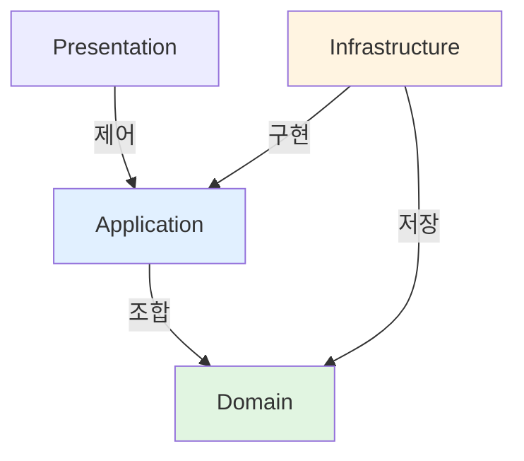
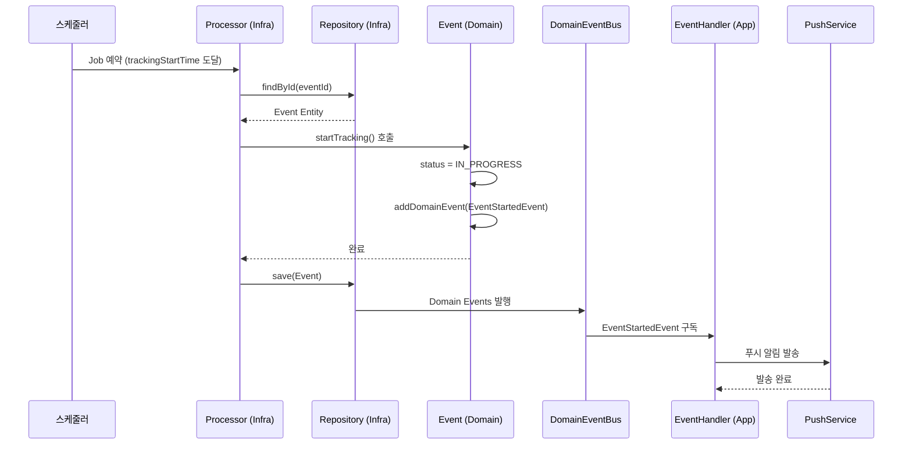
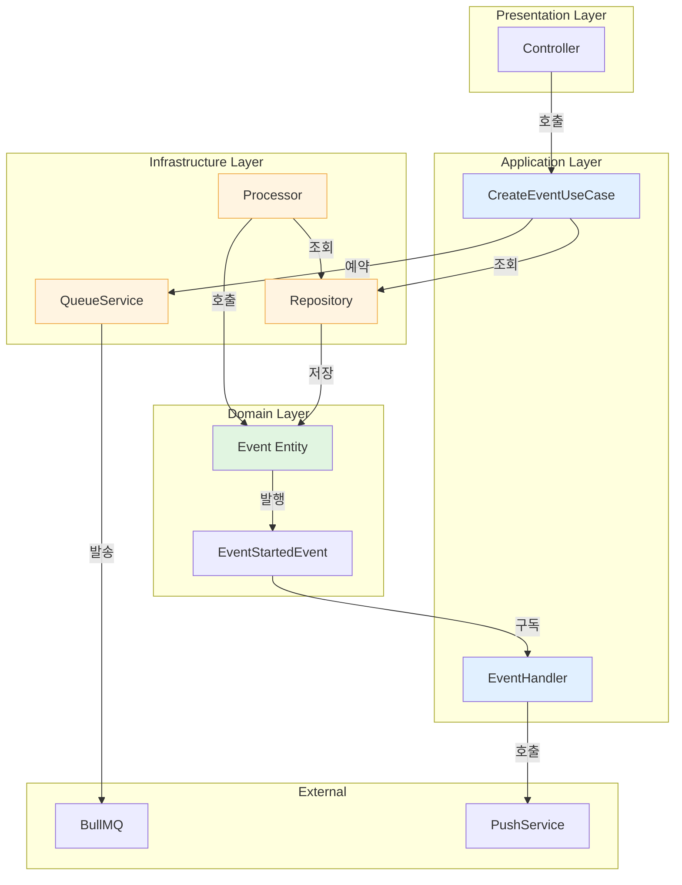

# DDD 구조에서 Queue Processor 처리 패턴

## 📋 목차

1. [개요](#개요)
2. [문제 정의](#문제-정의)
3. [DDD 관점에서의 접근법](#ddd-관점에서의-접근법)
4. [권장 패턴: Domain Event 기반 아키텍처](#권장-패턴-domain-event-기반-아키텍처)
5. [구현 가이드](#구현-가이드)
6. [의존성 방향](#의존성-방향)
7. [장단점 비교](#장단점-비교)
8. [실무적 가이드라인](#실무적-가이드라인)

---

## 개요

이 문서는 **Domain-Driven Design(DDD)** 구조의 NestJS 애플리케이션에서 **BullMQ Queue Processor**를 구현하는 베스트 프랙티스를 설명합니다.

특히 **Infrastructure Layer의 Processor가 Application Layer의 UseCase를 호출하는 것**이 왜 문제가 되는지, 그리고 **Domain Event 기반 패턴**으로 어떻게 해결하는지 설명합니다.

---

## 문제 정의

### 안티패턴: Infrastructure → Application 호출

```typescript
// ❌ 안티패턴
@Injectable()
@Processor('event')
export class StartEventTrackingProcessor {
  constructor(
    private readonly startTrackingUseCase: StartEventTrackingUseCase, // 문제!
  ) {}

  @Process('start-tracking')
  async handle(job: Job) {
    // Infrastructure가 Application Layer 의존
    await this.startTrackingUseCase.execute(job.data);
  }
}
```

### 문제점

1. **순환 의존 위험**
   - UseCase가 Repository를 호출
   - Processor가 UseCase를 호출
   - 계층 간 의존성이 복잡해짐

2. **단일 책임 원칙 위반**
   - Processor는 "외부 시스템과의 통합"만 담당해야 함
   - UseCase 호출은 "비즈니스 로직 실행"이므로 Application Layer의 책임

3. **테스트 어려움**
   - Processor 테스트 시 UseCase 모의까지 필요
   - 통합 테스트가 불가피해짐

4. **DDD 원칙 위반**
   - Infrastructure가 Domain에 의존해야 함
   - Infrastructure가 Application을 호출하면 의존성 방향이 꼬임

---

## DDD 관점에서의 접근법

### DDD 핵심 원칙



**의존성 규칙:**
- **Domain**: 독립적, 누구도 의존하지 않음
- **Application**: Domain에 의존
- **Infrastructure**: Domain과 Application 인터페이스에 의존
- **Presentation**: Application에 의존

### Processor의 정체성

**Processor = Infrastructure**
- BullMQ(외부 시스템)와의 통합 담당
- Adapter 역할 (Hexagonal Architecture)
- Application Layer에 의존하면 안 됨

---

## 권장 패턴: Domain Event 기반 아키텍처

### 핵심 아이디어

```
Infrastructure (Processor)
  → Repository 조회
  → Domain 메서드 호출
  → Domain Event 자동 발행
  → Application Layer (EventHandler)가 부수 효과 처리
```

### 전체 흐름 다이어그램



---

## 구현 가이드

### 1. Domain Event 정의

```typescript
// domain/models/event/events/event-started.event.ts
import { IDomainEvent } from '@lib/domain/events/i-domain-event';
import { UniqueEntityId } from '@lib/domain';

export interface EventStartedPayload {
  eventId: string;
  groupId: string;
  eventTime: Date;
}

export class EventStartedEvent implements IDomainEvent {
  public dateTimeOccurred: Date;

  constructor(public readonly payload: EventStartedPayload) {
    this.dateTimeOccurred = new Date();
  }

  getAggregateId(): UniqueEntityId {
    return new UniqueEntityId(this.payload.eventId);
  }
}
```

### 2. Domain Entity에서 이벤트 발행

```typescript
// domain/models/event/event.ts
export class Event extends AggregateRoot<EventProps> {
  /**
   * 위치 공유를 시작합니다 (모집중 → 진행중)
   */
  startTracking(): void {
    if (!this.canStartTracking()) {
      throw new Error('위치 공유를 시작할 수 없는 상태입니다.');
    }

    this.props.status = EventStatus.IN_PROGRESS;
    this.props.updatedAt = new Date();

    // ✅ Domain Event 자동 발행
    this.addDomainEvent(
      new EventStartedEvent({
        eventId: this.id.toString(),
        groupId: this.props.groupId,
        eventTime: this.props.eventTime,
      }),
    );
  }

  canStartTracking(): boolean {
    return this.props.status === EventStatus.RECRUITING
      && new Date() >= this.props.trackingStartTime;
  }
}
```

### 3. Processor 구현 (Infrastructure)

```typescript
// infra/queues/processors/start-event-tracking.processor.ts
import { Processor, Process, OnQueueActive, OnQueueError } from '@nestjs/bullmq';
import { Logger } from '@nestjs/common';
import { Job } from 'bullmq';
import { EventRepository } from '../../domain/repositories';
import { DomainEvents } from '@lib/domain/events/domain-events';
import { StartEventTrackingJobData } from '../jobs/event.job';

@Injectable()
@Processor('event')
export class StartEventTrackingProcessor {
  private readonly logger = new Logger(StartEventTrackingProcessor.name);

  constructor(
    private readonly eventRepository: EventRepository,
  ) {}

  @Process('start-tracking')
  async handle(job: Job<StartEventTrackingJobData>): Promise<void> {
    this.logger.log(`작업 시작: ${job.id}, data: ${JSON.stringify(job.data)}`);

    // 1. 조회
    const event = await this.eventRepository.findById(job.data.eventId);
    if (!event) {
      this.logger.error(`Event not found: ${job.data.eventId}`);
      throw new Error(`Event not found: ${job.data.eventId}`);
    }

    // 2. 도메인 메서드 호출 (자동으로 Domain Event 발행됨)
    event.startTracking();

    // 3. 저장 (Domain Events도 자동 발행됨)
    await this.eventRepository.save(event);

    this.logger.log(`일정 상태 전환 완료: ${event.id} → IN_PROGRESS`);
  }

  @OnQueueActive()
  onActive(job: Job) {
    this.logger.log(`Job 활성화: ${job.id}`);
  }

  @OnQueueError()
  onError(job: Job, error: Error) {
    this.logger.error(
      `Job 실패: ${job.id}, error: ${error.message}`,
      error.stack,
    );
  }
}
```

### 4. EventHandler 구현 (Application)

```typescript
// application/handlers/event-started.handler.ts
import { Injectable, Logger } from '@nestjs/common';
import { EventsHandler, IEventHandler } from '@nestjs/cqrs';
import { EventStartedEvent } from '../../domain/models/events/event-started.event';
import { PushNotificationService } from '@core/push-notification';

@Injectable()
export class EventStartedHandler implements IEventHandler<EventStartedEvent> {
  private readonly logger = new Logger(EventStartedHandler.name);

  constructor(
    private readonly pushNotificationService: PushNotificationService,
  ) {}

  async handle(event: EventStartedEvent): Promise<void> {
    this.logger.log(
      `일정 시작 이벤트 수신: ${event.payload.eventId}`,
    );

    // 부수 효과: 푸시 알림 발송
    await this.pushNotificationService.sendToGroupMembers(
      event.payload.groupId,
      '일정이 곧 시작됩니다! 출발 준비를 해주세요 🚗',
      {
        eventId: event.payload.eventId,
        eventTime: event.payload.eventTime,
      },
    );

    this.logger.log(`푸시 알림 발송 완료: groupId=${event.payload.groupId}`);
  }
}
```

### 5. Job 예약 (Presentation 또는 Application)

```typescript
// application/usecases/create-event.usecase.ts
@Injectable()
export class CreateEventUseCase {
  constructor(
    private readonly eventRepository: EventRepository,
    private readonly queueService: QueueService, // Core Queue Service
  ) {}

  async execute(dto: CreateEventDto): Promise<Event> {
    // 1. 일정 생성
    const event = Event.create({
      groupId: dto.groupId,
      createdBy: dto.createdBy,
      // ... 기타 필드
    });

    // 2. 저장
    await this.eventRepository.save(event);

    // 3. 자동 상태 전환 Job 예약 (trackingStartTime에 실행)
    await this.queueService.scheduleJobAt(
      'event',                    // Queue 이름
      'start-tracking',           // Job 이름
      { eventId: event.id },      // Job 데이터
      event.trackingStartTime,    // 예약 시간
    );

    // 4. 종료 Job 예약 (endTime에 실행)
    await this.queueService.scheduleJobAt(
      'event',
      'end-event',
      { eventId: event.id },
      event.endTime,
    );

    return event;
  }
}
```

---

## 의존성 방향

### 계층별 의존성 다이어그램



### 의존성 규칙 요약

| 계층 | 의존 가능 | 의존 불가 |
|------|-----------|-----------|
| **Domain** | - | 모든 계층 |
| **Application** | Domain | Infrastructure, Presentation |
| **Infrastructure** | Domain, Application 인터페이스 | Presentation, 구체적 UseCase |
| **Presentation** | Application | Infrastructure, Domain |

---

## 장단점 비교

### 안티패턴: Processor → UseCase

#### 장점
- ✅ UseCase 재사용 가능
- ✅ 비즈니스 로직 중앙화

#### 단점
- ❌ 순환 의존 위험
- ❌ 단일 책임 원칙 위반
- ❌ 테스트 어려움
- ❌ DDD 원칙 위반

### 권장 패턴: Processor → Domain + Event

#### 장점
- ✅ DDD 원칙 준수 (의존성 방향 명확)
- ✅ 단일 책임 원칙 준수
- ✅ 테스트 용이 (각 계층 독립적)
- ✅ 부수 효과 분리 (EventHandler)
- ✅ 확장성 (이벤트 기반)

#### 단점
- ⚠️ 파일 수 증가 (EventHandler 추가)
- ⚠️ 초기 설정 복잡도
- ⚠️ 디버깅 시 이벤트 흐름 추적 필요

---

## 실무적 가이드라인

### 1. 단순 vs 복잡 로직 구분

#### 단순한 로직: **Domain 메서드만 충분**

```typescript
// ✅ 권장
event.startTracking();  // 상태 전환만 필요
event.endEvent();       // 상태 전환만 필요
```

**적용 케이스:**
- 상태 변경 (Status Transition)
- 단순 검증 후 상태 변경
- 도메인 규칙 검증

#### 복잡한 로직: **UseCase 고려 가능**

```typescript
// ⚠️ 허용하지만 지양
await this.complexUseCase.execute(dto);
```

**적용 케이스:**
- 여러 Aggregate 조합
- 여러 Repository/Service 호출
- 복잡한 트랜잭션 처리
- 외부 API 연동이 많은 경우

### 2. 부수 효과 처리

**부수 효과(Side Effect)란?**
- 푸시 알림 발송
- 이메일 발송
- 외부 API 호출
- 로깅, 모니터링

**처리 위치:**
- ✅ **EventHandler**에서 처리 (권장)
- ⚠️ UseCase에서 처리 (간단한 경우)
- ❌ Processor에서 직접 처리 (비권장)

### 3. 에러 처리 전략

#### Processor 레벨
```typescript
@OnQueueError()
onError(job: Job, error: Error) {
  this.logger.error(`Job 실패: ${job.id}`, error.stack);

  // 재시도 횟수 초과 시 알림
  if (job.attemptsMade >= job.opts.attempts) {
    this.alertService.send(`Job 실패: ${error.message}`);
  }
}
```

#### Domain 레벨
```typescript
event.startTracking(); // 도메인 규칙 위반 시 예외 발생
```

### 4. 모듈 등록

```typescript
// event.module.ts
@Module({
  imports: [
    BullModule.registerQueue({
      name: 'event',
      redis: {
        host: process.env.REDIS_HOST,
        port: parseInt(process.env.REDIS_PORT),
      },
    }),
  ],
  providers: [
    // Processors
    StartEventTrackingProcessor,
    EndEventProcessor,

    // Event Handlers
    EventStartedHandler,
    EventEndedHandler,
  ],
})
export class EventModule {}
```

---

## 요약

### 핵심 원칙

1. **Processor는 Repository만 의존**
   - Entity 조회
   - Domain 메서드 호출
   - 저장

2. **Domain Event 발행**
   - Entity에서 `addDomainEvent()` 호출
   - Repository.save() 시 자동 발행

3. **EventHandler가 부수 효과 처리**
   - 푸시, 이메일, 외부 API
   - Application Layer에 위치

4. **의존성 방향 준수**
   - Infrastructure → Domain ✅
   - Infrastructure → Application ❌

### 체크리스트

- [ ] Processor는 Repository만 주입받음
- [ ] Domain 메서드 호출로 비즈니스 로직 실행
- [ ] Domain Event로 부수 효과 분리
- [ ] EventHandler가 Application Layer에 위치
- [ ] 순환 의존 없음

---

**참고 자료:**
- [Building Flexible Applications with Hexagonal and Event-Driven Architecture](https://dev.to/geampiere/building-flexible-applications-with-hexagonal-and-event-driven-architecture-in-nestjs-578i)
- [Architecture with Nest: Applying Tactical DDD](https://medium.com/@lesimoes/architecture-with-nest-applying-tactical-ddd-hexagonal-and-cqrs-part-i-36bccd209993)
- [Hexagonal Architecture in NestJS](https://medium.com/@lamjed.gaidi070/hexagonal-onion-and-clean-architecture-in-nestjs-c58b526d9f3f)
- [NestJS Queues Documentation](https://docs.nestjs.com/techniques/queues)
