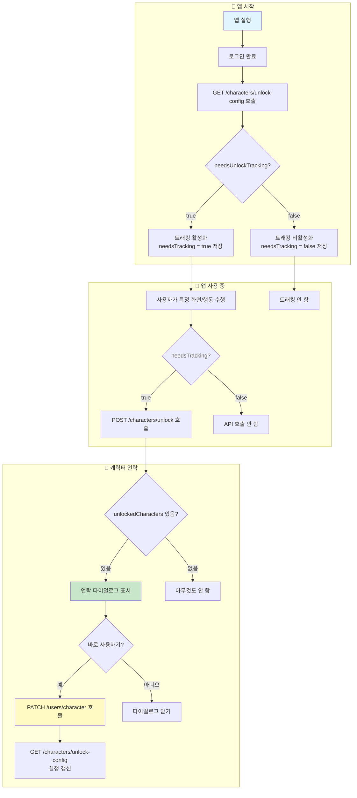
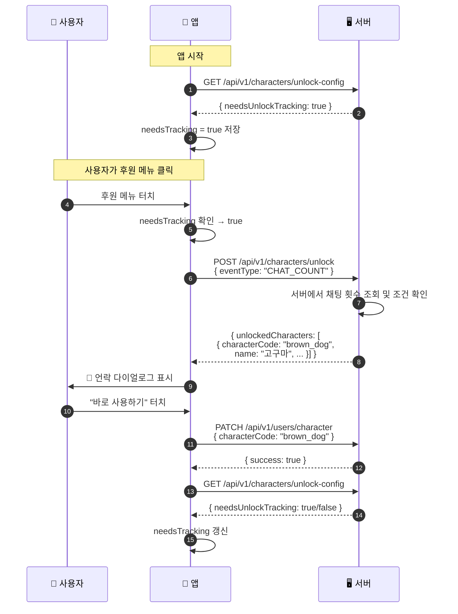
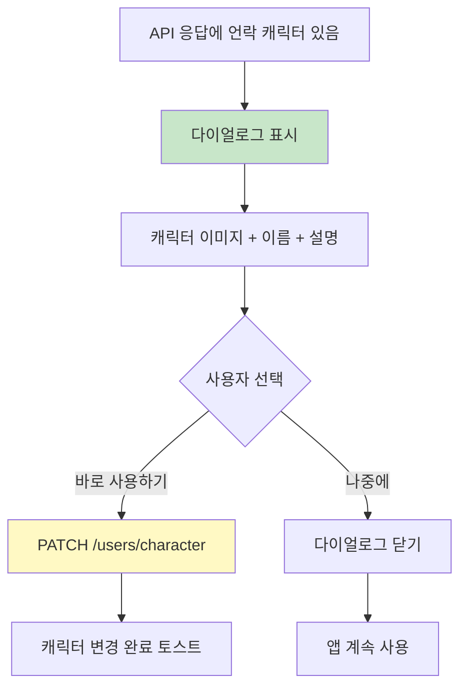

# 캐릭터 언락 시스템 - 클라이언트 구현 가이드

> **대상**: Android/iOS 프론트엔드 개발자
> **최종 수정일**: 2026-02-04

---

## 목차

1. [시스템 개요](#1-시스템-개요)
2. [전체 플로우](#2-전체-플로우)
3. [API 명세](#3-api-명세)
4. [사일런트 푸시](#4-사일런트-푸시)
5. [구현 순서](#5-구현-순서)
6. [상세 구현 가이드](#6-상세-구현-가이드)
7. [UI/UX 가이드](#7-uiux-가이드)
8. [주의사항](#8-주의사항)
9. [FAQ](#9-faq)

---

## 1. 시스템 개요

### 1.1 캐릭터 언락이란?

사용자가 앱 내에서 특정 행동(메뉴 접근, 레벨 달성 등)을 하면 **숨겨진 캐릭터가 자동으로 지급**되는 시스템입니다.

```
예시:
- 채팅 5번 이상 사용하면 → "고구마" 캐릭터 획득 (서버 검증)
- 레벨 10 달성하면 → "파란 새" 캐릭터 획득
- 첫 모임 생성하면 → "초록 개구리" 캐릭터 획득
```

### 1.2 핵심 원칙 (꼭 이해해야 함!)

| 원칙              | 설명                                            | 클라이언트가 할 일             |
| ----------------- | ----------------------------------------------- | ------------------------------ |
| **서버가 주인**   | 어떤 캐릭터가 언락되는지는 **서버만 알고 있음** | 결과만 받아서 표시             |
| **조건 숨김**     | 언락 조건을 클라이언트에 노출하면 안 됨         | 조건을 추측하는 코드 금지      |
| **트래킹 최적화** | 모든 캐릭터를 보유하면 트래킹 불필요            | 서버 설정에 따라 트래킹 ON/OFF |
| **서버 검증**     | 일부 이벤트는 서버가 직접 데이터를 검증         | payload 없이 eventType만 전송  |

### 1.3 클라이언트가 아는 것 vs 모르는 것

```
✅ 클라이언트가 아는 것:
   - "후원 메뉴에 들어가면 이벤트를 보내야 한다" (하드코딩)
   - "아직 트래킹이 필요한지 여부" (서버에서 받음)
   - "방금 언락된 캐릭터 정보" (API 응답으로 받음)

❌ 클라이언트가 모르는 것:
   - "후원 메뉴 가면 어떤 캐릭터가 언락되는지"
   - "총 몇 개의 숨겨진 캐릭터가 있는지"
   - "각 캐릭터의 언락 조건이 무엇인지"
```

---

## 2. 전체 플로우

### 2.1 앱 시작부터 캐릭터 언락까지 전체 흐름



### 2.2 시퀀스 다이어그램 - 상세 API 호출 순서



---

## 3. API 명세

### 3.1 트래킹 설정 조회

트래킹이 필요한지 확인합니다. **앱 시작 시 반드시 호출**해야 합니다.

```
GET /api/v1/characters/unlock-config
Authorization: Bearer {accessToken}
```

**응답:**

```json
{
  "needsUnlockTracking": true,
  "trackableEventTypes": ["MENU_ACCESSED", "FIRST_ACTION", "LEVEL_REACHED"]
}
```

| 필드                  | 타입     | 설명                                                                                             |
| --------------------- | -------- | ------------------------------------------------------------------------------------------------ |
| `needsUnlockTracking` | boolean  | `true`: 아직 언락 가능한 캐릭터 있음 → 트래킹 필요<br/>`false`: 모든 캐릭터 보유 → 트래킹 불필요 |
| `trackableEventTypes` | string[] | 트래킹 가능한 이벤트 타입 목록. 이 목록에 포함된 이벤트만 서버에 전송하면 됨                     |

**활용 예시:**

- `trackableEventTypes`에 `MENU_ACCESSED`가 없으면 메뉴 접근 이벤트는 전송하지 않음
- 불필요한 API 호출을 줄여 성능 최적화

---

### 3.2 언락 이벤트 전송 ⭐ 핵심 API

사용자 행동을 서버에 전송하여 캐릭터 언락을 시도합니다.

```
POST /api/v1/characters/unlock
Authorization: Bearer {accessToken}
Content-Type: application/json

// 클라이언트 검증 이벤트 (payload 필요)
{
  "eventType": "MENU_ACCESSED",
  "payload": {
    "menuId": "sponsor_menu"
  }
}

// 서버 검증 이벤트 (payload 불필요)
{
  "eventType": "CHAT_COUNT"
}
```

**요청 필드:**

| 필드        | 타입   | 필수 | 설명                                                      |
| ----------- | ------ | ---- | --------------------------------------------------------- |
| `eventType` | string | ✅   | 이벤트 타입 (아래 표 참조)                                |
| `payload`   | object | ❌   | 추가 정보. 서버 검증 이벤트 타입은 생략 가능 |

**이벤트 타입 목록:**

| eventType              | 검증 방식      | 설명               | payload 예시                       |
| ---------------------- | -------------- | ------------------ | ---------------------------------- |
| `CHAT_COUNT`           | **서버 검증**  | 채팅 횟수 기반     | 불필요 (서버에서 직접 조회)        |
| `MENU_ACCESSED`        | 클라이언트     | 특정 메뉴 접근     | `{ "menuId": "sponsor_menu" }`     |
| `SCREEN_VIEWED`        | 클라이언트     | 특정 화면 조회     | `{ "screenId": "profile_screen" }` |
| `LEVEL_REACHED`        | 클라이언트     | 특정 레벨 도달     | `{ "level": 10 }`                  |
| `FIRST_ACTION`         | 클라이언트     | 최초 특정 행동     | `{ "action": "create_meeting" }`   |
| `MEETING_PARTICIPATED` | 클라이언트     | 모임 참여          | `{ "meetingId": "..." }`           |

> **서버 검증 이벤트**: 서버가 직접 DB에서 데이터를 조회하여 조건을 확인합니다. 클라이언트가 payload를 조작할 수 없으므로 보안이 강화됩니다.

**응답:**

```json
{
  "unlockedCharacters": [
    {
      "characterCode": "brown_dog",
      "name": "갈색 강아지",
      "description": "후원자를 위한 특별한 캐릭터"
    }
  ]
}
```

| 필드                                 | 타입   | 설명                                              |
| ------------------------------------ | ------ | ------------------------------------------------- |
| `unlockedCharacters`                 | array  | 이번 요청으로 언락된 캐릭터 목록 (없으면 빈 배열) |
| `unlockedCharacters[].characterCode` | string | 캐릭터 고유 코드                                  |
| `unlockedCharacters[].name`          | string | 캐릭터 이름 (UI 표시용)                           |
| `unlockedCharacters[].description`   | string | 캐릭터 설명 (UI 표시용)                           |

**에러 응답:**

| HTTP 코드 | 에러 코드           | 설명                        |
| --------- | ------------------- | --------------------------- |
| 429       | `TOO_MANY_REQUESTS` | Rate Limit 초과 (분당 30회) |

---

### 3.3 캐릭터 목록 조회

전체 캐릭터 목록과 보유 여부를 조회합니다.

```
GET /api/v1/characters
Authorization: Bearer {accessToken}
```

**응답:**

```json
{
  "characters": [
    {
      "id": "uuid-1",
      "characterCode": "default_char",
      "name": "기본 캐릭터",
      "description": "모든 유저에게 지급되는 기본 캐릭터",
      "isDefault": true,
      "unlockHint": null,
      "isOwned": true,
      "createdAt": "2026-01-01T00:00:00Z",
      "updatedAt": "2026-01-01T00:00:00Z"
    },
    {
      "id": "uuid-2",
      "characterCode": "brown_dog",
      "name": "갈색 강아지",
      "description": "후원자를 위한 특별한 캐릭터",
      "isDefault": false,
      "unlockHint": "후원 페이지를 방문해보세요",
      "isOwned": false,
      "createdAt": "2026-01-01T00:00:00Z",
      "updatedAt": "2026-01-01T00:00:00Z"
    }
  ]
}
```

---

### 3.4 캐릭터 변경

현재 사용 캐릭터를 변경합니다.

```
PATCH /api/v1/users/character
Authorization: Bearer {accessToken}
Content-Type: application/json

{
  "characterCode": "brown_dog"
}
```

**응답:**

```json
{
  "success": true,
  "characterCode": "brown_dog"
}
```

---

## 4. 사일런트 푸시

캐릭터가 언락되면 서버에서 **사일런트 푸시**를 발송합니다. 이를 통해 다른 기기에서도 캐릭터 목록을 즉시 갱신할 수 있습니다.

### 4.1 사일런트 푸시란?

- 알림 표시 없이 백그라운드에서 앱에 데이터를 전달하는 푸시
- 사용자에게 알림 팝업이 뜨지 않음
- 앱이 백그라운드/포그라운드 상태일 때 모두 수신 가능

### 4.2 푸시 Payload 구조

```json
{
  "type": "CHARACTER_UNLOCKED",
  "characterCode": "brown_dog",
  "name": "갈색 강아지"
}
```

| 필드            | 타입   | 설명                      |
| --------------- | ------ | ------------------------- |
| `type`          | string | 푸시 타입 (고정값)        |
| `characterCode` | string | 언락된 캐릭터의 고유 코드 |
| `name`          | string | 언락된 캐릭터 이름        |

### 4.3 푸시 수신 처리

```kotlin
// FirebaseMessagingService 또는 푸시 핸들러
class AppFirebaseMessagingService : FirebaseMessagingService() {

    @Inject
    lateinit var characterRepository: CharacterRepository

    override fun onMessageReceived(remoteMessage: RemoteMessage) {
        val data = remoteMessage.data

        when (data["type"]) {
            "CHARACTER_UNLOCKED" -> handleCharacterUnlocked(data)
            // 다른 푸시 타입...
        }
    }

    private fun handleCharacterUnlocked(data: Map<String, String>) {
        val characterCode = data["characterCode"] ?: return
        val name = data["name"] ?: return

        // 캐릭터 목록 캐시 무효화 (다음 조회 시 서버에서 갱신)
        characterRepository.invalidateCache()

        // 선택적: 앱이 포그라운드면 캐릭터 목록 자동 갱신
        if (isAppInForeground()) {
            refreshCharacterListIfNeeded()
        }
    }
}
```

### 4.4 활용 시나리오

```
📱 기기 A에서 후원 메뉴 접근
    ↓
🖥️ 서버: 캐릭터 언락 + 사일런트 푸시 발송
    ↓
📱 기기 A: API 응답으로 언락 다이얼로그 표시
📱 기기 B: 사일런트 푸시 수신 → 캐릭터 목록 캐시 무효화
    ↓
📱 기기 B에서 캐릭터 목록 열면 → 최신 데이터 표시
```

### 4.5 주의사항

| 항목       | 설명                                                          |
| ---------- | ------------------------------------------------------------- |
| 중복 처리  | 같은 캐릭터에 대한 푸시가 여러 번 올 수 있음 → 멱등성 보장    |
| 오프라인   | 오프라인 시 푸시 수신 불가 → 앱 재시작 시 API로 동기화        |
| 다이얼로그 | 사일런트 푸시로는 언락 다이얼로그 표시 안 함 (API 응답에서만) |

---

## 5. 구현 순서

### 5.1 구현 체크리스트

```mermaid
flowchart LR
    subgraph Step1["1️⃣ 데이터 레이어"]
        A1[API 인터페이스 정의]
        A2[Repository 구현]
        A3[DataStore 설정]
    end

    subgraph Step2["2️⃣ 도메인 레이어"]
        B1[UseCase 생성]
        B2[Model 정의]
    end

    subgraph Step3["3️⃣ 트래커 구현"]
        C1[UnlockEventTracker 싱글톤]
        C2[트래킹 메서드 구현]
    end

    subgraph Step4["4️⃣ UI 레이어"]
        D1[언락 다이얼로그]
        D2[캐릭터 목록 화면]
    end

    subgraph Step5["5️⃣ 푸시 핸들러"]
        E1[사일런트 푸시 수신 처리]
    end

    subgraph Step6["6️⃣ 이벤트 연결"]
        F1[각 화면에 track 코드 추가]
    end

    Step1 --> Step2 --> Step3 --> Step4 --> Step5 --> Step6
```



### 5.2 상세 구현 순서

| 순서   | 작업                     | 파일/위치                     | 설명                     |
| ------ | ------------------------ | ----------------------------- | ------------------------ |
| **1**  | API 인터페이스 정의      | `data/api/CharacterApi.kt`    | Retrofit 인터페이스      |
| **2**  | Response DTO 정의        | `data/dto/`                   | API 응답 모델            |
| **3**  | Repository 인터페이스    | `domain/repository/`          | 추상 인터페이스          |
| **4**  | Repository 구현체        | `data/repository/`            | API 호출 구현            |
| **5**  | DataStore 설정           | `data/datastore/`             | `needsTracking` 저장     |
| **6**  | Domain Model 정의        | `domain/model/`               | `UnlockedCharacter` 등   |
| **7**  | UseCase 생성             | `domain/usecase/`             | 비즈니스 로직            |
| **8**  | **UnlockEventTracker**   | `presentation/common/`        | **핵심 싱글톤**          |
| **9**  | 언락 다이얼로그          | `presentation/common/dialog/` | 축하 팝업 UI             |
| **10** | 캐릭터 목록 화면         | `presentation/character/`     | 캐릭터 선택 UI           |
| **11** | **사일런트 푸시 핸들러** | `FirebaseMessagingService`    | 푸시 수신 시 캐시 무효화 |
| **12** | 각 화면에 track 연결     | 각 Screen/ViewModel           | 이벤트 발생 코드         |

---

## 6. 상세 구현 가이드

### 6.1 API 인터페이스 (Retrofit)

```kotlin
// data/api/CharacterApi.kt
interface CharacterApi {

    @GET("api/v1/characters/unlock-config")
    suspend fun getUnlockConfig(): UnlockConfigResponse

    @POST("api/v1/characters/unlock")
    suspend fun trackUnlockEvent(
        @Body request: TrackUnlockEventRequest
    ): TrackUnlockEventResponse

    @GET("api/v1/characters")
    suspend fun getCharacters(): CharacterListResponse

    @PATCH("api/v1/users/character")
    suspend fun changeCharacter(
        @Body request: ChangeCharacterRequest
    ): ChangeCharacterResponse
}
```

### 6.2 DTO 정의

```kotlin
// data/dto/UnlockConfigResponse.kt
data class UnlockConfigResponse(
    val needsUnlockTracking: Boolean,
    val trackableEventTypes: List<String>
)

// data/dto/TrackUnlockEventRequest.kt
data class TrackUnlockEventRequest(
    val eventType: String,
    val payload: Map<String, Any>? = null  // 서버 검증 이벤트는 생략 가능
)

// data/dto/TrackUnlockEventResponse.kt
data class TrackUnlockEventResponse(
    val unlockedCharacters: List<UnlockedCharacterDto>
)

data class UnlockedCharacterDto(
    val characterCode: String,
    val name: String,
    val description: String
)
```

### 6.3 DataStore 설정

```kotlin
// data/datastore/UserConfigDataStore.kt
@Singleton
class UserConfigDataStore @Inject constructor(
    private val dataStore: DataStore<Preferences>
) {
    private val needsTrackingKey = booleanPreferencesKey("needs_unlock_tracking")
    private val trackableEventTypesKey = stringSetPreferencesKey("trackable_event_types")

    val needsUnlockTracking: Flow<Boolean> = dataStore.data.map { prefs ->
        prefs[needsTrackingKey] ?: true  // 기본값: true (트래킹 함)
    }

    val trackableEventTypes: Flow<Set<String>> = dataStore.data.map { prefs ->
        prefs[trackableEventTypesKey] ?: emptySet()
    }

    suspend fun setUnlockConfig(needsTracking: Boolean, eventTypes: List<String>) {
        dataStore.edit { prefs ->
            prefs[needsTrackingKey] = needsTracking
            prefs[trackableEventTypesKey] = eventTypes.toSet()
        }
    }
}
```

### 6.4 UnlockEventTracker (⭐ 가장 중요!)

```kotlin
// presentation/common/event/UnlockEventTracker.kt
@Singleton
class UnlockEventTracker @Inject constructor(
    private val characterApi: CharacterApi,
    private val userConfigDataStore: UserConfigDataStore,
    private val unlockDialogManager: UnlockDialogManager
) {
    private val scope = CoroutineScope(SupervisorJob() + Dispatchers.IO)

    // 현재 트래킹 필요 여부 (메모리 캐시)
    private var needsTracking = true

    // 트래킹 가능한 이벤트 타입 (메모리 캐시)
    private var trackableEventTypes: Set<String> = emptySet()

    init {
        // DataStore 변경 감지
        scope.launch {
            userConfigDataStore.needsUnlockTracking.collect { needs ->
                needsTracking = needs
            }
        }
        scope.launch {
            userConfigDataStore.trackableEventTypes.collect { types ->
                trackableEventTypes = types
            }
        }
    }

    /**
     * 앱 시작 시 호출 - 트래킹 설정 동기화
     */
    suspend fun syncConfig() {
        runCatching {
            val response = characterApi.getUnlockConfig()
            userConfigDataStore.setUnlockConfig(
                needsTracking = response.needsUnlockTracking,
                eventTypes = response.trackableEventTypes
            )
        }.onFailure { e ->
            Timber.w(e, "Failed to sync unlock config")
        }
    }

    /**
     * 해당 이벤트 타입이 트래킹 가능한지 확인
     */
    private fun shouldTrack(eventType: String): Boolean {
        return needsTracking && trackableEventTypes.contains(eventType)
    }

    // ============================================================
    // 아래 메서드들을 각 화면에서 호출
    // ============================================================

    /**
     * 메뉴 접근 이벤트
     *
     * @param menuId 메뉴 ID (예: "sponsor_menu", "secret_menu")
     */
    fun trackMenuAccess(menuId: String) {
        if (!shouldTrack("MENU_ACCESSED")) return

        scope.launch {
            trackEventInternal(
                eventType = "MENU_ACCESSED",
                payload = mapOf("menuId" to menuId)
            )
        }
    }

    /**
     * 화면 조회 이벤트
     *
     * @param screenId 화면 ID (예: "profile_screen")
     */
    fun trackScreenView(screenId: String) {
        if (!shouldTrack("SCREEN_VIEWED")) return

        scope.launch {
            trackEventInternal(
                eventType = "SCREEN_VIEWED",
                payload = mapOf("screenId" to screenId)
            )
        }
    }

    /**
     * 레벨 도달 이벤트
     *
     * @param level 도달한 레벨
     */
    fun trackLevelReached(level: Int) {
        if (!shouldTrack("LEVEL_REACHED")) return

        scope.launch {
            trackEventInternal(
                eventType = "LEVEL_REACHED",
                payload = mapOf("level" to level)
            )
        }
    }

    /**
     * 최초 행동 이벤트
     *
     * @param action 행동 ID (예: "create_meeting", "first_chat")
     */
    fun trackFirstAction(action: String) {
        if (!shouldTrack("FIRST_ACTION")) return

        scope.launch {
            trackEventInternal(
                eventType = "FIRST_ACTION",
                payload = mapOf("action" to action)
            )
        }
    }

    /**
     * 채팅 횟수 이벤트 (서버 검증)
     *
     * 서버가 직접 채팅 횟수를 조회하므로 payload 불필요
     */
    fun trackChatCount() {
        if (!shouldTrack("CHAT_COUNT")) return

        scope.launch {
            trackEventInternal(eventType = "CHAT_COUNT")
        }
    }

    // ============================================================
    // 내부 구현
    // ============================================================

    private suspend fun trackEventInternal(
        eventType: String,
        payload: Map<String, Any>? = null
    ) {
        runCatching {
            val response = characterApi.trackUnlockEvent(
                TrackUnlockEventRequest(eventType = eventType, payload = payload)
            )

            // 언락된 캐릭터가 있으면 다이얼로그 표시
            if (response.unlockedCharacters.isNotEmpty()) {
                unlockDialogManager.showUnlockDialog(
                    response.unlockedCharacters.map { it.toDomain() }
                )

                // 설정 갱신 (모든 캐릭터 보유 시 트래킹 OFF)
                syncConfig()
            }
        }.onFailure { e ->
            // 실패해도 앱 동작에 영향 없음 (Fire-and-Forget)
            Timber.w(e, "Failed to track event: $eventType")
        }
    }
}
```

### 6.5 각 화면에서 트래커 사용

```kotlin
// presentation/sponsor/SponsorScreen.kt
@Composable
fun SponsorScreen(
    viewModel: SponsorViewModel = hiltViewModel()
) {
    // 트래커 주입
    val eventTracker = LocalUnlockEventTracker.current

    // ⚠️ 화면 진입 시 이벤트 전송 (하드코딩!)
    LaunchedEffect(Unit) {
        eventTracker.trackMenuAccess("sponsor_menu")
    }

    // UI 구현...
}
```

```kotlin
// presentation/meeting/CreateMeetingViewModel.kt
@HiltViewModel
class CreateMeetingViewModel @Inject constructor(
    private val eventTracker: UnlockEventTracker,
    // ...
) : ViewModel() {

    fun onMeetingCreated() {
        // 모임 생성 로직...

        // ⚠️ 모임 생성 완료 시 이벤트 전송 (하드코딩!)
        eventTracker.trackFirstAction("create_meeting")
    }
}
```

### 6.6 앱 시작 시 설정 동기화

```kotlin
// presentation/main/MainViewModel.kt
@HiltViewModel
class MainViewModel @Inject constructor(
    private val eventTracker: UnlockEventTracker
) : ViewModel() {

    init {
        viewModelScope.launch {
            // ⚠️ 앱 시작 시 반드시 호출!
            eventTracker.syncConfig()
        }
    }
}
```

---

## 7. UI/UX 가이드

### 7.1 언락 다이얼로그 플로우



### 7.2 다이얼로그 디자인 권장사항

```
┌─────────────────────────────────────┐
│                                     │
│         🎉 새 캐릭터 획득!           │
│                                     │
│         ┌─────────────┐             │
│         │             │             │
│         │  캐릭터     │             │
│         │  이미지     │             │
│         │             │             │
│         └─────────────┘             │
│                                     │
│          갈색 강아지                 │
│   후원자를 위한 특별한 캐릭터        │
│                                     │
│  ┌─────────────┐ ┌─────────────┐   │
│  │   나중에    │ │ 바로 사용하기│   │
│  └─────────────┘ └─────────────┘   │
│                                     │
└─────────────────────────────────────┘
```

### 7.3 캐릭터 목록 화면

```
┌─────────────────────────────────────┐
│  ← 캐릭터 선택                      │
├─────────────────────────────────────┤
│                                     │
│  ┌─────┐  ┌─────┐  ┌─────┐        │
│  │ 😀 │  │ 🐕 │  │ 🔒 │        │
│  │     │  │     │  │ ??? │        │
│  └─────┘  └─────┘  └─────┘        │
│   기본     갈색      ???           │
│  (사용중)  강아지   (미보유)        │
│                                     │
│  ┌─────┐  ┌─────┐  ┌─────┐        │
│  │ 🔒 │  │ 🔒 │  │ 🔒 │        │
│  │ ??? │  │ ??? │  │ ??? │        │
│  └─────┘  └─────┘  └─────┘        │
│   ???      ???      ???           │
│                                     │
└─────────────────────────────────────┘

- 보유 캐릭터: 선명하게 표시, 터치 시 선택 가능
- 미보유 캐릭터: 실루엣 + 자물쇠, 터치 불가
- 현재 사용 중: 체크 표시 또는 "사용중" 라벨
```

---

## 8. 주의사항

### 8.1 절대 하면 안 되는 것들

| 금지 사항                              | 이유                    |
| -------------------------------------- | ----------------------- |
| 언락 조건을 클라이언트에 하드코딩      | 서버 권위 원칙 위반     |
| 트래킹 실패 시 에러 다이얼로그 표시    | Fire-and-Forget 패턴    |
| API 응답의 `unlockCondition` 필드 사용 | 해당 필드는 응답에 없음 |

### 8.2 반드시 해야 하는 것들

| 필수 사항                      | 설명                                        |
| ------------------------------ | ------------------------------------------- |
| 앱 시작 시 `syncConfig()` 호출 | 트래킹 필요 여부 동기화                     |
| 이벤트 코드 하드코딩           | 새 이벤트 추가 시 앱 업데이트 필요          |
| Rate Limit 고려                | 분당 30회 제한 (동일 이벤트 중복 전송 자제) |
| 언락 후 `syncConfig()` 호출    | 모든 캐릭터 보유 시 트래킹 OFF              |

### 8.3 Rate Limiting

```
제한: 분당 30회

권장 사항:
- 동일 화면에서 중복 호출 방지 (LaunchedEffect 사용)
- 빠른 화면 전환 시 디바운싱 고려
- 429 에러 시 조용히 무시 (사용자에게 표시 X)
```

---

## 9. FAQ

### Q1. 새로운 언락 조건이 추가되면?

**서버**: DB에 새 캐릭터 + 조건 추가
**클라이언트**: 해당 화면에 `track()` 코드 추가 → **앱 업데이트 필요**

```kotlin
// 예: 비밀 메뉴가 새로 추가되면
// SecretMenuScreen.kt에 추가
LaunchedEffect(Unit) {
    eventTracker.trackMenuAccess("secret_menu")
}
```

---

### Q2. 한 번에 여러 캐릭터가 언락되면?

`unlockedCharacters` 배열에 여러 개가 담겨옴
→ 다이얼로그를 **순차적으로** 표시

```kotlin
suspend fun showUnlockDialogs(characters: List<UnlockedCharacter>) {
    characters.forEach { character ->
        showSingleUnlockDialog(character)
        // 사용자가 닫을 때까지 대기
    }
}
```

---

### Q3. 트래킹 API가 실패하면?

**아무것도 안 함!** (Fire-and-Forget)

- 에러 다이얼로그 표시 ❌
- 재시도 ❌
- 로그만 남김 ✅

```kotlin
runCatching {
    characterApi.trackUnlockEvent(...)
}.onFailure { e ->
    Timber.w(e, "Track event failed - ignoring")
    // 끝. 아무것도 안 함.
}
```

---

### Q4. 오프라인일 때 이벤트가 발생하면?

**무시함.** 오프라인 큐잉 불필요.

- 네트워크 복구 후 같은 행동을 다시 하면 그때 언락됨
- 이미 보유한 캐릭터는 중복 지급 안 됨 (서버에서 체크)

---

### Q5. 캐릭터 이미지는 어디서 가져옴?

`characterCode`를 기반으로 로컬 리소스 매핑

```kotlin
fun getCharacterImage(characterCode: String): Int {
    return when (characterCode) {
        "default_char" -> R.drawable.char_default
        "brown_dog" -> R.drawable.char_brown_dog
        "golden_cat" -> R.drawable.char_golden_cat
        else -> R.drawable.char_unknown  // 미보유 캐릭터용 실루엣
    }
}
```

---

## 부록: 이벤트 발생 위치 목록

현재 구현된 이벤트와 발생 위치:

| eventType       | payload                        | 발생 위치         | 검증 방식     | 비고             |
| --------------- | ------------------------------ | ----------------- | ------------- | ---------------- |
| `CHAT_COUNT`    | 불필요                         | 채팅 전송 후      | **서버 검증** | ViewModel        |
| `MENU_ACCESSED` | `{ menuId: "sponsor_menu" }`   | 후원 메뉴 화면    | 클라이언트    | `LaunchedEffect` |
| `MENU_ACCESSED` | `{ menuId: "secret_menu" }`    | 비밀 메뉴 화면    | 클라이언트    | `LaunchedEffect` |
| `LEVEL_REACHED` | `{ level: N }`                 | 레벨업 처리 후    | 클라이언트    | ViewModel        |
| `FIRST_ACTION`  | `{ action: "create_meeting" }` | 모임 생성 완료 후 | 클라이언트    | ViewModel        |

> **Note**: 새 이벤트 추가 시 이 표에도 추가해주세요!

---

## 문의

질문이 있으시면 백엔드 담당자에게 문의해주세요.
