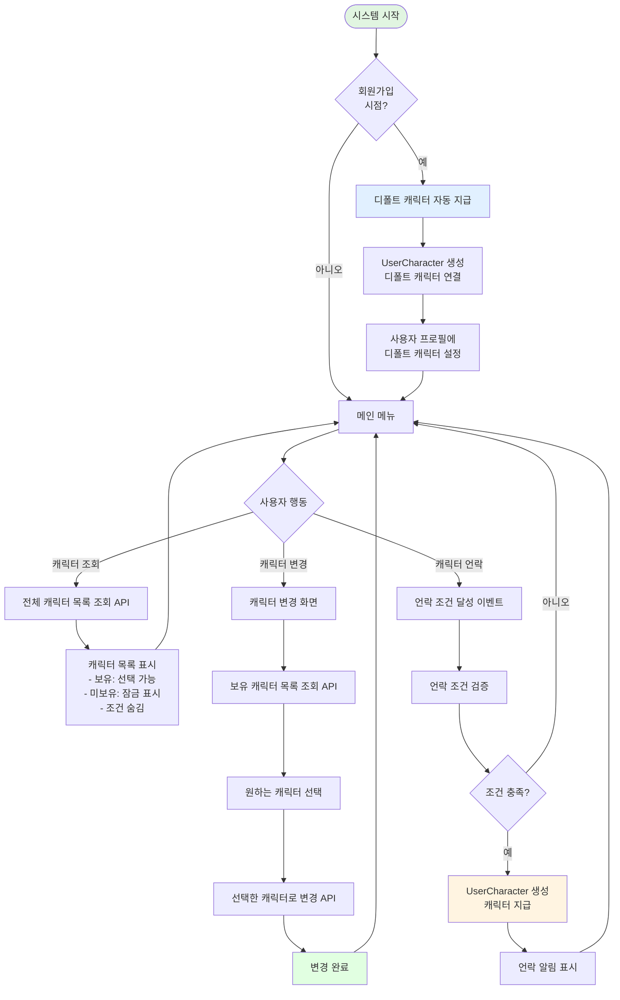
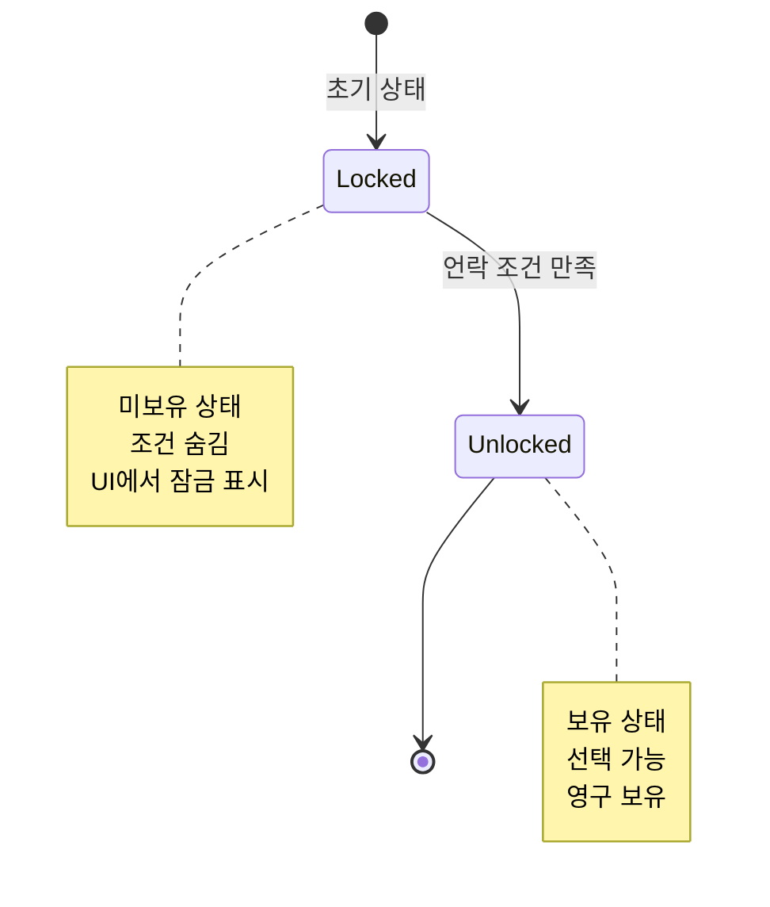
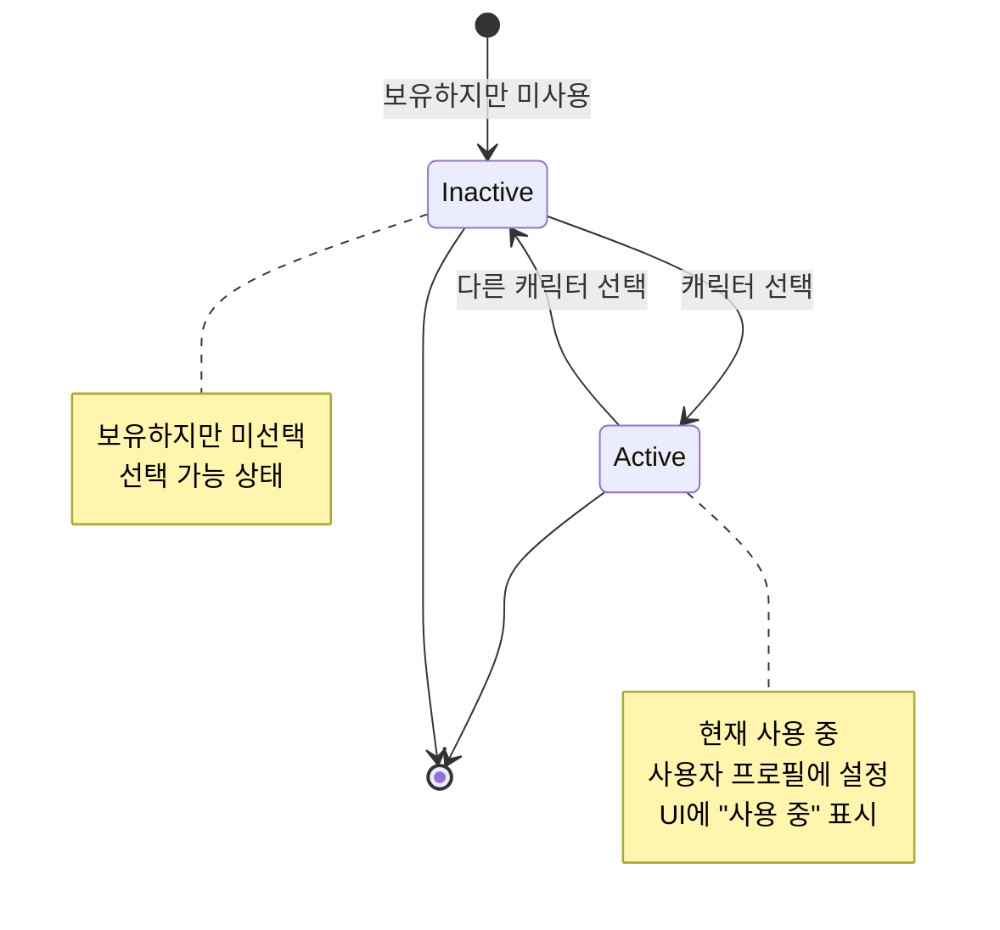

# 캐릭터 보유 및 관리 시스템 플로우

## 개요

캐릭터 보유 및 관리 시스템은 **사용자가 여러 캐릭터를 수집하고 선택하여 사용할 수 있는 시스템**입니다.

### 특징

- **다양한 캐릭터**: 여러 개의 캐릭터가 존재하며, 각각 고유한 특성 보유
- **언락 시스템**: 특정 조건을 만족하면 새로운 캐릭터 획득 가능
- **자유로운 변경**: 보유한 캐릭터는 언제든지 자유롭게 선택 및 변경 가능
- **디폴트 캐릭터**: 회원가입 시 기본 캐릭터 1개 자동 지급
- **호기심 유발**: 미언락 캐릭터의 언락 조건은 의도적으로 숨김 처리

---

## 시스템 구조

### 역할 (Role)

1. **사용자** (스마트폰 앱 사용자)

### 핵심 개념

- **캐릭터 코드**: 각 캐릭터의 고유 식별자 (서버 관리)
- **디폴트 캐릭터**: 모든 신규 가입자에게 자동으로 지급되는 기본 캐릭터
- **언락 조건**: 캐릭터를 획득하기 위해 만족해야 하는 조건 (추후 확장 예정)
- **보유 캐릭터**: 사용자가 언락하여 소유한 캐릭터 목록

---

## 데이터 구조

### Character 엔티티

| 필드명          | 타입     | 설명                         | 필수 여부 | 기본값    |
| --------------- | -------- | ---------------------------- | --------- | --------- |
| id              | UUID     | 캐릭터 고유 식별자           | 필수      | 자동 생성 |
| characterCode   | String   | 캐릭터 코드 (고유)           | 필수      | -         |
| name            | String   | 캐릭터 이름                  | 필수      | -         |
| description     | String   | 캐릭터 설명                  | 필수      | -         |
| unlockCondition | String   | 언락 조건 (JSON 또는 텍스트) | 선택      | null      |
| isDefault       | Boolean  | 디폴트 캐릭터 여부           | 필수      | false     |
| createdAt       | DateTime | 생성일                       | 필수      | 자동 생성 |
| updatedAt       | DateTime | 수정일                       | 필수      | 자동 갱신 |

### UserCharacter 엔티티 (N:M 중간 테이블)

| 필드명      | 타입     | 설명           | 필수 여부 | 기본값    |
| ----------- | -------- | -------------- | --------- | --------- |
| id          | UUID     | 고유 식별자    | 필수      | 자동 생성 |
| userId      | UUID     | 사용자 ID (FK) | 필수      | -         |
| characterId | UUID     | 캐릭터 ID (FK) | 필수      | -         |
| unlockedAt  | DateTime | 언락 일시      | 필수      | 자동 생성 |

**관계**

- User 1 : N UserCharacter
- Character 1 : N UserCharacter

---

## 전체 플로우

### 플로우 다이어그램



---

## 주요 플로우

### 1. 회원가입 시 디폴트 캐릭터 지급

#### 1.1 회원가입 프로세스 내 처리

- **시점**: 회원가입 API 처리 중
- **동작**:
  1. 사용자 계정 생성
  2. 디폴트 캐릭터 조회 (`isDefault: true`)
  3. UserCharacter 엔티티 생성 (userId + characterId)
  4. 사용자 프로필의 `characterCode` 필드에 디폴트 캐릭터 코드 설정
- **특징**: 사용자는 별도 액션 없이 자동으로 첫 캐릭터 보유

---

### 2. 캐릭터 목록 조회

#### 2.1 전체 캐릭터 조회

- **API 호출**: 전체 캐릭터 목록 조회 API 호출
- **서버 처리 로직**:
  1. 모든 캐릭터 목록 조회
  2. 사용자의 보유 캐릭터 목록 조회 (UserCharacter 테이블)
  3. 각 캐릭터에 보유 여부 플래그 추가
  4. **언락 조건은 응답에 포함하지 않음** (호기심 유발)
- **응답 데이터**:
  - 캐릭터 목록 배열
  - 각 캐릭터별: id, characterCode, name, description, isOwned (보유 여부)

#### 2.2 UI 표시

**캐릭터 카드 레이아웃**

- **보유한 캐릭터**:
  - 캐릭터 이미지 (선명하게 표시)
  - 캐릭터 이름
  - 캐릭터 설명
  - "선택" 버튼 (현재 사용 중인 캐릭터는 "사용 중" 표시)

- **미보유 캐릭터**:
  - 캐릭터 이미지 (흐릿하게 또는 실루엣)
  - 캐릭터 이름 (또는 "???")
  - 설명: "이 캐릭터는 아직 잠겨있습니다"
  - 잠금 아이콘 표시
  - **언락 조건 미표시** (호기심 유발 전략)

---

### 3. 캐릭터 변경

#### 3.1 캐릭터 변경 화면 진입

- **시점**: 사용자가 설정 또는 프로필 메뉴에서 "캐릭터 변경" 선택
- **동작**:
  - 보유 캐릭터 목록 조회 API 호출
  - 현재 사용 중인 캐릭터 표시

#### 3.2 캐릭터 선택 및 변경

- **API 호출**: 캐릭터 변경 API 호출
- **전달 데이터**:
  - characterCode (변경할 캐릭터 코드)
- **서버 처리 로직**:
  1. 요청한 캐릭터가 사용자의 보유 캐릭터인지 검증 (UserCharacter 확인)
  2. 보유하지 않은 캐릭터면 에러 반환
  3. 사용자 프로필의 `characterCode` 필드 업데이트
- **응답**: 변경 성공 메시지, 업데이트된 사용자 정보
- **특징**: 언제든지 자유롭게 변경 가능 (쿨타임, 비용 없음)

#### 3.3 변경 완료

- 클라이언트: 변경 성공 알림 표시
- UI: 선택된 캐릭터로 화면 갱신

---

### 4. 캐릭터 언락

#### 4.1 언락 조건 달성

- **트리거**: 특정 이벤트 발생 (레벨업, 업적 달성 등)
- **서버 처리 로직**:
  1. 이벤트 발생 시점에 언락 조건 검증
  2. 조건을 만족하는 캐릭터 조회
  3. 이미 보유한 캐릭터는 제외
  4. 신규 언락 캐릭터에 대해 UserCharacter 생성

**언락 조건 예시 (추후 확장)**

- 레벨 5 달성
- 누적 경험치 1000 획득
- 특정 미션 완료
- 특정 날짜/이벤트 참여

#### 4.2 언락 알림

- **시점**: 언락 조건 만족 직후
- **동작**:
  - 클라이언트에 푸시 알림 또는 인앱 알림
  - "새로운 캐릭터를 획득했습니다!" 메시지
  - 언락된 캐릭터 정보 표시
  - "바로 사용하기" 또는 "나중에" 선택 옵션

#### 4.3 바로 사용하기

- **선택 시**: 언락된 캐릭터로 즉시 변경 (캐릭터 변경 API 호출)
- **나중에 선택 시**: 보유 캐릭터 목록에만 추가, 기존 캐릭터 유지

---

## 주요 규칙

### 디폴트 캐릭터 규칙

1. **고정된 1개**: 서버에서 `isDefault: true`로 설정된 캐릭터 1개
2. **회원가입 시 자동 지급**: 모든 신규 사용자에게 자동으로 지급
3. **변경 불가**: 디폴트 캐릭터 속성은 관리자만 변경 가능
4. **삭제 불가**: 디폴트 캐릭터는 시스템에서 삭제할 수 없음

### 캐릭터 보유 규칙

1. **중복 보유 불가**: 동일한 캐릭터를 2번 이상 보유할 수 없음
2. **영구 보유**: 한번 언락한 캐릭터는 영구적으로 보유
3. **보유 여부 검증**: 캐릭터 변경 시 반드시 보유 여부 확인

### 캐릭터 변경 규칙

1. **자유로운 변경**: 보유한 캐릭터는 언제든지 변경 가능
2. **제한 없음**: 쿨타임, 비용, 횟수 제한 없음
3. **즉시 반영**: 변경 즉시 사용자 프로필에 반영

### 언락 조건 규칙

1. **조건 숨김**: 클라이언트에 언락 조건 노출 안 함 (호기심 유발)
2. **서버 검증**: 언락 조건은 서버에서만 검증
3. **자동 지급**: 조건 만족 시 자동으로 캐릭터 지급
4. **추후 확장**: 현재는 미정, 추후 다양한 조건 추가 예정

---

## 상태(Status) 관리

### 캐릭터 보유 상태



### 캐릭터 사용 상태



---

## 시간 순서 예시

### 타임라인

```mermaid
gantt
    title 캐릭터 관련 플로우 타임라인
    dateFormat HH:mm:ss
    axisFormat %H:%M:%S

    section 회원가입
    사용자 계정 생성              :done, signup1, 00:00:00, 500ms
    디폴트 캐릭터 조회            :done, default1, 00:00:00.5, 100ms
    UserCharacter 생성           :done, uc1, 00:00:00.6, 100ms
    사용자 프로필 설정            :done, profile1, 00:00:00.7, 100ms
    회원가입 완료                 :milestone, m1, 00:00:00.8, 0s

    section 캐릭터 목록 조회
    메인 메뉴 진입                :done, menu1, 00:00:05, 500ms
    캐릭터 목록 조회 API         :crit, list1, 00:00:05.5, 300ms
    보유 여부 플래그 추가         :done, flag1, 00:00:05.8, 100ms
    UI 렌더링                     :done, render1, 00:00:05.9, 500ms

    section 캐릭터 변경
    캐릭터 변경 선택              :done, change1, 00:00:10, 1s
    보유 캐릭터 조회 API          :crit, owned1, 00:00:11, 200ms
    새 캐릭터 선택                :done, select1, 00:00:11.2, 2s
    변경 API 호출                 :crit, update1, 00:00:13.2, 300ms
    변경 완료 알림                :done, notif1, 00:00:13.5, 500ms

    section 캐릭터 언락
    레벨업 이벤트 발생            :done, event1, 00:00:20, 500ms
    언락 조건 검증                :done, check1, 00:00:20.5, 200ms
    조건 만족 확인                :crit, meet1, 00:00:20.7, 100ms
    UserCharacter 생성           :done, uc2, 00:00:20.8, 200ms
    언락 알림 표시                :active, notif2, 00:00:21, 1s
```

---

## UI/UX 고려사항

### 캐릭터 목록 화면

**레이아웃**

- 그리드 형식 (2열 또는 3열)
- 스크롤 가능
- 각 캐릭터 카드 형태

**캐릭터 카드 (보유)**

- 캐릭터 이미지 (선명)
- 캐릭터 이름
- 간단한 설명
- "선택" 버튼 또는 "사용 중" 뱃지

**캐릭터 카드 (미보유)**

- 캐릭터 실루엣 또는 흐릿한 이미지
- 캐릭터 이름 숨김 또는 "???" 표시
- 잠금 아이콘 (🔒)
- "잠겨있음" 상태 표시
- 클릭 시: "이 캐릭터는 특별한 조건을 만족해야 획득할 수 있습니다" 안내

---

### 캐릭터 변경 화면

**화면 구성**

- 제목: "캐릭터 선택"
- 현재 사용 중인 캐릭터 강조 표시
- 보유 캐릭터 목록 (그리드)

**선택 인터랙션**

- 캐릭터 카드 클릭 시 미리보기
- "이 캐릭터로 변경하시겠습니까?" 확인 모달
- "변경" 또는 "취소" 버튼

**변경 완료**

- "캐릭터가 변경되었습니다" 토스트 메시지
- 변경된 캐릭터로 UI 즉시 갱신

---

### 캐릭터 언락 알림

**알림 형식**

- 전체 화면 모달 또는 하프 모달
- 애니메이션 효과 (캐릭터 등장)
- "새로운 캐릭터를 획득했습니다!" 제목

**내용**

- 언락된 캐릭터 이미지
- 캐릭터 이름
- 캐릭터 설명
- 축하 메시지

**액션 버튼**

- "바로 사용하기" (기본 액션)
- "나중에" (모달 닫기)

---

## 확장 가능성

### 향후 추가 가능 기능

1. **다양한 언락 조건**
   - 레벨 기반 (예: 레벨 10 달성)
   - 경험치 기반 (예: 누적 5000 경험치)
   - 미션 기반 (예: "첫 번째 업적 달성")
   - 시간 기반 (예: "7일 연속 접속")
   - 이벤트 기반 (예: "특별 이벤트 참여")

2. **캐릭터 능력치**
   - 캐릭터마다 고유한 스탯 또는 스킬
   - 레벨업 보너스 차별화
   - 경험치 획득량 차이

3. **캐릭터 등급 시스템**
   - 일반, 레어, 에픽, 레전더리 등급
   - 등급별 획득 난이도 차별화

4. **캐릭터 스킨 시스템**
   - 동일 캐릭터의 다양한 외형
   - 스킨 별도 언락 또는 구매

5. **캐릭터 조합 효과**
   - 특정 캐릭터 조합 시 보너스
   - 컬렉션 보상 시스템

6. **캐릭터 도감**
   - 모든 캐릭터 정보 열람
   - 수집률 표시
   - 업적 연동

7. **캐릭터 거래/선물**
   - 친구 간 캐릭터 선물 (제한적)
   - 특별 이벤트 캐릭터 교환

8. **캐릭터 스토리**
   - 각 캐릭터의 배경 스토리
   - 스토리 언락 조건

---

## 보안 고려사항

### 언락 조건 보안

- **클라이언트 노출 금지**: 언락 조건은 서버에서만 관리
- **조건 검증**: 모든 언락 조건은 서버에서 검증
- **부정 획득 방지**: 클라이언트 조작으로 캐릭터 획득 불가

### 데이터 무결성

- **보유 여부 검증**: 캐릭터 변경 시 반드시 서버에서 보유 여부 확인
- **중복 방지**: 동일 캐릭터 중복 보유 방지 (DB 유니크 제약)
- **트랜잭션 처리**: 캐릭터 지급 시 트랜잭션으로 원자성 보장

---

## 참고사항

### 캐릭터 시스템의 목적

- **수집 욕구 자극**: 다양한 캐릭터로 지속적인 참여 동기 부여
- **개성 표현**: 사용자가 선호하는 캐릭터로 자신을 표현
- **호기심 유발**: 언락 조건 숨김으로 탐험 및 도전 유도
- **성취감 제공**: 새로운 캐릭터 획득으로 성취감 경험

### 호기심 유발 전략

- **언락 조건 숨김**: 의도적으로 조건을 노출하지 않음
- **실루엣 표시**: 미보유 캐릭터의 윤곽만 표시
- **신비감 조성**: "특별한 조건" 등 모호한 힌트만 제공
- **커뮤니티 형성**: 사용자 간 정보 공유 유도

### 사용자 경험 최적화

- **빠른 변경**: 캐릭터 변경은 즉시 반영, 제약 없음
- **명확한 피드백**: 언락, 변경 등 모든 액션에 명확한 피드백
- **직관적인 UI**: 보유/미보유 상태를 한눈에 파악 가능
- **성취감 극대화**: 언락 순간 화려한 연출로 기쁨 증폭
