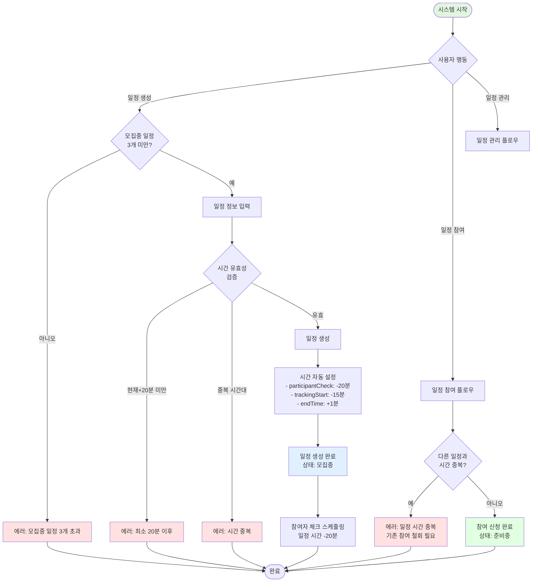
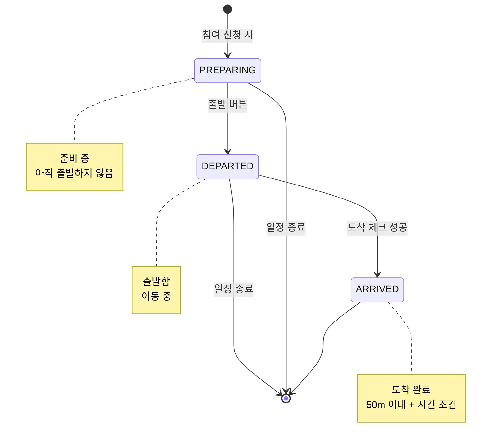
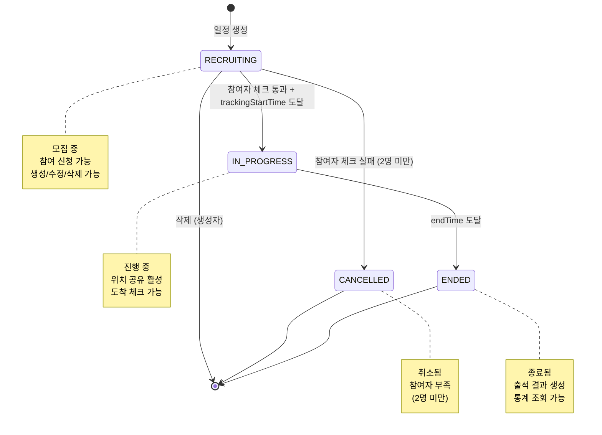
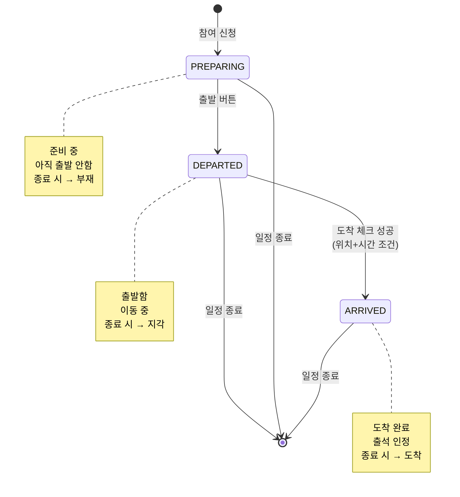
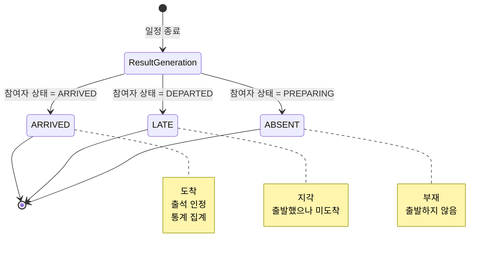
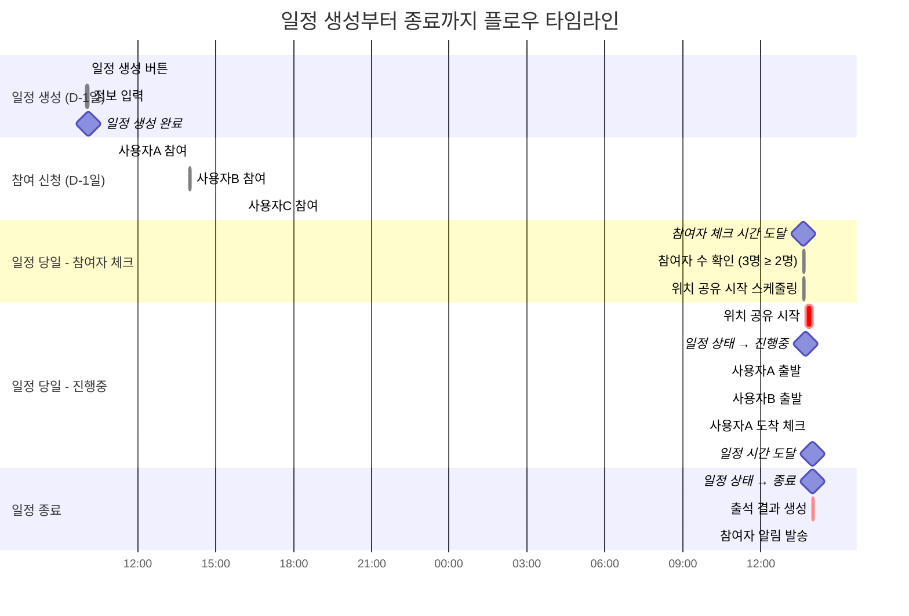

# 모임 일정 시스템 플로우

## 개요

모임 일정 시스템은 **모임 내에서 오프라인 만남을 계획하고 참여자들의 출석을 관리하는 시스템**입니다.

### 특징

- **모든 참여자가 일정 생성**: 모임의 모든 멤버가 일정 생성 가능
- **최대 3개 모집중 일정**: 모집중 상태의 일정은 최대 3개까지 존재
- **중복 방지 시스템**: 일정 시간 중복 및 참여 중복 방지
- **실시간 상태 관리**: 준비중 → 출발 → 도착 단계별 상태 추적
- **자동 출석 체크**: 위치 기반 자동 도착 확인
- **출석률 통계**: 개인별, 일정별, 모임별 출석률 통계

---

## 시스템 구조

### 역할 (Role)

1. **일정 생성자** - 일정을 만든 모임 참여자
2. **일정 참여자** - 일정에 참여 신청한 모임 멤버

### 핵심 개념

- **일정 상태**: 모집중, 진행중, 종료됨, 취소됨
- **참여자 상태**: 준비중, 출발, 도착 (진행중 일정에만 해당)
- **출석 결과**: 도착, 지각, 부재 (종료됨 일정에만 해당)
- **참여자 체크 시간**: 일정 시간 -20분 (최소 2명 필요)
- **위치 공유 시작 시간**: 일정 시간 -15분
- **도착 체크 범위**: 목적지로부터 50m 이내

---

## 데이터 구조

### Event 엔티티

| 필드명            | 타입     | 설명                                                  | 필수 여부 | 기본값          |
| ----------------- | -------- | ----------------------------------------------------- | --------- | --------------- |
| id                | UUID     | 일정 고유 식별자                                      | 필수      | 자동 생성       |
| groupId           | UUID     | 모임 ID (FK)                                          | 필수      | -               |
| createdBy         | UUID     | 생성자 사용자 ID (FK)                                 | 필수      | -               |
| title             | String   | 일정 제목                                             | 필수      | -               |
| description       | String   | 일정 설명                                             | 필수      | -               |
| eventTime         | DateTime | 일정 시작 시간                                        | 필수      | -               |
| trackingStartTime | DateTime | 위치 공유 시작 시간                                   | 필수      | eventTime -15분 |
| endTime           | DateTime | 일정 종료 시간                                        | 필수      | eventTime +1분  |
| locationAddress   | String   | 도로명 주소                                           | 필수      | -               |
| locationLatitude  | Decimal  | 위도                                                  | 필수      | -               |
| locationLongitude | Decimal  | 경도                                                  | 필수      | -               |
| status            | Enum     | 일정 상태 (RECRUITING, IN_PROGRESS, ENDED, CANCELLED) | 필수      | RECRUITING      |
| createdAt         | DateTime | 생성일                                                | 필수      | 자동 생성       |
| updatedAt         | DateTime | 수정일                                                | 필수      | 자동 갱신       |

### EventParticipant 엔티티

| 필드명     | 타입     | 설명                                       | 필수 여부 | 기본값    |
| ---------- | -------- | ------------------------------------------ | --------- | --------- |
| id         | UUID     | 고유 식별자                                | 필수      | 자동 생성 |
| eventId    | UUID     | 일정 ID (FK)                               | 필수      | -         |
| userId     | UUID     | 사용자 ID (FK)                             | 필수      | -         |
| status     | Enum     | 참여자 상태 (PREPARING, DEPARTED, ARRIVED) | 필수      | PREPARING |
| joinedAt   | DateTime | 참여 신청 일시                             | 필수      | 자동 생성 |
| departedAt | DateTime | 출발 시간                                  | 선택      | null      |
| arrivedAt  | DateTime | 도착 시간                                  | 선택      | null      |

### EventResult 엔티티

| 필드명    | 타입     | 설명                              | 필수 여부 | 기본값    |
| --------- | -------- | --------------------------------- | --------- | --------- |
| id        | UUID     | 고유 식별자                       | 필수      | 자동 생성 |
| eventId   | UUID     | 일정 ID (FK)                      | 필수      | -         |
| userId    | UUID     | 사용자 ID (FK)                    | 필수      | -         |
| result    | Enum     | 출석 결과 (ARRIVED, LATE, ABSENT) | 필수      | -         |
| createdAt | DateTime | 결과 생성일                       | 필수      | 자동 생성 |

**관계**

- Group 1 : N Event
- Event 1 : N EventParticipant
- Event 1 : N EventResult
- User 1 : N EventParticipant
- User 1 : N EventResult

---

## 전체 플로우

### 플로우 다이어그램



---

## 주요 플로우

### 1. 일정 생성

#### 1.1 모집중 일정 개수 확인

- **시점**: 일정 생성 버튼 클릭 시
- **서버 검증**: 해당 모임의 모집중 일정 개수 확인
  - Event 테이블에서 `groupId = 해당 모임` AND `status = RECRUITING` 조회
  - 개수 >= 3이면 에러: "모집중인 일정은 최대 3개까지 생성할 수 있습니다"

#### 1.2 일정 정보 입력

**입력 필드**

1. **일정 제목** (필수)
   - 최소 2자, 최대 50자

2. **일정 설명** (필수)
   - 최소 10자, 최대 500자

3. **일정 일시** (필수)
   - 날짜 + 시간 선택
   - 현재 시간보다 최소 20분 이후여야 함

4. **장소** (필수)
   - 도로명 주소 (클라이언트에서 검색)
   - 위도, 경도 (클라이언트에서 자동 추출)

#### 1.3 시간 유효성 검증

**검증 조건**

1. **최소 시간 조건**: 현재 시간 + 20분 이후
   - 예: 현재 2026-01-17 15:00 → 일정 시간은 2026-01-17 15:21 이상

2. **중복 시간 검증**: 모집중 + 진행중 일정과 시간 중복 방지
   - 신규 일정 시간: T
   - 검증 범위: T -15분 ~ T
   - 기존 일정들의 trackingStartTime ~ eventTime과 겹치면 에러

**중복 검증 예시**

```
기존 일정: 2026-01-17 14:00
  → 위치 공유 시작: 13:45
  → 일정 시간: 14:00

신규 일정 생성 시도:
  ✅ 13:30 → 가능 (13:15~13:30, 기존 13:45~14:00과 겹치지 않음)
  ❌ 13:40 → 불가 (13:25~13:40, 기존 13:45~14:00과 5분 겹침)
  ❌ 13:50 → 불가 (13:35~13:50, 기존 13:45~14:00과 겹침)
  ❌ 14:00 → 불가 (13:45~14:00, 기존과 완전 중복)
  ✅ 14:16 → 가능 (14:01~14:16, 기존 13:45~14:00과 겹치지 않음)
```

#### 1.4 일정 생성 API 호출

- **API 호출**: 일정 생성 API 호출
- **전달 데이터**:
  - groupId
  - title (일정 제목)
  - description (일정 설명)
  - eventTime (일정 시간)
  - locationAddress (도로명 주소)
  - locationLatitude (위도)
  - locationLongitude (경도)

**서버 처리 로직**

1. 사용자가 해당 모임의 참여자인지 확인 (GroupMember)
2. 모집중 일정 개수 확인 (3개 미만)
3. 시간 유효성 검증
   - 현재 시간 + 20분 이후 확인
   - 중복 시간 검증
4. Event 엔티티 생성
   - createdBy: 현재 사용자 ID
   - trackingStartTime: eventTime -15분
   - endTime: eventTime +1분
   - status: RECRUITING
5. EventParticipant 생성 (생성자 자동 참여)
   - eventId: 생성된 일정 ID
   - userId: 현재 사용자 ID
   - status: PREPARING

- **응답**: 생성된 일정 정보

#### 1.5 일정 생성 완료

- 클라이언트: 생성 완료 알림
- 일정 상세 화면으로 전환
- 생성자는 자동으로 참여 상태 (준비중)

---

### 2. 일정 참여

#### 2.1 일정 목록 조회

- **권한**: 모임의 모든 참여자
- **조회 대상**: 해당 모임의 모집중 일정 목록
- **표시 정보**:
  - 일정 제목, 설명
  - 일정 시간
  - 장소
  - 현재 참여 인원 / 모임 최대 인원
  - 본인 참여 여부

#### 2.2 참여 신청

- **시점**: 모집중 일정의 "참여하기" 버튼 클릭
- **API 호출**: 일정 참여 API 호출
- **전달 데이터**: eventId

**서버 처리 로직**

1. 일정 상태 확인 (status = RECRUITING만 가능)
2. 이미 참여 중인지 확인
   - 참여 중이면 에러: "이미 참여 중인 일정입니다"
3. 최대 인원 확인
   - 현재 참여자 수 >= 모임 maxMembers이면 에러: "참여 인원이 가득 찼습니다"
4. **중복 일정 확인** (핵심 검증)
   - 사용자가 참여 중인 모든 일정 조회
   - 각 일정의 trackingStartTime ~ endTime 범위 확인
   - 신규 일정의 trackingStartTime ~ endTime과 겹치는지 검증
   - 겹치면 에러: "다른 일정과 시간이 중복됩니다. 기존 일정 참여를 철회하세요"
5. EventParticipant 생성
   - eventId: 일정 ID
   - userId: 현재 사용자 ID
   - status: PREPARING

- **응답**: 참여 성공 메시지

**중복 일정 검증 예시**

```
사용자가 A모임 1번 일정 참여 중:
  일정 시간: 2026-01-17 14:00
  위치 공유 시작: 13:45 (trackingStartTime)
  일정 종료: 14:01 (endTime = eventTime +1분)
  검증 범위: 13:45 ~ 14:01

B모임 1번 일정 참여 시도:
  ❌ 일정 시간 13:50 (trackingStartTime 13:35, endTime 13:51) → 겹침 (13:45~13:51)
  ❌ 일정 시간 14:00 (trackingStartTime 13:45, endTime 14:01) → 완전 중복
  ❌ 일정 시간 13:40 (trackingStartTime 13:25, endTime 13:41) → 겹침 (13:40~13:41)
  ✅ 일정 시간 14:16 (trackingStartTime 14:01, endTime 14:17) → 가능 (13:45~14:01과 겹치지 않음)
```

**주요 에러 케이스**

- 모집중 상태가 아닌 일정
- 이미 참여 중인 일정
- 참여 인원 초과
- 다른 일정과 시간 중복

#### 2.3 참여 완료

- 클라이언트: 참여 완료 알림
- 일정 참여자 목록에 추가
- 상태: 준비중

---

### 3. 일정 참여 철회

#### 3.1 철회 조건

- **권한**: 본인이 참여 신청한 일정
- **가능 상태**: 모집중 일정만 철회 가능
- **제약**: 진행중 또는 종료됨 상태는 철회 불가

#### 3.2 철회 처리

- **API 호출**: 일정 참여 철회 API 호출
- **전달 데이터**: eventId

**서버 처리 로직**

1. 일정 상태 확인 (status = RECRUITING만 가능)
2. 사용자가 해당 일정 참여자인지 확인
3. EventParticipant 삭제

- **응답**: 철회 완료 메시지

---

### 4. 일정 진행 (자동 상태 전환)

#### 4.1 참여자 체크 (일정 시간 -20분)

- **트리거**: participantCheckTime 도달 (BullMQ 스케줄링)
- **시점**: 일정 시간 -20분
- **목적**: 최소 참여 인원(2명) 충족 여부 확인
- **처리**:
  1. 현재 참여자 수 확인
  2. **2명 이상**: 위치 공유 시작 스케줄링 예약 (trackingStartTime에 실행)
  3. **1명 이하**: Event.status = CANCELLED로 업데이트 (일정 취소)

**예시**

```
일정 시간: 2026-01-17 14:00
participantCheckTime: 2026-01-17 13:40

Case 1: 참여자 3명
13:40:00 → 참여자 체크: 3명 ≥ 2명 ✅
         → 위치 공유 시작 스케줄링 예약 (13:45에 실행)

Case 2: 참여자 1명
13:40:00 → 참여자 체크: 1명 < 2명 ❌
         → Event.status = CANCELLED
         → 참여자에게 취소 알림 발송
```

#### 4.2 모집중 → 진행중

- **트리거**: trackingStartTime 도달 (참여자 체크 통과 후 스케줄링)
- **시점**: 일정 시간 -15분
- **전제조건**: 참여자 체크 통과 (2명 이상)
- **처리**:
  1. Event.status = IN_PROGRESS로 업데이트
  2. 참여자들에게 푸시 알림
     - "일정이 곧 시작됩니다! 출발 준비를 해주세요"
  3. 위치 공유 시작 (별도 플로우)

**예시**

```
일정 시간: 2026-01-17 14:00
trackingStartTime: 2026-01-17 13:45

13:45:00 → Event.status = IN_PROGRESS
         → 위치 공유 시작
         → 참여자 알림 발송
```

#### 4.3 모집중 → 취소됨

- **트리거**: 참여자 체크 실패 (participantCheckTime 도달 시)
- **시점**: 일정 시간 -20분
- **조건**: 참여자 수 < 2명
- **처리**:
  1. Event.status = CANCELLED로 업데이트
  2. 참여자들에게 푸시 알림
     - "참여 인원 부족으로 일정이 취소되었습니다"

**예시**

```
일정 시간: 2026-01-17 14:00
participantCheckTime: 2026-01-17 13:40
참여자: 1명 (생성자만)

13:40:00 → 참여자 체크 실패 (1명 < 2명)
         → Event.status = CANCELLED
         → 참여자 취소 알림 발송
```

#### 4.4 진행중 상태에서 참여자 상태 변경

**상태 전환 흐름**



**1) 출발 상태 변경**

- **권한**: 본인
- **조건**: 일정 상태가 IN_PROGRESS이고 본인 상태가 PREPARING
- **API 호출**: 출발 API 호출
- **처리**:
  - EventParticipant.status = DEPARTED
  - EventParticipant.departedAt = 현재 시간

**2) 도착 체크**

- **권한**: 본인
- **조건**:
  1. 일정 상태가 IN_PROGRESS
  2. 본인 상태가 DEPARTED
  3. 현재 시간이 trackingStartTime ~ eventTime 범위 내
  4. 현재 위치가 목적지로부터 50m 이내

- **API 호출**: 도착 체크 API 호출
- **전달 데이터**:
  - eventId
  - currentLatitude (현재 위도)
  - currentLongitude (현재 경도)

**서버 처리 로직**

1. 일정 정보 조회
2. 시간 조건 확인
   - trackingStartTime <= 현재 시간 <= eventTime
   - 범위 밖이면 에러: "도착 체크 가능 시간이 아닙니다"
3. 위치 조건 확인 (Haversine 공식)
   - 목적지 좌표와 현재 좌표 간 거리 계산
   - 거리 > 50m이면 에러: "목적지로부터 50m 이내에 있어야 합니다"
4. 상태 업데이트
   - EventParticipant.status = ARRIVED
   - EventParticipant.arrivedAt = 현재 시간

- **응답**: 도착 체크 성공 메시지

**도착 체크 예시**

```
일정 시간: 2026-01-17 14:00
trackingStartTime: 2026-01-17 13:45
endTime: 2026-01-17 14:01

도착 체크 가능 시간: 13:45:00 ~ 14:00:59
도착 체크 가능 거리: 목적지로부터 50m 이내

✅ 13:50, 30m → 성공
✅ 14:00, 20m → 성공
❌ 14:01, 10m → 실패 (시간 초과)
❌ 13:50, 60m → 실패 (거리 초과)
```

---

### 5. 일정 종료 (자동 상태 전환)

#### 5.1 진행중 → 종료됨

- **트리거**: endTime 도달 (BullMQ 스케줄링)
- **시점**: 일정 시간 +1분
- **처리**:
  1. Event.status = ENDED로 업데이트
  2. 출석 결과 자동 생성 (EventResult)
  3. 참여자들에게 푸시 알림
     - "일정이 종료되었습니다. 출석 결과를 확인하세요"

**예시**

```
일정 시간: 2026-01-17 14:00
endTime: 2026-01-17 14:01

14:01:00 → Event.status = ENDED
         → 출석 결과 생성
         → 참여자 알림 발송
```

#### 5.2 출석 결과 생성

**매핑 규칙**
| 참여자 상태 (진행중 종료 시점) | 출석 결과 |
|-------------------------------|-----------|
| ARRIVED | ARRIVED (도착) |
| DEPARTED | LATE (지각) |
| PREPARING | ABSENT (부재) |

**처리 로직**

1. 해당 일정의 모든 EventParticipant 조회
2. 각 참여자의 status에 따라 EventResult 생성
   ```
   status = ARRIVED  → result = ARRIVED
   status = DEPARTED → result = LATE
   status = PREPARING → result = ABSENT
   ```
3. EventResult 엔티티 일괄 생성
4. 결과는 자동 확정, 수정 불가

---

### 6. 일정 수정 및 삭제

#### 6.1 일정 수정

- **권한**: 생성자만 가능
- **가능 상태**: 모집중 일정만 수정 가능
- **수정 가능 항목**:
  - 일정 제목
  - 일정 설명
  - 일정 시간 (유효성 검증 재실행)
  - 장소 (주소, 위도, 경도)

**서버 처리 로직**

1. 생성자 확인 (createdBy = 현재 사용자)
2. 일정 상태 확인 (status = RECRUITING)
3. 시간 변경 시 유효성 검증 재실행
4. Event 업데이트
   - 시간 변경 시 trackingStartTime, endTime 자동 재계산
5. 참여자들에게 알림 발송

#### 6.2 일정 삭제

- **권한**: 생성자만 가능
- **가능 상태**: 모집중 일정만 삭제 가능

- **API 호출**: 일정 삭제 API 호출

**서버 처리 로직**

1. 생성자 확인 (createdBy = 현재 사용자)
2. 일정 상태 확인 (status = RECRUITING)
3. 트랜잭션 시작
   - EventParticipant 삭제 (모든 참여자)
   - Event 삭제
4. 참여자들에게 삭제 알림 발송
   - "참여하신 일정이 취소되었습니다"

- **응답**: 삭제 완료 메시지

---

## 주요 규칙

### 일정 생성 규칙

1. **모집중 일정 최대 3개**: 하나의 모임당 모집중 일정은 3개까지
2. **최소 생성 시간**: 현재 시간으로부터 최소 20분 이후
3. **시간 중복 방지**: 모집중/진행중 일정과 15분 범위 중복 불가
4. **모든 참여자 생성 가능**: 모임장뿐 아니라 모든 멤버가 생성 가능

### 일정 참여 규칙

1. **모집중만 참여 가능**: 모집중 상태의 일정만 참여 신청 가능
2. **중복 참여 불가**: trackingStartTime ~ endTime 범위가 중복되는 다른 일정에는 참여 불가
3. **최대 인원 제한**: 모임의 maxMembers까지만 참여 가능
4. **생성자 자동 참여**: 일정 생성 시 생성자는 자동 참여 (준비중)

### 일정 상태 전환 규칙

1. **참여자 체크**: participantCheckTime (일정 시간 -20분) 참여자 수 확인
2. **모집중 → 진행중**: trackingStartTime (일정 시간 -15분) 참여자 체크 통과 시 자동 전환
3. **모집중 → 취소됨**: participantCheckTime에 참여자 2명 미만 시 자동 전환
4. **진행중 → 종료됨**: endTime (일정 시간 +1분) 자동 전환
5. **자동 전환**: BullMQ 스케줄링으로 자동 처리

### 참여자 상태 규칙

1. **준비중**: 기본 상태, 아직 출발하지 않음
2. **출발**: 사용자가 수동으로 상태 변경
3. **도착**: 위치 + 시간 조건 만족 시만 가능

### 도착 체크 규칙

1. **시간 조건**: trackingStartTime ~ eventTime 범위 내
2. **위치 조건**: 목적지로부터 50m 이내
3. **상태 조건**: 본인 상태가 DEPARTED여야 함

### 출석 결과 규칙

1. **자동 생성**: 일정 종료 시 자동 생성
2. **매핑 규칙**: ARRIVED → 도착, DEPARTED → 지각, PREPARING → 부재
3. **수정 불가**: 한 번 생성된 결과는 수정 불가

---

## 상태(Status) 관리

### 일정 상태



### 참여자 상태 (진행중 일정)



### 출석 결과 (종료된 일정)



---

## 출석 통계

### 개인별 출석률

**계산 방식**

```
출석률 = (도착 횟수 / 전체 참여 횟수) × 100%

예시:
전체 참여: 10회
도착: 8회
지각: 1회
부재: 1회

출석률 = (8 / 10) × 100% = 80%
```

**조회 위치**

- 사용자 프로필 화면
- 개인 통계 화면

### 일정별 출석률

**계산 방식**

```
일정 출석률 = (도착 인원 / 전체 참여 인원) × 100%

예시:
전체 참여자: 10명
도착: 7명
지각: 2명
부재: 1명

출석률 = (7 / 10) × 100% = 70%
```

**조회 위치**

- 일정 상세 화면 (종료된 일정)
- 일정 결과 화면

### 모임별 참여자 출석 통계

**표시 정보**

- 참여자별 전체 참여 횟수
- 참여자별 도착/지각/부재 횟수
- 참여자별 출석률

**조회 위치**

- 모임 관리 화면 (모임장)
- 모임 통계 화면

---

## 시간 순서 예시

### 타임라인



---

## UI/UX 고려사항

### 일정 생성 화면

**입력 필드**

1. **일정 제목**
   - 플레이스홀더: "일정 제목 (2-50자)"

2. **일정 설명**
   - 멀티라인 텍스트
   - 플레이스홀더: "일정에 대한 설명 (10-500자)"

3. **일정 일시**
   - 날짜 선택기 + 시간 선택기
   - 최소 시간 안내: "현재로부터 최소 20분 이후"

4. **장소 검색**
   - 주소 검색 API 연동
   - 선택 시 위도/경도 자동 추출
   - 지도 미리보기

**유효성 검사 메시지**

- "일정은 현재로부터 최소 20분 이후여야 합니다"
- "해당 시간대에 다른 일정이 있습니다"
- "모집중인 일정은 최대 3개까지 생성할 수 있습니다"

---

### 일정 목록 화면

**일정 카드**

- 일정 제목
- 일정 시간 (D-day 표시)
- 장소 (주소)
- 참여 인원 표시 (예: 5/20)
- 본인 참여 여부 배지
- 상태 배지 (모집중/진행중/종료됨)

**필터/정렬**

- 상태별 필터 (모집중/진행중/종료됨/전체)
- 시간순 정렬 (최신순/오래된순)

---

### 일정 상세 화면

**모집중 일정**

- 일정 정보 (제목, 설명, 시간, 장소)
- 지도 (목적지 표시)
- 참여자 목록
- "참여하기" 버튼 (미참여 시)
- "참여 철회" 버튼 (참여 시)
- "수정" / "삭제" 버튼 (생성자만)

**진행중 일정**

- 일정 정보
- 지도 + 실시간 위치 (위치 공유 플로우)
- 참여자 목록 + 상태 표시
  - 준비중: 🔵
  - 출발: 🟡
  - 도착: 🟢
- "출발" 버튼 (준비중 → 출발)
- "도착 체크" 버튼 (출발 → 도착)

**종료된 일정**

- 일정 정보
- 출석 결과 표시
  - 도착: 🟢 (이름)
  - 지각: 🟡 (이름)
  - 부재: 🔴 (이름)
- 출석률 통계
- 개인 출석 기록

---

### 출발 및 도착 체크 화면

**출발 버튼**

- "출발하기" 버튼
- 클릭 시 확인 모달
- "출발하시겠습니까?" → 확인 시 상태 변경

**도착 체크 버튼**

- "도착 체크" 버튼
- 클릭 시 위치 확인
- 성공: "도착 완료!" 알림
- 실패:
  - "목적지로부터 50m 이내에 있어야 합니다 (현재 거리: XXm)"
  - "도착 체크는 13:45 ~ 14:00 사이에만 가능합니다"

---

### 출석 결과 화면

**일정 출석 결과**

- 원형 차트 (도착/지각/부재 비율)
- 참여자별 출석 상태 목록
- 출석률 표시

**개인 출석 통계**

- 전체 참여 횟수
- 도착/지각/부재 횟수
- 출석률 (도착 횟수 / 전체 참여 횟수)
- 출석 기록 타임라인

---

## 확장 가능성

### 향후 추가 가능 기능

1. **일정 알림 강화**
   - D-1일, D-day 오전 알림
   - 출발 시간 추천 (교통 정보 기반)
   - 늦을 것 같은 경우 자동 알림

2. **일정 템플릿**
   - 자주 사용하는 장소 즐겨찾기
   - 반복 일정 생성
   - 일정 복사 기능

3. **상세 출석 통계**
   - 월별 출석률 추이
   - 요일별 출석 분석
   - 참여자 간 비교

4. **패널티 시스템**
   - 부재 횟수에 따른 제재
   - 출석률 기반 등급제
   - 모임 내 신뢰도 점수

5. **보상 시스템**
   - 완벽 출석 배지
   - 출석 스트릭 (연속 출석)
   - 경험치 및 레벨업

6. **일정 공유**
   - 다른 모임에 일정 공유
   - 외부 캘린더 연동 (Google Calendar)
   - 일정 초대 링크

7. **위치 기반 기능 강화**
   - 경로 안내 (네비게이션 연동)
   - 예상 도착 시간 표시
   - 실시간 위치 공유 (위치 공유 플로우)

---

## 보안 고려사항

### 위치 정보 보안

- **위치 데이터 암호화**: 위도/경도 데이터 암호화 저장
- **접근 권한 제한**: 해당 일정 참여자만 위치 정보 조회 가능
- **위치 공유 시간 제한**: trackingStartTime ~ eventTime 범위로 제한

### 시간 검증

- **서버 시간 기준**: 모든 시간 검증은 서버 시간 기준
- **클라이언트 시간 조작 방지**: 도착 체크 시 서버 시간으로 검증
- **타임존 처리**: UTC 기준 저장, 클라이언트 로컬 타임존 변환

### 데이터 무결성

- **중복 참여 방지**: DB 유니크 제약 (eventId + userId)
- **상태 전환 검증**: 상태 전환 시 이전 상태 확인
- **트랜잭션 처리**: 출석 결과 생성 시 트랜잭션으로 원자성 보장

---

## 참고사항

### 일정 시스템의 목적

- **오프라인 만남 활성화**: 온라인 모임을 넘어 실제 만남 촉진
- **출석 관리 자동화**: 수동 출석 체크 대신 위치 기반 자동화
- **참여 동기 부여**: 출석률 통계로 지속적 참여 유도
- **책임감 강화**: 참여 신청 후 불참 시 기록 남음

### 15분 위치 공유 전략

- **충분한 준비 시간**: 15분 전부터 출발 상태 확인
- **늦지 않도록 유도**: 일찍 출발하도록 동기 부여
- **실시간 위치 추적**: 다른 참여자들의 이동 상황 공유 (위치 공유 플로우)

### 50m 도착 범위 이유

- **GPS 오차 고려**: 일반적인 GPS 오차 범위 포함
- **유연성 제공**: 건물 진입, 주차 등 여유 공간 확보
- **부정 방지**: 너무 넓으면 실제 미도착 가능성

### 출석 결과 자동 확정 전략

- **공정성**: 수동 수정으로 인한 불공정 방지
- **신뢰성**: 시스템 기반 자동 판정으로 객관성 확보
- **간편성**: 관리자 개입 없이 자동 처리
