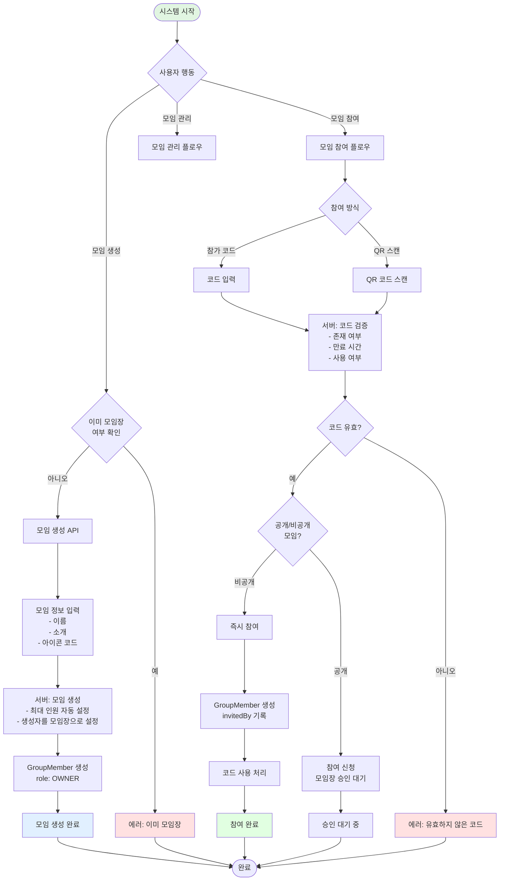
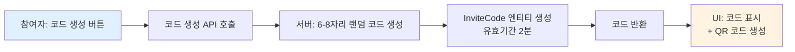
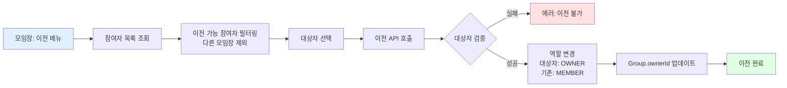
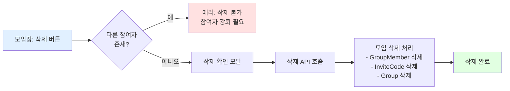
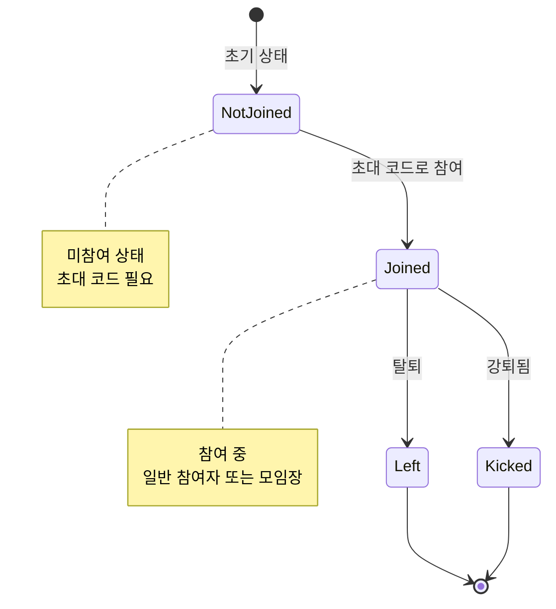
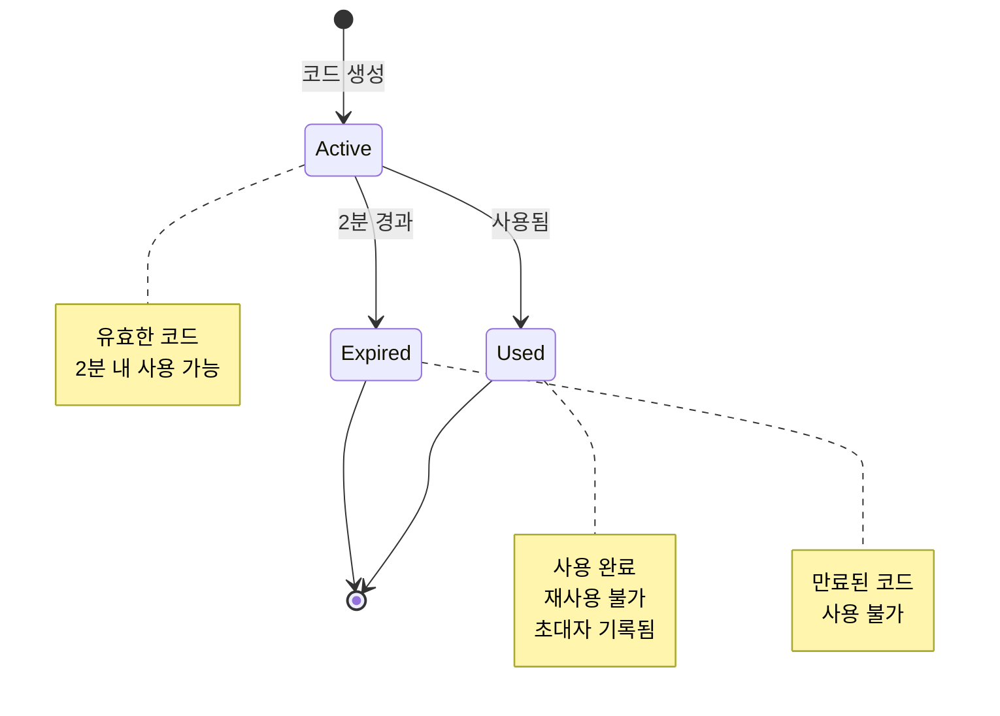
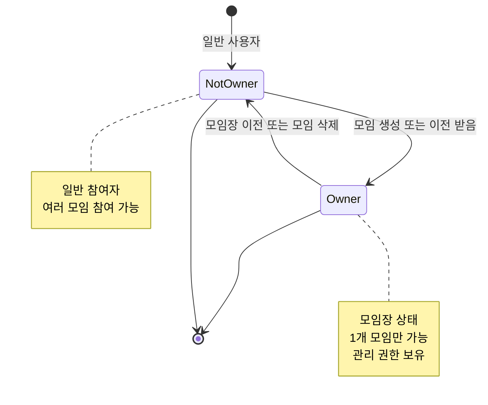

# 모임 시스템 플로우

## 개요

모임 시스템은 **사용자들이 그룹을 생성하고 참여하여 함께 활동할 수 있는 커뮤니티 시스템**입니다.

### 특징

- **모임 생성 및 관리**: 사용자가 직접 모임을 생성하고 관리
- **모임장 제한**: 1인당 1개의 모임만 모임장으로 운영 가능
- **다중 모임 참여**: 일반 참여자는 여러 모임에 제한 없이 참여 가능
- **초대 코드 시스템**: 일회성 코드 또는 QR 코드로 간편한 참여
- **공개/비공개 모임**: 모임 공개 여부 설정 가능
- **모임장 이전**: 모임장 권한을 다른 참여자에게 이전 가능

---

## 시스템 구조

### 역할 (Role)

1. **모임장** - 모임 생성자이자 관리자
2. **일반 참여자** - 모임에 참여한 멤버

### 핵심 개념

- **모임장**: 모임을 생성한 사용자, 모임 관리 권한 보유
- **참가 코드**: 일회성 초대 코드 (2분 유효, 1회 사용)
- **QR 코드**: 참가 코드를 QR 형태로 인코딩한 것
- **공개/비공개 모임**: 모임 공개 여부 (MVP에서는 비공개만 활성화)
- **최대 인원**: 서버에서 지정한 모임 최대 참여 인원

---

## 데이터 구조

### Group 엔티티

| 필드명      | 타입     | 설명                          | 필수 여부 | 기본값      |
| ----------- | -------- | ----------------------------- | --------- | ----------- |
| id          | UUID     | 모임 고유 식별자              | 필수      | 자동 생성   |
| name        | String   | 모임 이름                     | 필수      | -           |
| description | String   | 모임 소개                     | 필수      | -           |
| iconCode    | String   | 아이콘 코드 (클라이언트 전달) | 필수      | -           |
| ownerId     | UUID     | 모임장 사용자 ID (FK)         | 필수      | -           |
| maxMembers  | Integer  | 최대 참여 인원                | 필수      | 서버 설정값 |
| isPublic    | Boolean  | 공개 모임 여부                | 필수      | false       |
| createdAt   | DateTime | 생성일                        | 필수      | 자동 생성   |
| updatedAt   | DateTime | 수정일                        | 필수      | 자동 갱신   |

### GroupMember 엔티티 (N:M 중간 테이블)

| 필드명    | 타입     | 설명                  | 필수 여부 | 기본값    |
| --------- | -------- | --------------------- | --------- | --------- |
| id        | UUID     | 고유 식별자           | 필수      | 자동 생성 |
| groupId   | UUID     | 모임 ID (FK)          | 필수      | -         |
| userId    | UUID     | 사용자 ID (FK)        | 필수      | -         |
| role      | Enum     | 역할 (OWNER, MEMBER)  | 필수      | MEMBER    |
| joinedAt  | DateTime | 참여 일시             | 필수      | 자동 생성 |
| invitedBy | UUID     | 초대자 사용자 ID (FK) | 선택      | null      |

**관계**

- User 1 : N GroupMember
- Group 1 : N GroupMember

### InviteCode 엔티티

| 필드명    | 타입     | 설명                  | 필수 여부 | 기본값      |
| --------- | -------- | --------------------- | --------- | ----------- |
| id        | UUID     | 고유 식별자           | 필수      | 자동 생성   |
| groupId   | UUID     | 모임 ID (FK)          | 필수      | -           |
| code      | String   | 초대 코드 (랜덤 생성) | 필수      | -           |
| createdBy | UUID     | 코드 생성자 ID (FK)   | 필수      | -           |
| expiresAt | DateTime | 만료 시간             | 필수      | 생성 후 2분 |
| isUsed    | Boolean  | 사용 여부             | 필수      | false       |
| usedBy    | UUID     | 사용자 ID (FK)        | 선택      | null        |
| usedAt    | DateTime | 사용 일시             | 선택      | null        |
| createdAt | DateTime | 생성일                | 필수      | 자동 생성   |

---

## 전체 플로우

### 플로우 다이어그램



---

## 주요 플로우

### 1. 모임 생성

#### 1.1 모임장 자격 확인

- **시점**: 모임 생성 버튼 클릭 시
- **서버 검증**: 해당 사용자가 이미 모임장인 모임이 있는지 확인
  - GroupMember 테이블에서 `userId = 현재 사용자` AND `role = OWNER` 조회
  - 존재하면 에러 반환: "이미 모임장으로 참여 중인 모임이 있습니다"

#### 1.2 모임 정보 입력

**입력 필드**

1. **모임 이름** (필수)
   - 최소 2자, 최대 30자

2. **모임 소개** (필수)
   - 최소 10자, 최대 500자

3. **아이콘 코드** (필수)
   - 클라이언트가 텍스트로 전달
   - 서버는 검증 없이 그대로 저장

4. **공개/비공개** (필수)
   - 기본값: 비공개 (false)
   - MVP에서는 비공개만 활성화

#### 1.3 모임 생성 API 호출

- **API 호출**: 모임 생성 API 호출
- **전달 데이터**:
  - name (모임 이름)
  - description (모임 소개)
  - iconCode (아이콘 코드)
  - isPublic (공개 여부, 기본 false)

**서버 처리 로직**

1. 사용자의 모임장 자격 재확인
2. Group 엔티티 생성
   - name, description, iconCode 저장
   - ownerId: 현재 사용자 ID
   - maxMembers: 서버 설정값 (예: 50)
   - isPublic: 입력값 또는 false
3. GroupMember 엔티티 생성
   - groupId: 생성된 모임 ID
   - userId: 현재 사용자 ID
   - role: OWNER
   - invitedBy: null (자신이 생성)
4. 트랜잭션으로 원자적 처리

- **응답**: 생성된 모임 정보

#### 1.4 모임 생성 완료

- 클라이언트: 생성 완료 알림 표시
- 모임 상세 화면으로 전환

---

### 2. 모임 참여

#### 2.1 참가 코드 생성

**생성 주체**

- 모임의 **모든 참여자** (모임장 + 일반 참여자)

**생성 플로우**



- **API 호출**: 참가 코드 생성 API 호출
- **전달 데이터**: groupId

**서버 처리 로직**

1. 사용자가 해당 모임의 참여자인지 검증 (GroupMember 확인)
2. 6-8자리 랜덤 코드 생성 (영숫자 조합)
3. InviteCode 엔티티 생성
   - code: 생성된 코드
   - groupId: 모임 ID
   - createdBy: 현재 사용자 ID
   - expiresAt: 현재 시간 + 2분
   - isUsed: false
4. 코드 반환

- **응답**: 생성된 코드, 만료 시간

**UI 표시**

- 코드를 크게 표시
- QR 코드 자동 생성 (코드 인코딩)
- 유효기간 카운트다운 (2분)
- 복사 버튼 제공
- "이 코드는 2분간 유효하며, 1회만 사용 가능합니다" 안내

#### 2.2 참가 코드로 참여

**참여 방식**

1. **코드 직접 입력**
   - 사용자가 6-8자리 코드 입력
2. **QR 코드 스캔**
   - QR 스캔 후 자동으로 코드 추출

- **API 호출**: 모임 참여 API 호출
- **전달 데이터**: inviteCode

**서버 처리 로직**

1. 코드 검증
   - InviteCode 테이블에서 코드 조회
   - 존재하지 않으면 에러: "유효하지 않은 코드입니다"
   - expiresAt < 현재 시간이면 에러: "만료된 코드입니다"
   - isUsed = true이면 에러: "이미 사용된 코드입니다"
2. 모임 정보 조회 (groupId)
3. 이미 해당 모임에 참여 중인지 확인
   - 참여 중이면 에러: "이미 참여 중인 모임입니다"
4. 최대 인원 확인
   - 현재 참여자 수 >= maxMembers이면 에러: "모임 인원이 가득 찼습니다"
5. 공개/비공개 확인
   - **비공개 모임 (isPublic: false)**: 즉시 참여
   - **공개 모임 (isPublic: true)**: 참여 신청 생성, 모임장 승인 대기
6. **비공개 모임 참여 처리**:
   - GroupMember 생성
     - groupId: 모임 ID
     - userId: 현재 사용자 ID
     - role: MEMBER
     - invitedBy: 코드 생성자 ID (InviteCode.createdBy)
   - InviteCode 업데이트
     - isUsed: true
     - usedBy: 현재 사용자 ID
     - usedAt: 현재 시간

- **응답**: 참여 성공 메시지, 모임 정보

**주요 에러 케이스**

- 유효하지 않은 코드
- 만료된 코드 (2분 경과)
- 이미 사용된 코드
- 이미 참여 중인 모임
- 모임 인원 초과

#### 2.3 참여 완료

- 클라이언트: 참여 완료 알림 표시
- 모임 상세 화면으로 전환
- "모임에 참여했습니다" 메시지

---

### 3. 모임 관리

#### 3.1 모임 정보 수정

- **권한**: 모임장만 가능
- **수정 가능 항목**:
  - 모임 이름
  - 모임 소개
  - 아이콘 코드
  - 공개/비공개 설정 (MVP에서는 비활성화)

#### 3.2 참여자 관리

**참여자 목록 조회**

- **권한**: 모든 참여자
- **표시 정보**:
  - 참여자 닉네임, 네임태그
  - 역할 (모임장/일반 참여자)
  - 참여 일시
  - 초대자 (invitedBy가 있는 경우)

**참여자 강퇴**

- **권한**: 모임장만 가능
- **제약**: 본인(모임장)은 강퇴 불가
- **처리**: GroupMember 삭제
- **알림**: 강퇴된 사용자에게 알림

---

### 4. 모임장 이전

#### 4.1 이전 조건 확인

- **시점**: 모임장이 모임 탈퇴 시도 또는 모임장 이전 메뉴 선택
- **조건**:
  1. 이전 대상자는 해당 모임의 **일반 참여자**여야 함
  2. 이전 대상자가 **다른 모임의 모임장이 아니어야 함** (1인 1모임장 규칙)

#### 4.2 모임장 이전 플로우



- **API 호출**: 모임장 이전 API 호출
- **전달 데이터**:
  - groupId
  - newOwnerId (새 모임장 사용자 ID)

**서버 처리 로직**

1. 현재 사용자가 모임장인지 확인
2. 새 모임장 후보자가 해당 모임의 참여자인지 확인
3. 새 모임장 후보자가 다른 모임의 모임장인지 확인
   - 모임장이면 에러: "이미 다른 모임의 모임장입니다"
4. 트랜잭션 시작
   - GroupMember 업데이트 (새 모임장): role = OWNER
   - GroupMember 업데이트 (기존 모임장): role = MEMBER
   - Group 업데이트: ownerId = newOwnerId
5. 트랜잭션 커밋

- **응답**: 이전 완료 메시지

#### 4.3 이전 완료

- 기존 모임장: 일반 참여자로 변경
- 새 모임장: 모임장 권한 획득
- 양측 모두 알림 발송

---

### 5. 모임 탈퇴

#### 5.1 일반 참여자 탈퇴

- **권한**: 일반 참여자 본인
- **처리**: GroupMember 삭제
- **알림**: 모임장에게 탈퇴 알림

#### 5.2 모임장 탈퇴

- **제약**: 모임장은 직접 탈퇴 불가
- **절차**:
  1. 다른 참여자에게 모임장 이전
  2. 일반 참여자가 된 후 탈퇴

**에러 케이스**

- 모임장이 탈퇴 시도 시: "모임장은 탈퇴할 수 없습니다. 모임장을 이전하거나 모임을 삭제하세요"

---

### 6. 모임 삭제

#### 6.1 삭제 조건 확인

- **권한**: 모임장만 가능
- **조건**: 본인을 제외한 참여자가 없어야 함
  - 다른 참여자가 있으면 에러: "다른 참여자가 있어 삭제할 수 없습니다. 모든 참여자를 강퇴하세요"

#### 6.2 모임 삭제 플로우



- **API 호출**: 모임 삭제 API 호출
- **전달 데이터**: groupId

**서버 처리 로직**

1. 현재 사용자가 모임장인지 확인
2. 다른 참여자 존재 여부 확인
   - GroupMember에서 groupId = 해당 모임 AND userId != 현재 사용자 조회
   - 존재하면 에러 반환
3. 트랜잭션 시작
   - GroupMember 삭제 (모임장 본인)
   - InviteCode 삭제 (해당 모임의 모든 초대 코드)
   - Group 삭제
4. 트랜잭션 커밋

- **응답**: 삭제 완료 메시지

#### 6.3 삭제 완료

- 클라이언트: 삭제 완료 알림
- 모임 목록 화면으로 전환

---

## 주요 규칙

### 모임장 규칙

1. **1인 1모임장**: 한 사용자는 동시에 1개의 모임만 모임장으로 운영 가능
2. **생성자 = 모임장**: 모임 생성 시 자동으로 모임장 역할 부여
3. **모임장 이전 가능**: 다른 참여자에게 모임장 권한 이전 가능
4. **직접 탈퇴 불가**: 모임장은 모임장 이전 후 탈퇴 가능

### 참여자 규칙

1. **다중 모임 참여**: 일반 참여자는 여러 모임에 제한 없이 참여 가능
2. **중복 참여 불가**: 동일 모임에 중복 참여 불가
3. **자유로운 탈퇴**: 일반 참여자는 언제든지 탈퇴 가능

### 초대 코드 규칙

1. **생성 권한**: 모든 참여자 (모임장 + 일반 참여자)
2. **유효기간**: 생성 후 2분
3. **1회 사용**: 한 번 사용하면 만료
4. **초대자 기록**: 코드 사용 시 생성자(초대자) 정보 저장

### 모임 삭제 규칙

1. **모임장만 가능**: 모임장만 삭제 권한 보유
2. **빈 모임만 삭제**: 본인 외 참여자가 없어야 삭제 가능
3. **강퇴 후 삭제**: 다른 참여자가 있으면 강퇴 후 삭제

### 공개/비공개 규칙 (MVP)

1. **비공개 모임만**: MVP에서는 비공개 모임만 지원
2. **초대 코드 필수**: 모든 참여는 초대 코드를 통해서만 가능
3. **즉시 참여**: 비공개 모임은 승인 절차 없이 즉시 참여

---

## 상태(Status) 관리

### 모임 참여 상태



### 초대 코드 상태



### 모임장 역할 상태



---

## 시간 순서 예시

### 타임라인

```mermaid
gantt
    title 모임 생성 및 참여 플로우 타임라인
    dateFormat HH:mm:ss
    axisFormat %H:%M:%S

    section 사용자A - 모임 생성
    모임장 자격 확인              :done, check1, 00:00:00, 200ms
    모임 정보 입력                :done, input1, 00:00:00.2, 30s
    모임 생성 API 호출            :crit, create1, 00:00:30.2, 500ms
    Group + GroupMember 생성     :done, entity1, 00:00:30.7, 300ms
    생성 완료                     :milestone, m1, 00:00:31, 0s

    section 사용자A - 초대 코드 생성
    코드 생성 버튼 클릭           :done, code1, 00:01:00, 500ms
    코드 생성 API 호출            :crit, api1, 00:01:00.5, 300ms
    InviteCode 생성              :done, inv1, 00:01:00.8, 200ms
    코드 + QR 표시               :done, ui1, 00:01:01, 1s
    코드 유효 (2분)              :active, valid1, 00:01:02, 2m

    section 사용자B - 코드로 참여
    QR 스캔                      :done, scan1, 00:01:30, 2s
    참여 API 호출                :crit, join1, 00:01:32, 500ms
    코드 검증                    :done, verify1, 00:01:32.5, 200ms
    GroupMember 생성            :done, member1, 00:01:32.7, 300ms
    코드 사용 처리               :done, used1, 00:01:33, 100ms
    참여 완료                    :milestone, m2, 00:01:33.1, 0s

    section 사용자A - 모임장 이전
    이전 메뉴 선택               :done, transfer1, 00:05:00, 1s
    사용자B 선택                 :done, select1, 00:05:01, 3s
    이전 API 호출                :crit, api2, 00:05:04, 500ms
    역할 변경                    :done, role1, 00:05:04.5, 300ms
    이전 완료                    :milestone, m3, 00:05:04.8, 0s
```

---

## UI/UX 고려사항

### 모임 생성 화면

**레이아웃**

- 간결한 폼 형태
- 단계별 입력 또는 한 화면에 모든 필드

**입력 필드**

1. **모임 이름**
   - 플레이스홀더: "모임 이름 (2-30자)"
   - 실시간 글자 수 표시

2. **모임 소개**
   - 멀티라인 텍스트 영역
   - 플레이스홀더: "모임을 소개해주세요 (10-500자)"
   - 실시간 글자 수 표시

3. **아이콘 선택**
   - 아이콘 그리드 또는 선택기
   - 선택된 아이콘 미리보기

4. **공개/비공개** (MVP에서는 숨김)
   - 스위치 또는 라디오 버튼
   - 비공개 기본 선택

**제출 버튼**

- "모임 만들기"
- 로딩 상태 표시

**에러 메시지**

- "이미 모임장으로 참여 중인 모임이 있습니다"

---

### 초대 코드 화면

**코드 생성**

- "초대하기" 버튼
- 클릭 시 코드 + QR 생성

**코드 표시**

- 큰 글씨로 코드 표시 (예: ABC12D)
- QR 코드 이미지
- 복사 버튼
- 공유 버튼 (카카오톡, 메시지 등)
- 유효기간 카운트다운 (2분)
- "이 코드는 2분간 유효하며, 1회만 사용 가능합니다" 안내

---

### 모임 참여 화면

**참여 방식 선택**

- "코드 입력" 버튼
- "QR 스캔" 버튼

**코드 입력**

- 입력 필드 (6-8자리)
- 자동 대문자 변환
- "참여하기" 버튼

**QR 스캔**

- 카메라 활성화
- QR 인식 후 자동 참여 처리

**성공 메시지**

- "모임에 참여했습니다" 토스트
- 모임 상세 화면으로 전환

**에러 메시지**

- "유효하지 않은 코드입니다"
- "만료된 코드입니다 (2분 경과)"
- "이미 사용된 코드입니다"
- "이미 참여 중인 모임입니다"
- "모임 인원이 가득 찼습니다"

---

### 모임 관리 화면

**참여자 목록**

- 참여자 카드 형태
- 프로필 정보, 역할 표시
- 모임장: 왕관 아이콘 표시
- 초대자 정보 표시 (있는 경우)

**모임장 전용 메뉴**

- "참여자 강퇴" 버튼 (각 참여자별)
- "모임 정보 수정" 버튼
- "모임장 이전" 버튼
- "모임 삭제" 버튼

**모임장 이전**

- 참여자 목록 (이전 가능한 사용자만)
- 불가능한 사용자: "이미 다른 모임의 모임장" 표시
- 선택 후 확인 모달

**모임 삭제**

- 조건 확인: 다른 참여자 없음
- "정말 삭제하시겠습니까?" 확인 모달
- 삭제 불가 시: "다른 참여자를 먼저 강퇴하세요" 안내

---

## 확장 가능성

### 향후 추가 가능 기능

1. **공개 모임 시스템**
   - 모임 목록 조회 및 검색
   - 참여 신청 및 승인 프로세스
   - 모임 카테고리, 태그 시스템

2. **모임 활동 기록**
   - 모임별 활동 로그
   - 출석 체크 시스템
   - 업적 및 보상

3. **모임 채팅**
   - 실시간 그룹 채팅
   - 공지사항 시스템
   - 파일 공유

4. **모임 권한 세분화**
   - 부모임장, 관리자 역할 추가
   - 권한별 기능 제한

5. **모임 통계**
   - 참여자 활동 통계
   - 모임 성장 추이
   - 활동 랭킹

6. **영구 초대 링크**
   - 만료되지 않는 초대 링크
   - 링크별 사용 횟수 제한
   - 링크 비활성화 기능

7. **모임 프로필 강화**
   - 모임 배너 이미지
   - 모임 규칙, 소개 페이지
   - 모임 레벨, 경험치 시스템

8. **참여 신청 메시지**
   - 공개 모임 참여 시 간단한 자기소개
   - 모임장의 질문에 대한 답변

9. **모임 아카이빙**
   - 삭제 대신 아카이브
   - 비활성 모임 관리
   - 모임 히스토리 보존

---

## 보안 고려사항

### 초대 코드 보안

- **짧은 유효기간**: 2분으로 제한하여 코드 유출 리스크 최소화
- **1회 사용**: 재사용 불가로 무단 참여 방지
- **생성자 기록**: 초대자 추적으로 책임 소재 명확화
- **서버 검증**: 모든 코드 검증은 서버에서만 수행

### 권한 관리

- **모임장 검증**: 모든 관리 기능 실행 전 모임장 권한 확인
- **참여자 검증**: 코드 생성 등 참여자 전용 기능도 권한 확인
- **트랜잭션 처리**: 모임장 이전, 모임 삭제 등 중요 작업은 트랜잭션으로 원자성 보장

### 데이터 무결성

- **중복 참여 방지**: DB 유니크 제약으로 중복 참여 차단
- **최대 인원 검증**: 참여 시 실시간 인원 확인
- **1인 1모임장**: 모임장 생성/이전 시 조건 검증

---

## 참고사항

### 모임 시스템의 목적

- **커뮤니티 형성**: 사용자들이 공통 관심사로 그룹 형성
- **소속감 제공**: 모임 참여로 소속감 및 유대감 강화
- **협업 활성화**: 그룹 단위 활동 및 협업 촉진
- **지속적 참여**: 모임을 통한 지속적인 앱 사용 동기 부여

### 1인 1모임장 제한 이유

- **집중도 향상**: 한 모임에 집중하여 관리 품질 향상
- **책임감 강화**: 모임장 역할의 중요성 강조
- **과부하 방지**: 여러 모임 관리로 인한 피로도 방지

### 일회성 코드 전략

- **보안 강화**: 짧은 유효기간으로 코드 유출 리스크 감소
- **의도적 초대**: 의도하지 않은 참여 방지
- **초대자 추적**: 누가 초대했는지 명확히 기록

### 비공개 모임 우선 전략 (MVP)

- **간단한 구현**: 승인 프로세스 없이 빠른 개발
- **핵심 기능 검증**: 기본 기능 안정화 후 공개 모임 확장
- **점진적 확장**: MVP 검증 후 공개 모임 기능 추가
