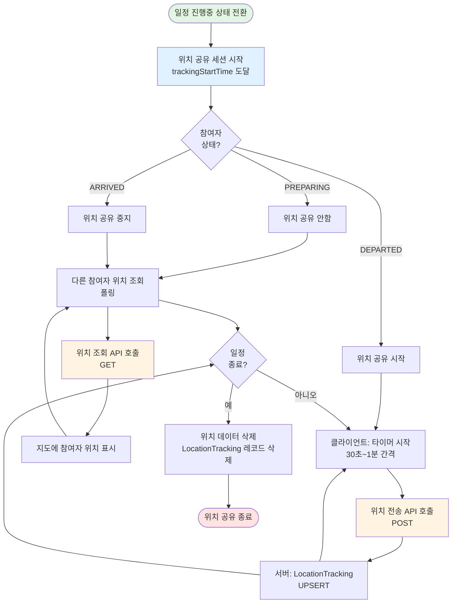
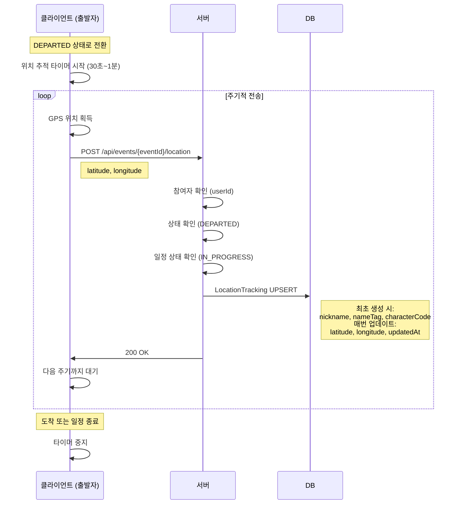
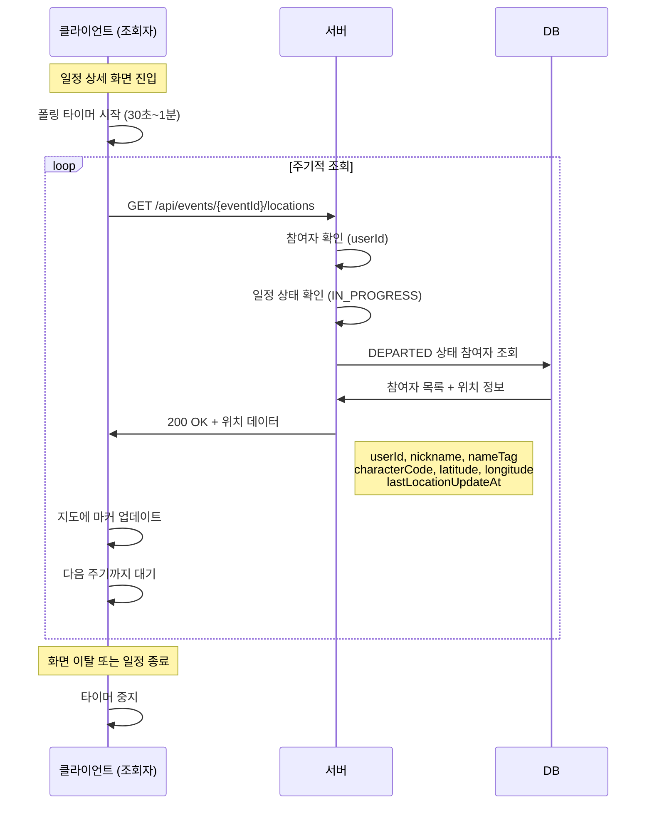
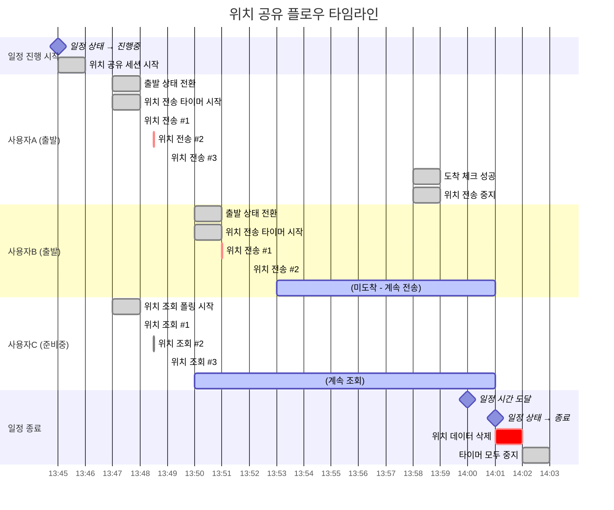

# 위치 공유 시스템 플로우

## 개요

위치 공유 시스템은 **진행중인 일정에서 참여자들의 실시간 위치를 공유하여 서로의 이동 상황을 확인할 수 있는 시스템**입니다.

### 특징

- **진행중 일정만 활성화**: trackingStartTime ~ endTime 동안만 위치 공유
- **출발자만 위치 전송**: DEPARTED 상태 참여자만 위치 공유
- **폴링 방식**: WebSocket 대신 HTTP POST/GET 요청으로 간편하게 구현
- **주기적 업데이트**: 클라이언트가 30초~1분 간격으로 위치 전송
- **실시간 조회**: 다른 참여자들의 위치를 실시간으로 조회 가능
- **자동 종료**: 일정 종료 시 위치 데이터 자동 삭제

---

## 시스템 구조

### 역할 (Role)

1. **위치 전송자** - DEPARTED 상태의 참여자 (출발한 사용자)
2. **위치 조회자** - 모든 일정 참여자

### 핵심 개념

- **위치 공유 세션**: 진행중 일정 기간 동안 활성화된 위치 공유 상태
- **위치 업데이트 주기**: 클라이언트가 설정한 주기 (30초~1분)
- **폴링 조회**: 클라이언트가 주기적으로 GET 요청으로 위치 조회
- **출발자 필터링**: DEPARTED 상태 사용자만 위치 공유 대상

---

## 데이터 구조

### LocationTracking 엔티티 (조회 전용 테이블)

위치 정보를 빠르게 조회하기 위한 별도 테이블:

| 필드명        | 타입     | 설명                     | 필수 여부 | 기본값    |
| ------------- | -------- | ------------------------ | --------- | --------- |
| id            | UUID     | 고유 식별자              | 필수      | 자동 생성 |
| eventId       | UUID     | 일정 ID (FK)             | 필수      | -         |
| userId        | UUID     | 사용자 ID (FK)           | 필수      | -         |
| nickname      | String   | 사용자 닉네임 (스냅샷)   | 필수      | -         |
| nameTag       | String   | 사용자 네임태그 (스냅샷) | 필수      | -         |
| characterCode | String   | 캐릭터 코드 (스냅샷)     | 필수      | -         |
| latitude      | Decimal  | 현재 위도                | 필수      | -         |
| longitude     | Decimal  | 현재 경도                | 필수      | -         |
| updatedAt     | DateTime | 위치 업데이트 시간       | 필수      | 자동 갱신 |

**관계**

- Event 1 : N LocationTracking
- User 1 : N LocationTracking

**특징**

- **조회 최적화**: User 조인 없이 단일 테이블 조회로 완결
- **스냅샷 방식**: 출발 시점의 사용자 정보 저장 (진행 중 변경 무시)
- **비정규화**: 조회 성능을 위해 의도적으로 중복 저장
- eventId + userId 복합 유니크 제약 (중복 방지)
- 최신 위치만 저장 (UPSERT 방식)
- 일정 종료 시 해당 일정의 모든 레코드 삭제
- 인덱스: (eventId), (eventId, userId)

---

## 전체 플로우

### 플로우 다이어그램



---

## 주요 플로우

### 1. 위치 공유 세션 시작

#### 1.1 자동 시작 (일정 상태 전환)

- **트리거**: Event.status가 IN_PROGRESS로 변경
- **시점**: trackingStartTime 도달 (일정 시간 -15분)
- **처리**:
  1. 일정 상태 확인 (status = IN_PROGRESS)
  2. 모든 참여자에게 위치 공유 시작 알림
  3. 클라이언트: 위치 추적 활성화

**특징**

- 별도 세션 엔티티 생성 안 함
- Event.status = IN_PROGRESS가 세션 활성화 의미

---

### 2. 위치 전송 (출발자)

#### 2.1 위치 전송 조건

- **권한**: 본인
- **상태 조건**: EventParticipant.status = DEPARTED
- **시간 조건**: Event.status = IN_PROGRESS
- **주기**: 클라이언트 설정 (30초~1분)

#### 2.2 위치 전송 플로우



#### 2.3 위치 전송 API

- **API 호출**: 위치 전송 API 호출
- **Method**: POST
- **Endpoint**: `/api/events/{eventId}/location`
- **전달 데이터**:
  - latitude (위도)
  - longitude (경도)

**서버 처리 로직**

1. 사용자가 해당 일정 참여자인지 확인 (EventParticipant)
2. 일정 상태 확인 (Event.status = IN_PROGRESS)
3. 참여자 상태 확인 (EventParticipant.status = DEPARTED)
   - PREPARING 또는 ARRIVED 상태면 에러: "출발 상태에서만 위치를 전송할 수 있습니다"
4. 사용자 정보 조회 (User 테이블에서 nickname, nameTag, characterCode)
5. LocationTracking UPSERT
   - eventId + userId 조합으로 기존 레코드 찾기
   - **있으면 (기존 레코드)**:
     - latitude, longitude, updatedAt만 업데이트
     - nickname, nameTag, characterCode는 유지 (스냅샷)
   - **없으면 (최초 생성)**:
     - 모든 필드 저장 (사용자 정보 + 위치 정보)
   - UPSERT로 원자적 처리

- **응답**: 성공 메시지 (200 OK)

**클라이언트 타이머 로직**

```javascript
// 의사 코드
let trackingInterval = null;

function startLocationTracking(eventId, intervalSeconds) {
  trackingInterval = setInterval(async () => {
    const position = await getCurrentPosition(); // GPS 위치 획득
    await sendLocation(eventId, position.latitude, position.longitude);
  }, intervalSeconds * 1000);
}

function stopLocationTracking() {
  if (trackingInterval) {
    clearInterval(trackingInterval);
    trackingInterval = null;
  }
}

// 출발 버튼 클릭 시
onDepartureButtonClick() {
  updateStatus('DEPARTED');
  startLocationTracking(eventId, 30); // 30초 간격
}

// 도착 체크 성공 시
onArrivalCheckSuccess() {
  stopLocationTracking();
}
```

---

### 3. 위치 조회 (모든 참여자)

#### 3.1 위치 조회 조건

- **권한**: 해당 일정의 모든 참여자
- **조회 대상**: DEPARTED 상태 참여자의 위치
- **방식**: 폴링 (주기적 GET 요청)

#### 3.2 위치 조회 플로우



#### 3.3 위치 조회 API

- **API 호출**: 위치 조회 API 호출
- **Method**: GET
- **Endpoint**: `/api/events/{eventId}/locations`

**서버 처리 로직**

1. 사용자가 해당 일정 참여자인지 확인
2. 일정 상태 확인 (status = IN_PROGRESS)
3. 해당 일정의 위치 데이터 조회
   - LocationTracking에서 eventId로 조회
   - EventParticipant와 조인하여 status = DEPARTED만 필터링
   - **User 조인 불필요**: LocationTracking에 모든 정보 포함
4. 응답 데이터 생성

- **응답**: 출발자 목록 + 위치 정보

**응답 데이터 구조 (예시)**

```json
{
  "eventId": "uuid",
  "participants": [
    {
      "userId": "uuid",
      "nickname": "사용자A",
      "nameTag": "1234",
      "characterCode": "character_01",
      "latitude": 37.123456,
      "longitude": 127.123456,
      "lastUpdatedAt": "2026-01-17T13:50:30Z"
    },
    {
      "userId": "uuid",
      "nickname": "사용자B",
      "nameTag": "5678",
      "characterCode": "character_02",
      "latitude": 37.234567,
      "longitude": 127.234567,
      "lastUpdatedAt": "2026-01-17T13:50:25Z"
    }
  ]
}
```

**클라이언트 폴링 로직**

```javascript
// 의사 코드
let pollingInterval = null;

function startLocationPolling(eventId, intervalSeconds) {
  pollingInterval = setInterval(async () => {
    const locations = await fetchLocations(eventId);
    updateMapMarkers(locations.participants);
  }, intervalSeconds * 1000);
}

function stopLocationPolling() {
  if (pollingInterval) {
    clearInterval(pollingInterval);
    pollingInterval = null;
  }
}

// 일정 상세 화면 진입 시
onEventDetailEnter() {
  startLocationPolling(eventId, 30); // 30초 간격
}

// 화면 이탈 시
onEventDetailExit() {
  stopLocationPolling();
}
```

---

### 4. 상태 변경에 따른 위치 공유 제어

#### 4.1 출발 시 (PREPARING → DEPARTED)

- **동작**: 위치 전송 타이머 시작
- **처리**:
  1. EventParticipant.status = DEPARTED로 업데이트
  2. 클라이언트: 위치 전송 타이머 시작
  3. 주기적으로 위치 전송 시작

#### 4.2 도착 시 (DEPARTED → ARRIVED)

- **동작**: 위치 전송 타이머 중지
- **처리**:
  1. EventParticipant.status = ARRIVED로 업데이트
  2. 클라이언트: 위치 전송 타이머 중지
  3. 다른 참여자들에게는 더 이상 위치 표시 안 됨

**상태별 위치 공유 여부**

| 참여자 상태 | 위치 전송 | 위치 조회             |
| ----------- | --------- | --------------------- |
| PREPARING   | ❌        | ✅ (다른 사람 위치)   |
| DEPARTED    | ✅        | ✅ (본인 + 다른 사람) |
| ARRIVED     | ❌        | ✅ (다른 사람 위치)   |

---

### 5. 위치 공유 세션 종료

#### 5.1 자동 종료 (일정 종료)

- **트리거**: Event.status가 ENDED로 변경
- **시점**: endTime 도달 (일정 시간 +1분)
- **처리**:
  1. 일정 상태 확인 (status = ENDED)
  2. 해당 일정의 모든 LocationTracking 레코드 삭제
  3. 클라이언트: 위치 전송/조회 타이머 중지
  4. 참여자들에게 일정 종료 알림

**데이터 정리 로직**

```sql
DELETE FROM location_tracking
WHERE event_id = {일정 ID}
```

---

## 주요 규칙

### 위치 전송 규칙

1. **출발자만 전송**: DEPARTED 상태 참여자만 위치 전송 가능
2. **주기적 전송**: 클라이언트가 30초~1분 간격으로 전송
3. **진행중만 가능**: 일정 상태가 IN_PROGRESS일 때만 전송 가능
4. **UPSERT 방식**: eventId + userId 조합으로 기존 레코드 업데이트 또는 생성

### 위치 조회 규칙

1. **모든 참여자 조회 가능**: 일정 참여자는 누구나 조회 가능
2. **출발자만 표시**: DEPARTED 상태 참여자의 위치만 반환
3. **폴링 방식**: 클라이언트가 주기적으로 GET 요청
4. **실시간 업데이트**: 지도 마커를 주기적으로 갱신

### 데이터 관리 규칙

1. **별도 테이블 관리**: LocationTracking 조회 전용 테이블
2. **종료 시 삭제**: 일정 종료 시 해당 일정의 모든 레코드 삭제
3. **이력 미보관**: 위치 이동 경로는 저장하지 않음 (최신 위치만)
4. **복합 유니크 제약**: eventId + userId 조합으로 중복 방지

### 상태 전환 규칙

1. **출발 시 시작**: DEPARTED 상태 전환 시 위치 전송 시작
2. **도착 시 중지**: ARRIVED 상태 전환 시 위치 전송 중지
3. **일정 종료 시 정리**: ENDED 상태 전환 시 모든 위치 데이터 삭제

---

## 시간 순서 예시

### 타임라인



---

## UI/UX 고려사항

### 일정 상세 화면 (진행중)

**지도 영역**

- 중심: 목적지 좌표
- 목적지 마커: 🏁 (깃발 아이콘)
- 참여자 마커: 캐릭터 아이콘 + 닉네임
  - 출발자만 표시
  - 마커 색상으로 구분 가능
  - 클릭 시 닉네임, 최근 업데이트 시간 표시

**참여자 목록**

- 상태별 그룹핑
  - 도착 (🟢): 도착한 사람들
  - 출발 (🟡): 이동 중인 사람들
  - 준비중 (🔵): 아직 출발하지 않은 사람들
- 각 참여자: 닉네임, 캐릭터 아이콘, 상태

**본인 액션 버튼**

- 준비중: "출발" 버튼
- 출발: "도착 체크" 버튼
- 도착: "도착 완료" 뱃지

**위치 업데이트 표시**

- "마지막 업데이트: 30초 전" 등 시간 표시
- 오래된 위치 (2분 이상): 회색 처리 또는 경고 표시

---

### 위치 전송 설정

**설정 화면**

- "위치 공유 주기" 설정
  - 30초
  - 45초
  - 1분
- 배터리 절약 모드
  - 화면 꺼짐 시 위치 전송 중지
  - 백그라운드에서도 위치 전송 (선택)

**배터리 고려**

- 짧은 주기 선택 시 배터리 소모 경고
- 배터리 상태에 따라 자동 주기 조정 제안

---

### 실시간 위치 표시

**마커 애니메이션**

- 위치 업데이트 시 부드러운 이동 애니메이션
- 새 위치로 즉시 점프 대신 부드럽게 이동

**거리 표시**

- 목적지까지 남은 거리 표시
- "약 500m 남음" 등

**예상 도착 시간**

- 현재 속도 기반 예상 도착 시간 계산
- "약 5분 후 도착 예정" 등

---

## 기술적 고려사항

### 폴링 최적화

**클라이언트 최적화**

```javascript
// 화면이 보이지 않을 때 폴링 중지
document.addEventListener('visibilitychange', () => {
  if (document.hidden) {
    stopLocationPolling();
  } else {
    startLocationPolling(eventId, intervalSeconds);
  }
});
```

**서버 최적화**

- 인덱스: LocationTracking 테이블에 (event_id), (event_id, user_id) 인덱스
- 조인 최소화: LocationTracking ← EventParticipant (User 조인 불필요)
- 단일 테이블 조회: 필요한 모든 정보가 LocationTracking에 포함
- 페이로드 최소화: 필요한 필드만 반환
- 캐싱: Redis에 위치 데이터 임시 캐싱 (선택)

### 위치 정확도

**GPS 정확도 필터링**

```javascript
// 클라이언트에서 정확도 낮은 위치 필터링
if (position.accuracy > 50) {
  // 50m 이상 오차
  console.log('위치 정확도가 낮아 전송하지 않음');
  return;
}
```

**위치 변화량 확인**

```javascript
// 이전 위치와 거리 계산
const distance = calculateDistance(prevLocation, currentLocation);
if (distance < 10) {
  // 10m 미만 이동
  console.log('위치 변화가 작아 전송하지 않음');
  return;
}
```

### 배터리 절약

**적응형 주기**

- 이동 속도에 따라 전송 주기 조정
- 정지 상태: 1분 간격
- 이동 중: 30초 간격

**백그라운드 처리**

- iOS: 백그라운드 위치 업데이트 활용
- Android: Foreground Service 사용

---

## 확장 가능성

### 향후 추가 가능 기능

1. **경로 기록**
   - 이동 경로 저장 및 재생
   - 경로 분석 (소요 시간, 거리 등)

2. **WebSocket 전환**
   - 실시간성 향상을 위한 WebSocket 도입
   - 폴링 대신 푸시 방식

3. **위치 공유 범위 설정**
   - 정확한 위치 / 대략적 위치 선택
   - 프라이버시 보호

4. **도착 예상 시간**
   - 현재 속도 기반 ETA 계산
   - 교통 정보 연동

5. **위치 기반 알림**
   - 목적지 근처 도착 시 다른 참여자에게 알림
   - "사용자A님이 곧 도착합니다"

6. **그룹 내비게이션**
   - 목적지까지 경로 안내
   - 최적 경로 제안

7. **위치 히스토리**
   - 이동 경로 기록 및 통계
   - "평균 이동 시간" 등 분석

8. **오프라인 모드**
   - 네트워크 끊김 시 로컬 저장
   - 재연결 시 일괄 전송

---

## 보안 고려사항

### 위치 정보 보안

- **접근 권한 제한**: 해당 일정 참여자만 위치 조회 가능
- **진행중만 조회**: 일정 종료 후 위치 정보 접근 불가
- **위치 데이터 암호화**: 전송 시 HTTPS, 저장 시 암호화 (선택)

### 프라이버시 보호

- **출발자만 공유**: 명시적으로 출발 버튼을 누른 사용자만
- **종료 시 삭제**: 일정 종료 시 모든 위치 데이터 삭제
- **위치 공유 동의**: 앱 설치 시 위치 권한 동의 필수

### GPS 스푸핑 방지

- **서버 검증**: 비정상적인 위치 변화 감지
  - 예: 짧은 시간에 너무 먼 거리 이동
- **도착 체크 재검증**: 50m 범위 검증으로 스푸핑 일부 방지

---

## 참고사항

### 폴링 방식 선택 이유

- **간단한 구현**: WebSocket보다 구현 및 유지보수 간편
- **충분한 실시간성**: 30초~1분 간격으로도 위치 추적에 충분
- **서버 부하 적음**: WebSocket 연결 유지 대비 부하 적음
- **확장 용이**: 추후 필요 시 WebSocket으로 전환 가능

### 위치 데이터 삭제 이유

- **프라이버시**: 불필요한 위치 이력 보관 방지
- **저장 공간**: DB 용량 절약
- **법적 준수**: 개인정보보호법 준수 (최소 보관)

### 30초~1분 주기 설정

- **배터리 절약**: 너무 짧은 주기는 배터리 소모
- **실시간성**: 위치 추적에 충분한 업데이트 주기
- **네트워크 부하**: 서버 및 네트워크 부하 최소화

### GPS 정확도

- **일반적 GPS 오차**: 5~10m
- **도시 지역**: 건물로 인해 10~30m 오차 가능
- **50m 도착 범위**: GPS 오차 고려한 합리적 범위
