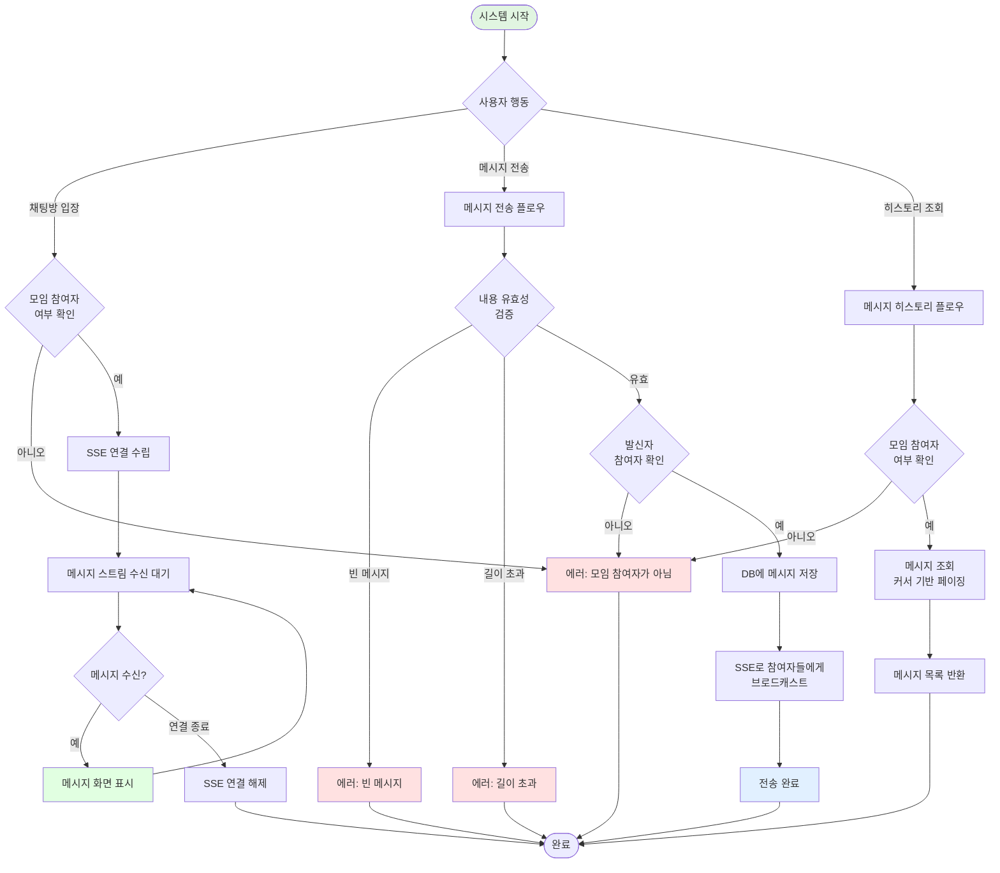
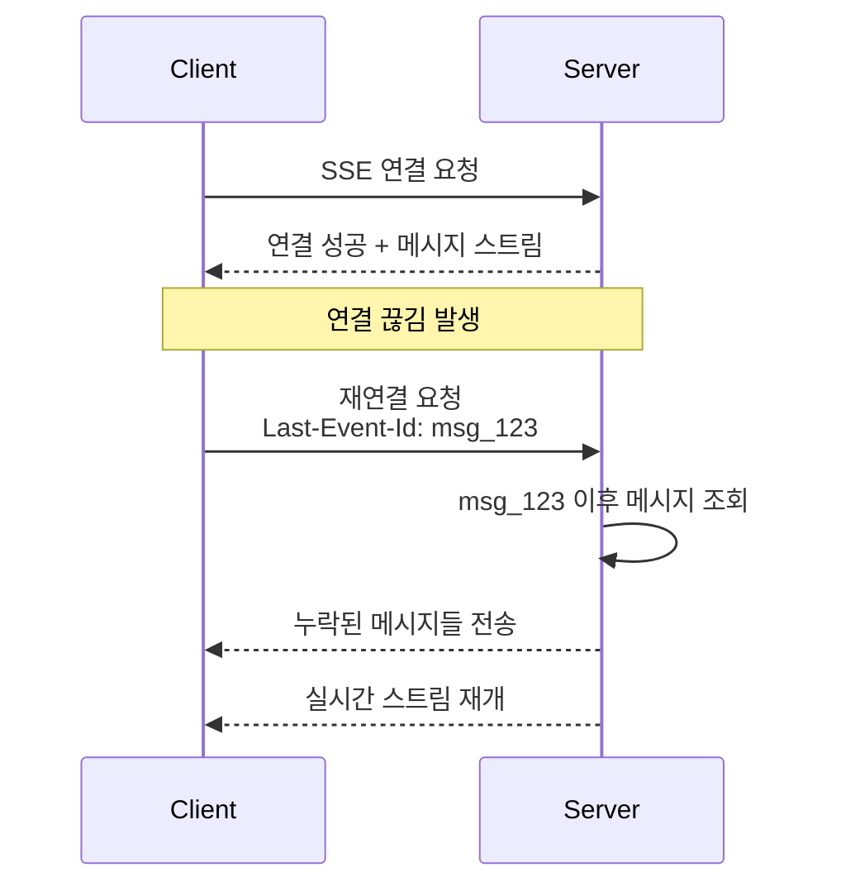
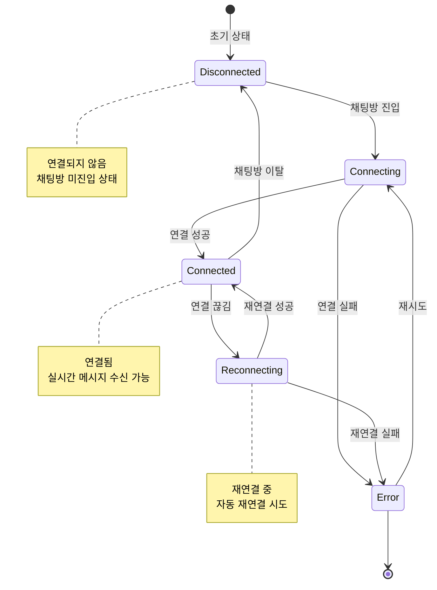
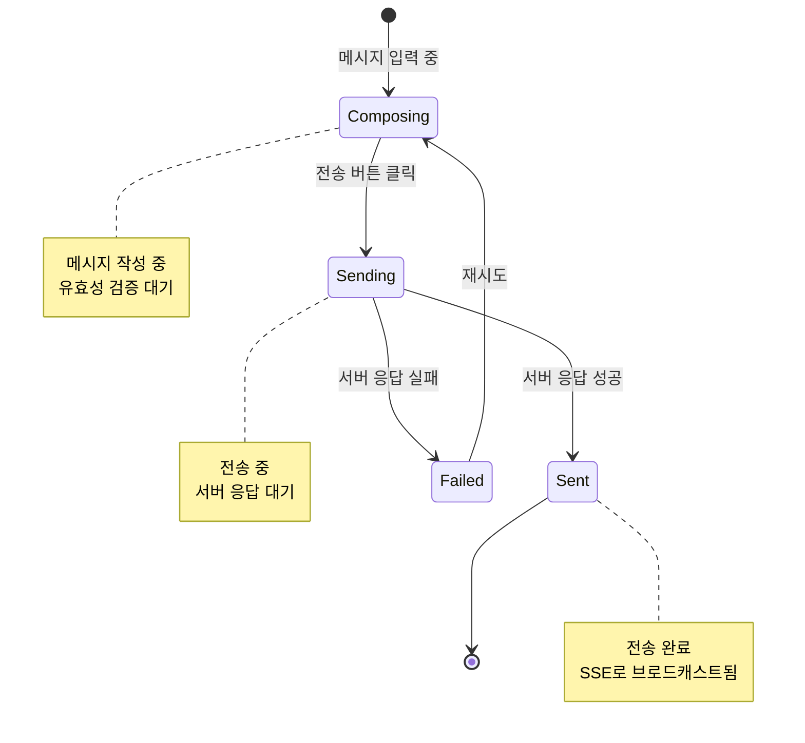
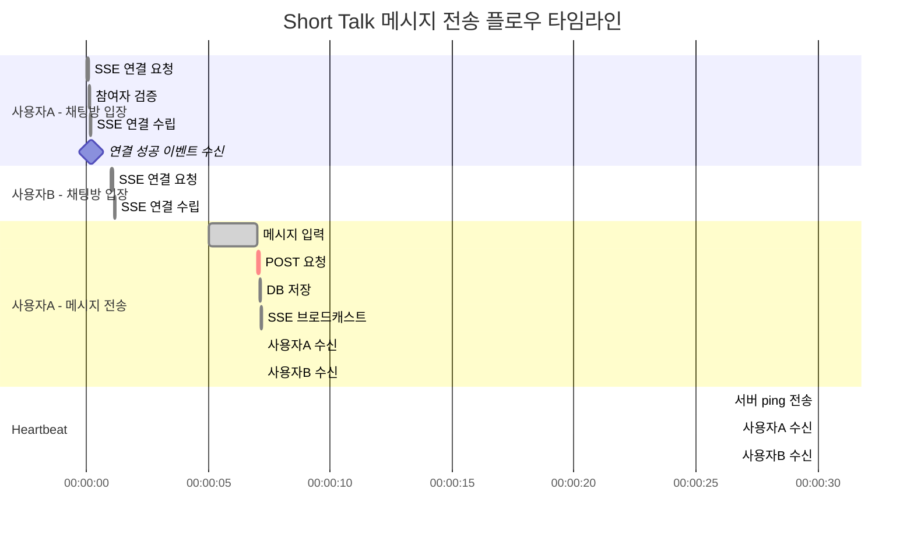

# Short Talk 시스템 플로우

## 개요

Short Talk은 **모임 내 참여자들이 실시간으로 텍스트 메시지를 주고받을 수 있는 그룹 채팅 시스템**입니다.

### 특징

- **그룹 전용 채팅**: 각 모임마다 하나의 채팅방이 자동 생성
- **실시간 메시지 수신**: SSE(Server-Sent Events)를 통한 실시간 메시지 푸시
- **간단한 메시지 전송**: REST API(POST)를 통한 메시지 전송
- **메시지 히스토리**: 과거 메시지 조회 및 무한 스크롤 지원
- **참여자 전용**: 모임 참여자만 채팅 참여 가능
- **경량 설계**: WebSocket 대신 SSE 사용으로 서버 부하 감소

---

## 시스템 구조

### 역할 (Role)

1. **메시지 발신자** - 메시지를 보내는 모임 참여자
2. **메시지 수신자** - 메시지를 받는 다른 모임 참여자들

### 핵심 개념

- **Short Talk**: 모임 내 그룹 채팅 기능의 명칭
- **SSE 연결**: 서버에서 클라이언트로 실시간 메시지를 푸시하는 단방향 연결
- **메시지 스트림**: SSE를 통해 전달되는 실시간 메시지 흐름
- **채팅 히스토리**: 과거에 주고받은 메시지 기록
- **커서 기반 페이지네이션**: 메시지 ID 기반의 효율적인 페이징

### 통신 아키텍처

```
┌─────────────────┐                    ┌─────────────────┐
│     Client      │                    │     Server      │
├─────────────────┤                    ├─────────────────┤
│                 │  POST /messages    │                 │
│  메시지 전송    │ ────────────────▶ │  메시지 저장    │
│                 │                    │        │        │
│                 │                    │        ▼        │
│                 │  SSE (text/event)  │  브로드캐스트   │
│  메시지 수신    │ ◀──────────────── │                 │
│                 │                    │                 │
└─────────────────┘                    └─────────────────┘

통신 방식:
- 전송: HTTP POST 요청 (REST API)
- 수신: SSE (Server-Sent Events) 스트림
```

---

## 데이터 구조

### ChatMessage 엔티티

| 필드명    | 타입     | 설명                   | 필수 여부 | 기본값    |
| --------- | -------- | ---------------------- | --------- | --------- |
| id        | UUID     | 메시지 고유 식별자     | 필수      | 자동 생성 |
| groupId   | UUID     | 모임 ID (FK)           | 필수      | -         |
| senderId  | UUID     | 발신자 사용자 ID (FK)  | 필수      | -         |
| content   | String   | 메시지 내용            | 필수      | -         |
| createdAt | DateTime | 전송 일시              | 필수      | 자동 생성 |

**관계**

- Group 1 : N ChatMessage
- User 1 : N ChatMessage

**인덱스**

- `idx_chat_message_group_id`: groupId
- `idx_chat_message_created_at`: createdAt (DESC)
- `idx_chat_message_group_created`: (groupId, createdAt DESC) - 복합 인덱스

---

## 데이터베이스 스키마

### Prisma Schema

```prisma
model ChatMessage {
  id        String   @id @default(uuid()) @db.Uuid
  groupId   String   @map("group_id") @db.Uuid
  senderId  String   @map("sender_id") @db.Uuid
  content   String   @db.Text
  createdAt DateTime @default(now()) @map("created_at") @db.Timestamptz(6)

  // Relations
  group  Group @relation(fields: [groupId], references: [id], onDelete: Cascade)
  sender User  @relation(fields: [senderId], references: [id], onDelete: Cascade)

  @@index([groupId])
  @@index([createdAt(sort: Desc)])
  @@index([groupId, createdAt(sort: Desc)])
  @@map("chat_message")
}
```

### SQL 정의

```sql
CREATE TABLE chat_message (
    id UUID PRIMARY KEY DEFAULT gen_random_uuid(),
    group_id UUID NOT NULL REFERENCES "group"(id) ON DELETE CASCADE,
    sender_id UUID NOT NULL REFERENCES "user"(id) ON DELETE CASCADE,
    content TEXT NOT NULL,
    created_at TIMESTAMPTZ NOT NULL DEFAULT now()
);

-- 인덱스
CREATE INDEX idx_chat_message_group_id ON chat_message(group_id);
CREATE INDEX idx_chat_message_created_at ON chat_message(created_at DESC);
CREATE INDEX idx_chat_message_group_created ON chat_message(group_id, created_at DESC);
```

---

## 전체 플로우

### 플로우 다이어그램



---

## 주요 플로우

### 1. SSE 연결 (채팅방 입장)

#### 1.1 연결 요청

- **시점**: 채팅방 화면 진입 시
- **엔드포인트**: `GET /groups/{groupId}/short-talk/stream`
- **응답 타입**: `text/event-stream`

**서버 처리 로직**

1. 사용자가 해당 모임의 참여자인지 확인 (GroupMember)
   - 참여자가 아니면 에러: "모임 참여자만 채팅에 참여할 수 있습니다"
2. SSE 연결 수립
   - Response Content-Type: `text/event-stream`
   - Cache-Control: `no-cache`
   - Connection: `keep-alive`
3. 해당 그룹의 SSE 클라이언트 목록에 연결 추가
4. 연결 성공 이벤트 전송

**SSE 연결 초기화 예시**

```typescript
// 서버 응답 헤더
Content-Type: text/event-stream
Cache-Control: no-cache
Connection: keep-alive
X-Accel-Buffering: no

// 초기 연결 이벤트
event: connected
data: {"status": "connected", "groupId": "uuid", "timestamp": "2026-01-17T10:00:00Z"}
```

#### 1.2 연결 유지

- **Heartbeat**: 30초마다 ping 이벤트 전송 (연결 유지)
- **재연결**: 연결 끊김 시 클라이언트가 자동 재연결 (EventSource 기본 동작)
- **Last-Event-Id**: 재연결 시 마지막 수신 메시지 ID로 누락 메시지 복구

**Heartbeat 예시**

```
event: ping
data: {"timestamp": "2026-01-17T10:00:30Z"}
```

#### 1.3 연결 종료

- **시점**: 채팅방 화면 이탈 또는 앱 백그라운드 전환
- **처리**:
  - 클라이언트: EventSource.close() 호출
  - 서버: SSE 클라이언트 목록에서 제거

---

### 2. 메시지 전송

#### 2.1 메시지 입력

**입력 필드**

1. **메시지 내용** (필수)
   - 최소 1자, 최대 1000자
   - 공백만으로 구성된 메시지 불가
   - 줄바꿈 허용 (최대 10줄)

#### 2.2 메시지 전송 API 호출

- **API 호출**: `POST /groups/{groupId}/short-talk/messages`
- **전달 데이터**:
  - content (메시지 내용)

**요청 예시**

```json
{
  "content": "안녕하세요! 오늘 모임 장소 어디에요?"
}
```

**서버 처리 로직**

1. 사용자가 해당 모임의 참여자인지 확인 (GroupMember)
   - 참여자가 아니면 에러: "모임 참여자만 메시지를 보낼 수 있습니다"
2. 메시지 내용 유효성 검증
   - 빈 메시지 또는 공백만 있으면 에러: "메시지 내용을 입력해주세요"
   - 1000자 초과 시 에러: "메시지는 1000자 이내로 입력해주세요"
3. ChatMessage 엔티티 생성
   - groupId: 모임 ID
   - senderId: 현재 사용자 ID
   - content: 메시지 내용
4. DB에 메시지 저장
5. 해당 그룹의 모든 SSE 연결에 메시지 브로드캐스트
6. 발신자에게 전송 완료 응답

**응답 예시**

```json
{
  "id": "550e8400-e29b-41d4-a716-446655440000",
  "groupId": "123e4567-e89b-12d3-a456-426614174000",
  "senderId": "987fcdeb-51a2-3bc4-d567-890123456789",
  "content": "안녕하세요! 오늘 모임 장소 어디에요?",
  "createdAt": "2026-01-17T10:05:00Z",
  "sender": {
    "id": "987fcdeb-51a2-3bc4-d567-890123456789",
    "nickname": "홍길동",
    "nameTag": "1234",
    "characterCode": "char_001"
  }
}
```

#### 2.3 SSE 브로드캐스트

**메시지 이벤트 형식**

```
event: message
id: 550e8400-e29b-41d4-a716-446655440000
data: {"id":"550e8400-e29b-41d4-a716-446655440000","groupId":"123e4567-e89b-12d3-a456-426614174000","senderId":"987fcdeb-51a2-3bc4-d567-890123456789","content":"안녕하세요! 오늘 모임 장소 어디에요?","createdAt":"2026-01-17T10:05:00Z","sender":{"id":"987fcdeb-51a2-3bc4-d567-890123456789","nickname":"홍길동","nameTag":"1234","characterCode":"char_001"}}
```

**브로드캐스트 대상**

- 해당 그룹에 SSE 연결된 모든 클라이언트
- 발신자 포함 (자신이 보낸 메시지도 SSE로 수신)

---

### 3. 메시지 히스토리 조회

#### 3.1 초기 로딩

- **시점**: 채팅방 최초 진입 시
- **조회 개수**: 최근 30개 메시지
- **정렬**: 생성일시 내림차순 (최신순)

#### 3.2 무한 스크롤 (이전 메시지 로딩)

- **시점**: 스크롤이 상단에 도달했을 때
- **방식**: 커서 기반 페이지네이션

- **API 호출**: `GET /groups/{groupId}/short-talk/messages`
- **쿼리 파라미터**:
  - cursor (선택): 마지막 조회 메시지 ID
  - limit (선택): 조회 개수 (기본 30, 최대 50)

**요청 예시**

```
GET /groups/123e4567-e89b-12d3-a456-426614174000/short-talk/messages?cursor=550e8400-e29b-41d4-a716-446655440000&limit=30
```

**서버 처리 로직**

1. 사용자가 해당 모임의 참여자인지 확인
2. 메시지 조회
   - cursor가 없으면: 최신 메시지부터 limit개 조회
   - cursor가 있으면: 해당 메시지보다 이전 메시지 limit개 조회
3. 발신자 정보 포함하여 반환
4. 다음 페이지 존재 여부 반환

**응답 예시**

```json
{
  "messages": [
    {
      "id": "550e8400-e29b-41d4-a716-446655440000",
      "groupId": "123e4567-e89b-12d3-a456-426614174000",
      "senderId": "987fcdeb-51a2-3bc4-d567-890123456789",
      "content": "안녕하세요! 오늘 모임 장소 어디에요?",
      "createdAt": "2026-01-17T10:05:00Z",
      "sender": {
        "id": "987fcdeb-51a2-3bc4-d567-890123456789",
        "nickname": "홍길동",
        "nameTag": "1234",
        "characterCode": "char_001"
      }
    }
  ],
  "nextCursor": "440e8400-e29b-41d4-a716-446655440000",
  "hasMore": true
}
```

**커서 기반 페이지네이션 장점**

- 실시간 데이터 추가에도 중복/누락 없음
- Offset 방식보다 성능 우수 (대량 데이터)
- 일관된 결과 보장

---

### 4. 재연결 및 누락 메시지 복구

#### 4.1 연결 끊김 감지

- **클라이언트**: EventSource의 onerror 이벤트로 감지
- **자동 재연결**: EventSource는 기본적으로 자동 재연결 시도

#### 4.2 누락 메시지 복구

- **방식**: Last-Event-Id 헤더 활용
- **처리 흐름**:



**서버 처리 로직**

1. 재연결 시 Last-Event-Id 헤더 확인
2. 해당 ID 이후의 메시지 조회
3. 누락된 메시지들을 순차적으로 전송
4. 이후 실시간 스트림 재개

---

## 주요 규칙

### 참여 권한 규칙

1. **모임 참여자 전용**: 해당 모임의 GroupMember만 채팅 참여 가능
2. **SSE 연결 권한**: 참여자만 SSE 연결 가능
3. **메시지 전송 권한**: 참여자만 메시지 전송 가능
4. **히스토리 조회 권한**: 참여자만 과거 메시지 조회 가능

### 메시지 규칙

1. **텍스트 전용**: MVP에서는 텍스트 메시지만 지원
2. **길이 제한**: 최소 1자, 최대 1000자
3. **공백 검증**: 공백만으로 구성된 메시지 불가
4. **줄바꿈 제한**: 최대 10줄
5. **수정/삭제 불가**: 전송된 메시지는 수정 및 삭제 불가

### SSE 연결 규칙

1. **단일 연결**: 사용자당 그룹당 하나의 SSE 연결
2. **Heartbeat**: 30초마다 ping 이벤트로 연결 유지
3. **자동 재연결**: 연결 끊김 시 클라이언트가 자동 재연결
4. **누락 복구**: Last-Event-Id로 누락 메시지 복구

### 메시지 저장 규칙

1. **영구 저장**: 모든 메시지는 DB에 영구 저장
2. **삭제 정책**: 모임 삭제 시 해당 모임의 모든 메시지 CASCADE 삭제
3. **사용자 삭제**: 사용자 삭제 시 해당 사용자의 메시지 CASCADE 삭제

---

## 상태(Status) 관리

### SSE 연결 상태



### 메시지 전송 상태



---

## 시간 순서 예시

### 타임라인



---

## API 명세

### 1. SSE 연결

```
GET /groups/{groupId}/short-talk/stream
```

**Headers**

| 헤더명        | 필수 | 설명                           |
| ------------- | ---- | ------------------------------ |
| Authorization | 필수 | Bearer {accessToken}           |
| Last-Event-Id | 선택 | 마지막 수신 메시지 ID (재연결) |

**Response Headers**

```
Content-Type: text/event-stream
Cache-Control: no-cache
Connection: keep-alive
X-Accel-Buffering: no
```

**SSE Events**

| 이벤트명  | 설명               | 데이터 형식                                    |
| --------- | ------------------ | ---------------------------------------------- |
| connected | 연결 성공          | `{"status": "connected", "groupId": "...", "timestamp": "..."}` |
| message   | 새 메시지          | ChatMessage JSON                               |
| ping      | Heartbeat          | `{"timestamp": "..."}`                         |
| error     | 에러 발생          | `{"code": "...", "message": "..."}`            |

**에러 응답**

| 상태 코드 | 에러 코드          | 설명                 |
| --------- | ------------------ | -------------------- |
| 401       | UNAUTHORIZED       | 인증 실패            |
| 403       | NOT_GROUP_MEMBER   | 모임 참여자가 아님   |
| 404       | GROUP_NOT_FOUND    | 모임을 찾을 수 없음  |

---

### 2. 메시지 전송

```
POST /groups/{groupId}/short-talk/messages
```

**Request Body**

```json
{
  "content": "string (1-1000자)"
}
```

**Response (201 Created)**

```json
{
  "id": "uuid",
  "groupId": "uuid",
  "senderId": "uuid",
  "content": "string",
  "createdAt": "datetime",
  "sender": {
    "id": "uuid",
    "nickname": "string",
    "nameTag": "string",
    "characterCode": "string"
  }
}
```

**에러 응답**

| 상태 코드 | 에러 코드            | 설명                       |
| --------- | -------------------- | -------------------------- |
| 400       | EMPTY_MESSAGE        | 빈 메시지                  |
| 400       | MESSAGE_TOO_LONG     | 메시지 길이 초과 (1000자)  |
| 401       | UNAUTHORIZED         | 인증 실패                  |
| 403       | NOT_GROUP_MEMBER     | 모임 참여자가 아님         |
| 404       | GROUP_NOT_FOUND      | 모임을 찾을 수 없음        |

---

### 3. 메시지 히스토리 조회

```
GET /groups/{groupId}/short-talk/messages
```

**Query Parameters**

| 파라미터 | 필수 | 타입   | 설명                          | 기본값 |
| -------- | ---- | ------ | ----------------------------- | ------ |
| cursor   | 선택 | UUID   | 마지막 조회 메시지 ID         | -      |
| limit    | 선택 | Number | 조회 개수 (1-50)              | 30     |

**Response (200 OK)**

```json
{
  "messages": [
    {
      "id": "uuid",
      "groupId": "uuid",
      "senderId": "uuid",
      "content": "string",
      "createdAt": "datetime",
      "sender": {
        "id": "uuid",
        "nickname": "string",
        "nameTag": "string",
        "characterCode": "string"
      }
    }
  ],
  "nextCursor": "uuid | null",
  "hasMore": "boolean"
}
```

**에러 응답**

| 상태 코드 | 에러 코드          | 설명                 |
| --------- | ------------------ | -------------------- |
| 400       | INVALID_CURSOR     | 유효하지 않은 커서   |
| 400       | INVALID_LIMIT      | 유효하지 않은 limit  |
| 401       | UNAUTHORIZED       | 인증 실패            |
| 403       | NOT_GROUP_MEMBER   | 모임 참여자가 아님   |
| 404       | GROUP_NOT_FOUND    | 모임을 찾을 수 없음  |

---

## UI/UX 고려사항

### 채팅방 화면

**레이아웃**

```
┌─────────────────────────────────────┐
│  ← Short Talk          모임명 (3)  │  ← 헤더 (참여자 수)
├─────────────────────────────────────┤
│                                     │
│  ┌─────────────────────────────┐    │
│  │ 2026.01.17 금요일            │    │  ← 날짜 구분선
│  └─────────────────────────────┘    │
│                                     │
│        ┌──────────────────────┐     │
│        │ 안녕하세요!          │     │  ← 상대방 메시지 (좌측)
│  😀    │               10:05  │     │
│ 홍길동  └──────────────────────┘     │
│                                     │
│  ┌──────────────────────┐           │
│  │ 네 안녕하세요~       │           │  ← 내 메시지 (우측)
│  │               10:06  ├───────    │
│  └──────────────────────┘           │
│                                     │
│         ↑ 이전 메시지 로드          │  ← 무한 스크롤
├─────────────────────────────────────┤
│  ┌─────────────────────────┐  📤   │  ← 입력창
│  │ 메시지를 입력하세요...   │       │
│  └─────────────────────────┘        │
└─────────────────────────────────────┘
```

**메시지 버블**

- **내 메시지**: 우측 정렬, 강조 색상 배경
- **상대방 메시지**: 좌측 정렬, 프로필 이미지 + 닉네임 표시
- **시간 표시**: 메시지 버블 내 또는 하단에 표시 (HH:mm)

**날짜 구분선**

- 날짜가 변경되면 구분선 표시
- 형식: "2026.01.17 금요일"

**스크롤 동작**

- 새 메시지 도착 시 자동 스크롤 (하단에 있을 때만)
- 상단 스크롤 시 이전 메시지 로드 (무한 스크롤)
- 새 메시지 알림 버튼 (상단에서 스크롤 중일 때)

---

### 입력창

**레이아웃**

- 텍스트 입력 필드 (멀티라인 지원)
- 전송 버튼 (비활성: 빈 입력, 활성: 내용 있음)

**동작**

- Enter: 줄바꿈 (모바일)
- Enter + 전송 버튼: 메시지 전송
- 입력 중 글자 수 표시 (선택적)

**유효성 검사 메시지**

- "메시지를 입력해주세요" (빈 입력 시 전송 시도)
- "1000자 이내로 입력해주세요" (길이 초과)

---

### 연결 상태 표시

**상태별 UI**

| 상태       | 표시                     | 동작                     |
| ---------- | ------------------------ | ------------------------ |
| 연결 중    | 상단에 "연결 중..." 표시 | 로딩 인디케이터          |
| 연결됨     | 표시 없음 (정상 상태)    | 메시지 송수신 가능       |
| 재연결 중  | 상단에 "재연결 중..." 표시 | 로딩 인디케이터        |
| 연결 실패  | 상단에 "연결 실패" 표시  | 재연결 버튼 표시         |

---

### 에러 처리

**네트워크 에러**

- 토스트: "네트워크 연결을 확인해주세요"
- 자동 재연결 시도 (최대 5회)
- 재연결 실패 시 수동 재연결 버튼 표시

**권한 에러**

- 토스트: "채팅 참여 권한이 없습니다"
- 이전 화면으로 이동

**전송 실패**

- 메시지 버블에 실패 아이콘 표시
- 탭하여 재전송 옵션

---

## 성능 고려사항

### SSE 연결 관리

**서버 측**

```typescript
// SSE 클라이언트 관리 구조
Map<groupId, Map<userId, Response>>

// 예시
{
  "group_123": {
    "user_456": Response1,
    "user_789": Response2
  }
}
```

- 그룹별로 연결된 클라이언트 관리
- 연결 해제 시 즉시 제거
- 메모리 효율을 위해 주기적 정리

**클라이언트 측**

- 앱 백그라운드 시 SSE 연결 해제
- 포그라운드 복귀 시 재연결 + 누락 메시지 복구
- 배터리 절약을 위한 연결 관리

### 메시지 조회 최적화

**인덱스 전략**

```sql
-- 그룹별 최신 메시지 조회
CREATE INDEX idx_chat_message_group_created
ON chat_message(group_id, created_at DESC);

-- 커서 기반 페이지네이션
WHERE group_id = ? AND created_at < (SELECT created_at FROM chat_message WHERE id = ?)
ORDER BY created_at DESC
LIMIT 30
```

**쿼리 최적화**

- 커서 기반 페이지네이션으로 Offset 회피
- 발신자 정보는 JOIN으로 한 번에 조회
- 필요한 필드만 SELECT (SELECT *)

### 브로드캐스트 최적화

- 비동기 브로드캐스트 (메시지 저장과 분리)
- 연결된 클라이언트에만 전송
- 실패한 연결은 자동 정리

---

## 확장 가능성

### 향후 추가 가능 기능

1. **이미지/파일 메시지**
   - 이미지 업로드 및 미리보기
   - 파일 첨부 (문서, 압축파일 등)
   - 썸네일 자동 생성

2. **메시지 읽음 처리**
   - 안 읽은 메시지 수 표시
   - 읽음 확인 (카카오톡 1 표시)
   - 마지막 읽은 위치 동기화

3. **메시지 삭제/수정**
   - 본인 메시지 삭제 (삭제됨 표시)
   - 본인 메시지 수정 (수정됨 표시)
   - 삭제/수정 시간 제한

4. **메시지 검색**
   - 키워드 검색
   - 날짜별 검색
   - 발신자별 필터

5. **답장 및 인용**
   - 특정 메시지에 답장
   - 메시지 인용 기능
   - 스레드 형태 표시

6. **이모지 반응**
   - 메시지에 이모지 반응
   - 반응 통계 표시

7. **공지 기능**
   - 모임장 공지 메시지
   - 공지 고정 표시
   - 공지 알림

8. **멘션 기능**
   - @사용자 멘션
   - 멘션 알림
   - 멘션된 메시지 하이라이트

9. **푸시 알림**
   - 새 메시지 푸시 알림
   - 알림 설정 (음소거)
   - 멘션 시 별도 알림

10. **메시지 보관 정책**
    - 오래된 메시지 아카이빙
    - 메시지 보관 기간 설정
    - 용량 관리

---

## 보안 고려사항

### 인증 및 권한

- **JWT 인증**: 모든 API 요청에 JWT 토큰 필수
- **참여자 검증**: SSE 연결, 메시지 전송, 히스토리 조회 시 GroupMember 확인
- **토큰 갱신**: SSE 연결 중 토큰 만료 시 재연결 필요

### 데이터 보호

- **HTTPS**: 모든 통신 암호화
- **입력 검증**: XSS 방지를 위한 메시지 내용 이스케이프
- **Rate Limiting**: 메시지 전송 속도 제한 (예: 초당 5개)

### SSE 보안

- **연결 인증**: SSE 연결 시 JWT 검증
- **연결 제한**: 사용자당 동시 연결 수 제한
- **타임아웃**: 비활성 연결 자동 종료

---

## 참고사항

### SSE vs WebSocket 선택 이유

| 항목           | SSE                        | WebSocket                |
| -------------- | -------------------------- | ------------------------ |
| 연결 방향      | 단방향 (서버 → 클라이언트) | 양방향                   |
| 프로토콜       | HTTP                       | WS (별도 프로토콜)       |
| 구현 복잡도    | 낮음                       | 높음                     |
| 서버 부하      | 낮음                       | 높음                     |
| 자동 재연결    | 기본 지원                  | 직접 구현 필요           |
| 브라우저 지원  | 대부분 지원                | 대부분 지원              |
| 채팅 적합성    | 읽기 위주 적합             | 양방향 통신 적합         |

**SSE 선택 이유**

- 메시지 전송은 빈도가 낮아 REST API로 충분
- 메시지 수신만 실시간 필요
- 서버 구현 및 운영 복잡도 감소
- HTTP 인프라 그대로 활용 가능

### 메시지 순서 보장

- DB 저장 후 브로드캐스트로 순서 보장
- createdAt 타임스탬프 + UUID로 정렬
- Last-Event-Id로 누락 메시지 순서대로 복구

### 오프라인 처리

- 오프라인 시 SSE 연결 끊김
- 온라인 복귀 시 재연결 + 히스토리 조회
- 오프라인 중 메시지 전송 시도는 실패 처리
