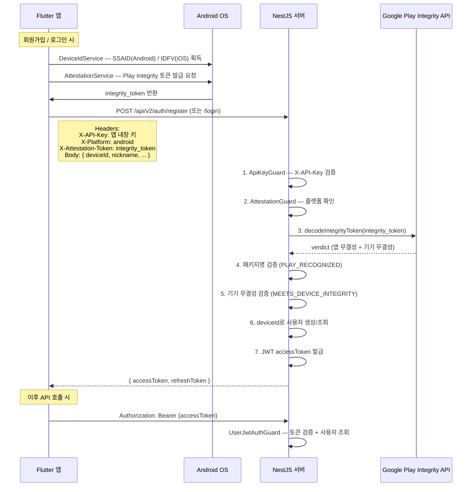

[< README로 돌아가기](../../README.md)

# Authentication (인증 아키텍처)

디바이스 ID 기반 인증 + Play Integrity 검증 + JWT 토큰 발급으로 구성된 인증 시스템.

## 인증 흐름



## 3단계 보안 계층

### 1단계: API Key (`ApiKeyGuard`)

앱에 내장된 API Key를 `X-API-Key` 헤더로 전송. 앱이 아닌 직접 API 호출을 기본 차단.

### 2단계: Play Integrity (`AttestationGuard`)

Google Play Integrity API로 3가지 검증:

- **패키지명**: 우리 앱(`com.eodigae.app`)에서 보낸 요청인지
- **앱 무결성**: Google Play에서 설치된 정품 앱인지 (`PLAY_RECOGNIZED`)
- **기기 무결성**: 루팅/에뮬레이터가 아닌 정상 기기인지 (`MEETS_DEVICE_INTEGRITY`)

### 3단계: JWT (`UserJwtAuthGuard`)

인증 완료 후 발급된 JWT로 이후 모든 API 요청 인증. Passport + passport-jwt 전략 사용.

## 디바이스 ID 기반 인증

이메일/비밀번호 대신 디바이스 고유 ID로 사용자를 식별.

| 플랫폼  | 식별자                     | 특징                             |
| ------- | -------------------------- | -------------------------------- |
| Android | SSAID (Android ID)         | 기기별 고유, 팩토리 리셋 시 변경 |
| iOS     | IDFV (identifierForVendor) | 앱 벤더별 고유                   |

앱에서 `DeviceIdService`가 OS별 식별자를 획득하고, 이 값으로 회원가입/로그인 수행. 사용자는 별도 계정 생성 없이 앱 설치만으로 서비스 이용 가능.

## API 버전 정책

| 버전 | 경로             | 보안                     | 용도                                     |
| ---- | ---------------- | ------------------------ | ---------------------------------------- |
| v1   | `/api/v1/auth/*` | API Key만                | 로컬 개발/테스트 전용 (`LocalOnlyGuard`) |
| v2   | `/api/v2/auth/*` | API Key + Play Integrity | 프로덕션                                 |

v1은 프로덕션 환경에서 `API_VERSION_DEPRECATED` 403을 반환.

## Guard 구성

```
공개 API (회원가입/로그인)
└── @PublicAuth()
    ├── ApiKeyGuard       — X-API-Key 헤더 검증
    └── AttestationGuard  — X-Attestation-Token 헤더 → Google API 검증

인증 필요 API
└── @UserAuth()
    └── UserJwtAuthGuard  — Bearer 토큰 → JWT 검증 + 사용자 조회

관리자 API
└── @UseGuards(AdminApiKeyGuard)
    └── AdminApiKeyGuard  — X-API-Key 헤더 (관리자 전용 키)
```

## 미구현

- iOS App Attest 검증 — `verifyIos()`가 항상 `{ valid: true }` 반환 (iOS 미출시)

---

[< README로 돌아가기](../../README.md)
