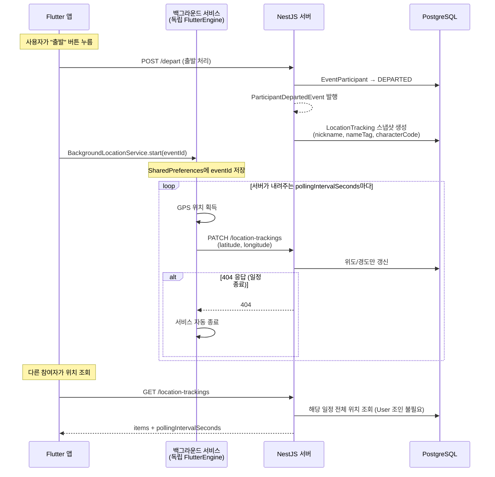
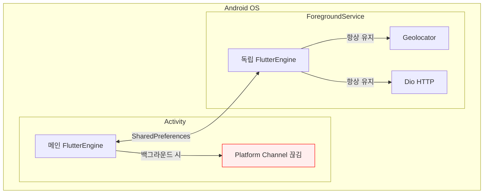

[< README로 돌아가기](../../README.md)

# Location Tracking (백그라운드 위치 추적)

진행중인 일정에서 출발한 참여자의 실시간 위치를 공유하는 시스템.

## 폴링 선택 이유

WebSocket/SSE 대신 HTTP 폴링(PATCH/GET) 선택.

- 위치 전송은 **클라이언트 → 서버** 단방향 — SSE/WebSocket의 서버 푸시 장점 불필요
- Flutter 백그라운드 독립 엔진에서 **Dio.patch() 한 줄**로 전송 가능 — WebSocket 연결 유지보다 안정적
- 30초 간격 주기적 업데이트 — 폴링으로 충분

## 전체 동작 흐름

## 독립 FlutterEngine 아키텍처

Flutter 앱이 백그라운드로 전환되면 메인 FlutterEngine의 Platform Channel이 끊어져 GPS 데이터를 전송할 수 없음.

`flutter_background_service`로 **독립 FlutterEngine을 가진 ForegroundService**를 생성하여 해결.

두 엔진은 메모리를 공유하지 않으며, **SharedPreferences가 유일한 통신 수단**:

- `bg_event_id`: 추적 중인 일정 ID (메인 → 독립)
- `access_token`: 인증 토큰 (메인 → 독립, 갱신 시 자동 반영)

## 동적 폴링 정책

서버가 약속 시간까지 남은 시간에 따라 `pollingIntervalSeconds`를 응답에 포함.

| 남은 시간            | 폴링 간격 |
| -------------------- | --------- |
| 10분 초과            | 30초      |
| 5분 초과 ~ 10분 이하 | 15초      |
| 5분 이하             | 5초       |

기존 앱은 이 필드를 무시하고 하드코딩된 30초로 동작 (하위 호환).

## 비정규화 스냅샷 설계

위치 데이터는 `location_trackings` 별도 테이블에 저장.

- **출발 시점**에 사용자 정보(nickname, nameTag, characterCode)를 스냅샷으로 저장
- 조회 시 **User 조인 없이 단일 테이블**로 완결
- `eventId + userId` 복합 유니크 — 참여자당 1개 레코드 (최신 위치만 유지)
- 일정 종료 시 해당 일정의 모든 레코드 삭제

## 도착 판정

도착 처리는 Event BC에서 **Haversine 공식**으로 계산.

- 사용자 위치와 목적지 간 거리가 **50m 이내**이면 도착 인정
- GPS 오차(도시 지역 10~30m)를 고려한 범위

---

[< README로 돌아가기](../../README.md)
