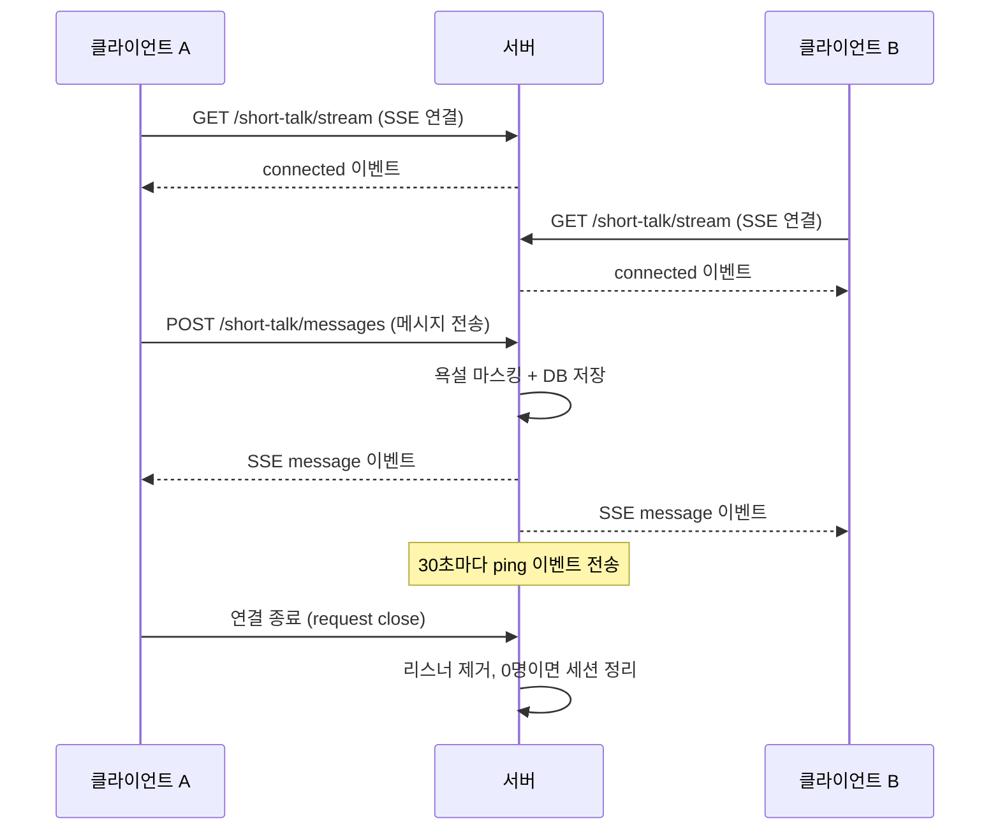
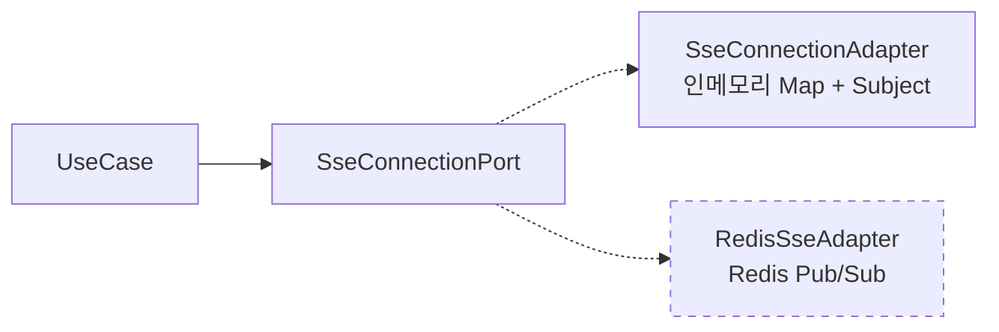

[< README로 돌아가기](../../README.md)

# Short Talk (SSE 실시간 채팅)

모임 내 참여자들이 실시간으로 메시지를 주고받는 그룹 채팅 시스템.

## SSE 선택 이유

WebSocket 대신 SSE 선택.

- 메시지 **수신은 SSE**, **전송은 REST POST**로 분리 — 서버 구현 복잡도 감소
- HTTP 표준 기반 — Nginx, Cloud Run 등 인프라 설정 단순
- 단방향 푸시(서버 → 클라이언트)만 필요한 채팅 수신에 적합

## 동작 흐름



## Port/Adapter 패턴

SSE 연결 관리는 `SseConnectionPort`(추상)와 `SseConnectionAdapter`(인메모리 구현)로 분리.



- **UseCase**: Port 인터페이스만 의존 — Subject, Map 등 구현 디테일을 모름
- **SseConnectionAdapter**: 인메모리 Map으로 그룹별 → 사용자별 연결 관리
- **확장**: Redis Pub/Sub 어댑터로 교체하면 다중 인스턴스 환경 지원 가능

현재 Cloud Run `max-instances=1`에서는 인메모리로 충분. 스케일아웃 필요 시 어댑터만 교체.

## 이벤트 타입 (Discriminated Union)

```typescript
type ShortTalkEvent =
  | { type: 'connected'; groupId: string; timestamp: string }
  | { type: 'message'; id: string; groupId: string; senderId: string;
      content: string; sender: ShortTalkSenderInfo; ... }
  | { type: 'ping'; timestamp: string }
  | { type: 'error'; message: string; timestamp: string };
```

이벤트 타입별로 필수 필드가 다르며, 잘못된 필드 조합은 컴파일 에러로 검출.

## 주요 특징

- **Heartbeat**: 30초 간격 ping으로 연결 유지
- **재연결 처리**: 동일 사용자 재연결 시 기존 연결 자동 종료
- **세션 정리**: 리스너 0명이면 세션 즉시 삭제 + 5분 주기 닫힌 연결 정리
- **욕설 마스킹**: 메시지 전송 시 자동 마스킹 처리
- **히스토리**: 커서 기반 페이지네이션 + sinceId로 놓친 메시지 동기화
- **멤버십 검증**: `GroupMembershipLookupService`로 모임 멤버만 참여 가능

---

[< README로 돌아가기](../../README.md)
