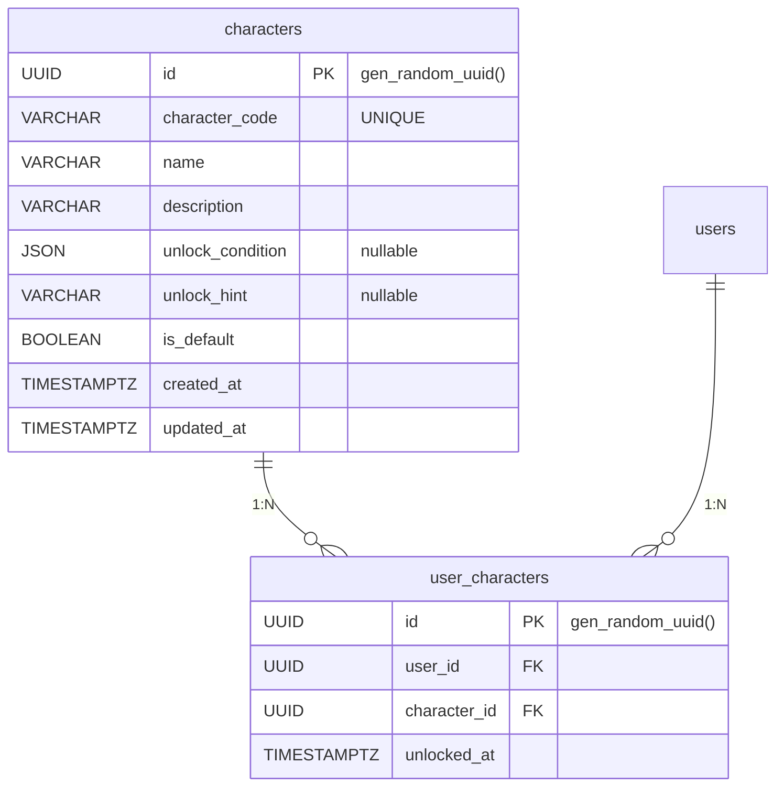

# 캐릭터 관련 테이블 명세

## ER 다이어그램

---

## 1. `characters` — 캐릭터

앱에서 사용 가능한 캐릭터 마스터 데이터. 디폴트 캐릭터는 회원가입 시 자동 지급된다.

| 컬럼               | 타입        | 제약조건         | 기본값            | 설명                                           |
| ------------------ | ----------- | ---------------- | ----------------- | ---------------------------------------------- |
| `id`               | UUID        | **PK**           | gen_random_uuid() | 캐릭터 고유 ID                                 |
| `character_code`   | VARCHAR     | NOT NULL, UNIQUE | —                 | 캐릭터 고유 코드                               |
| `name`             | VARCHAR     | NOT NULL         | —                 | 캐릭터 이름                                    |
| `description`      | VARCHAR     | NOT NULL         | —                 | 캐릭터 설명                                    |
| `unlock_condition` | JSON        | nullable         | NULL              | 언락 조건 (서버에서만 사용, 클라이언트 미노출) |
| `unlock_hint`      | VARCHAR     | nullable         | NULL              | 언락 힌트 (클라이언트 노출 가능)               |
| `is_default`       | BOOLEAN     | NOT NULL         | —                 | 디폴트 캐릭터 여부 (회원가입 시 자동 지급)     |
| `created_at`       | TIMESTAMPTZ | NOT NULL         | now()             | 생성일                                         |
| `updated_at`       | TIMESTAMPTZ | NOT NULL         | —                 | 수정일                                         |

**인덱스**

| 이름                            | 컬럼             | 타입   | 설명                  |
| ------------------------------- | ---------------- | ------ | --------------------- |
| `PRIMARY`                       | `id`             | PK     |                       |
| `characters_character_code_key` | `character_code` | UNIQUE | 캐릭터 코드 중복 방지 |

**관계**

| 대상 테이블       | 관계 | 설명               |
| ----------------- | ---- | ------------------ |
| `user_characters` | 1:N  | 사용자별 보유 현황 |

---

## 2. `user_characters` — 사용자 보유 캐릭터

사용자와 캐릭터 간 N:M 관계를 표현하는 중간 테이블. 한번 언락한 캐릭터는 영구 보유.

| 컬럼           | 타입        | 제약조건                 | 기본값            | 설명         |
| -------------- | ----------- | ------------------------ | ----------------- | ------------ |
| `id`           | UUID        | **PK**                   | gen_random_uuid() | 보유 고유 ID |
| `user_id`      | UUID        | **FK** → `users.id`      | —                 | 사용자 ID    |
| `character_id` | UUID        | **FK** → `characters.id` | —                 | 캐릭터 ID    |
| `unlocked_at`  | TIMESTAMPTZ | NOT NULL                 | now()             | 언락 일시    |

**인덱스**

| 이름                        | 컬럼                      | 타입   | 설명                       |
| --------------------------- | ------------------------- | ------ | -------------------------- |
| `PRIMARY`                   | `id`                      | PK     |                            |
| `idx_user_character_unique` | `user_id`, `character_id` | UNIQUE | 동일 캐릭터 중복 보유 방지 |

**FK 제약**

| 참조            | ON DELETE | 설명                          |
| --------------- | --------- | ----------------------------- |
| `users.id`      | CASCADE   | 사용자 삭제 시 보유 기록 삭제 |
| `characters.id` | CASCADE   | 캐릭터 삭제 시 보유 기록 삭제 |
