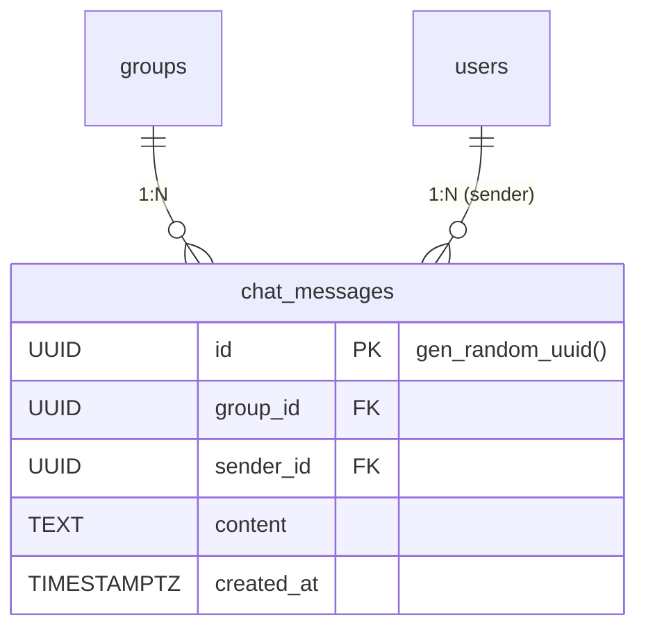

# 채팅 관련 테이블 명세

## ER 다이어그램

---

## 1. `chat_messages` — 채팅 메시지

모임 내 Short Talk(그룹 채팅) 메시지. SSE로 실시간 브로드캐스트되며, 커서 기반 페이지네이션으로 히스토리를 조회한다.

| 컬럼         | 타입        | 제약조건             | 기본값            | 설명                      |
| ------------ | ----------- | -------------------- | ----------------- | ------------------------- |
| `id`         | UUID        | **PK**               | gen_random_uuid() | 메시지 고유 ID            |
| `group_id`   | UUID        | **FK** → `groups.id` | —                 | 모임 ID (채팅방)          |
| `sender_id`  | UUID        | **FK** → `users.id`  | —                 | 발신자 ID                 |
| `content`    | VARCHAR     | NOT NULL             | —                 | 메시지 내용 (최대 1000자) |
| `created_at` | TIMESTAMPTZ | NOT NULL             | now()             | 전송 일시                 |

**인덱스**

| 이름                             | 컬럼                          | 타입         | 설명                                        |
| -------------------------------- | ----------------------------- | ------------ | ------------------------------------------- |
| `PRIMARY`                        | `id`                          | PK           |                                             |
| `idx_chat_message_group_created` | `group_id`, `created_at` DESC | INDEX (복합) | 그룹별 최신 메시지 조회 + 커서 페이지네이션 |

**FK 제약**

| 참조        | ON DELETE | 설명                         |
| ----------- | --------- | ---------------------------- |
| `groups.id` | CASCADE   | 모임 삭제 시 메시지도 삭제   |
| `users.id`  | CASCADE   | 사용자 삭제 시 메시지도 삭제 |
