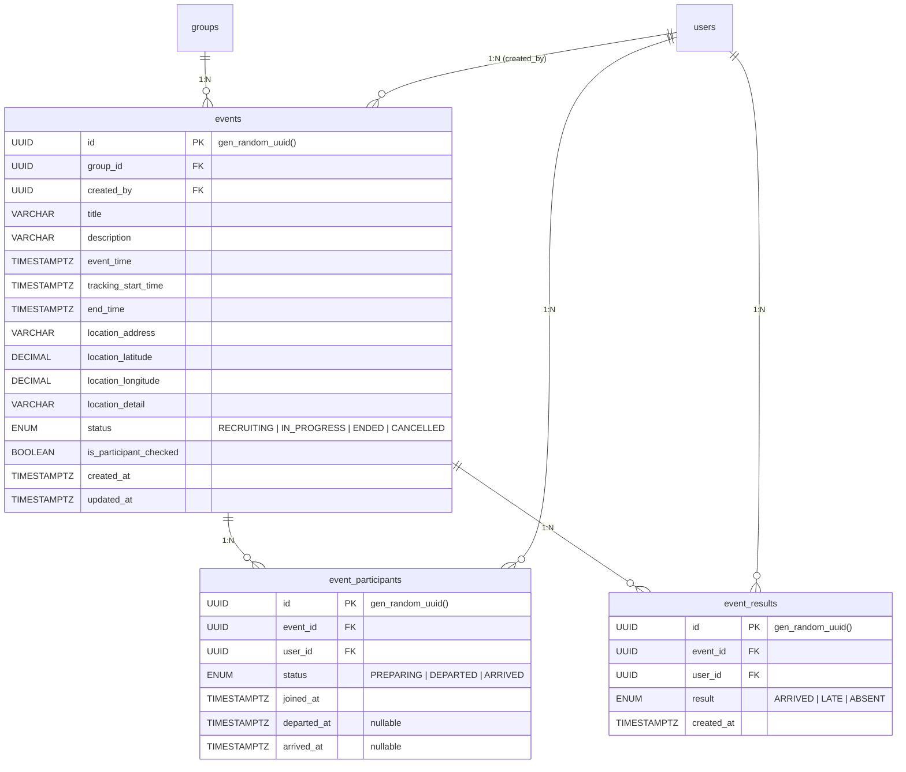

# 일정 관련 테이블 명세

## ER 다이어그램

---

## 1. `events` — 일정

모임 내 오프라인 만남 일정. 모집중 → 진행중 → 종료됨 상태로 자동 전환되며, Cloud Tasks로 스케줄링된다.

| 컬럼                     | 타입        | 제약조건             | 기본값            | 설명                                   |
| ------------------------ | ----------- | -------------------- | ----------------- | -------------------------------------- |
| `id`                     | UUID        | **PK**               | gen_random_uuid() | 일정 고유 ID                           |
| `group_id`               | UUID        | **FK** → `groups.id` | —                 | 소속 모임 ID                           |
| `created_by`             | UUID        | **FK** → `users.id`  | —                 | 생성자 ID                              |
| `title`                  | VARCHAR     | NOT NULL             | —                 | 일정 제목                              |
| `description`            | VARCHAR     | NOT NULL             | —                 | 일정 설명                              |
| `event_time`             | TIMESTAMPTZ | NOT NULL             | —                 | 일정 시작 시간                         |
| `tracking_start_time`    | TIMESTAMPTZ | NOT NULL             | —                 | 위치 공유 시작 시간 (event_time -15분) |
| `end_time`               | TIMESTAMPTZ | NOT NULL             | —                 | 일정 종료 시간 (event_time +1분)       |
| `location_address`       | VARCHAR     | NOT NULL             | —                 | 도로명 주소                            |
| `location_latitude`      | DECIMAL     | NOT NULL             | —                 | 위도                                   |
| `location_longitude`     | DECIMAL     | NOT NULL             | —                 | 경도                                   |
| `location_detail`        | VARCHAR     | NOT NULL             | —                 | 장소 상세 정보                         |
| `status`                 | ENUM        | NOT NULL             | —                 | 일정 상태                              |
| `is_participant_checked` | BOOLEAN     | NOT NULL             | —                 | 참여자 체크 완료 여부                  |
| `created_at`             | TIMESTAMPTZ | NOT NULL             | now()             | 생성일                                 |
| `updated_at`             | TIMESTAMPTZ | NOT NULL             | —                 | 수정일                                 |

**인덱스**

| 이름      | 컬럼 | 타입 | 설명 |
| --------- | ---- | ---- | ---- |
| `PRIMARY` | `id` | PK   |      |

**FK 제약**

| 참조                    | ON DELETE | 설명                     |
| ----------------------- | --------- | ------------------------ |
| `groups.id`             | CASCADE   | 모임 삭제 시 일정도 삭제 |
| `users.id` (created_by) | —         | 생성자 참조              |

**Enum: `event_status`**

| 값            | 설명                                     |
| ------------- | ---------------------------------------- |
| `RECRUITING`  | 모집중 — 참여 신청 가능, 모임당 최대 3개 |
| `IN_PROGRESS` | 진행중 — 위치 공유 활성, 도착 체크 가능  |
| `ENDED`       | 종료됨 — 출석 결과 생성 완료             |
| `CANCELLED`   | 취소됨 — 참여자 2명 미만으로 자동 취소   |

**관계**

| 대상 테이블          | 관계 | 설명             |
| -------------------- | ---- | ---------------- |
| `groups`             | N:1  | 소속 모임        |
| `users`              | N:1  | 생성자           |
| `event_participants` | 1:N  | 일정 참여자 목록 |
| `event_results`      | 1:N  | 출석 결과 목록   |
| `location_trackings` | 1:N  | 위치 추적 데이터 |

---

## 2. `event_participants` — 일정 참여자

일정에 참여 신청한 사용자. 진행중 일정에서 준비중 → 출발 → 도착 상태로 전환된다.

| 컬럼          | 타입        | 제약조건             | 기본값            | 설명           |
| ------------- | ----------- | -------------------- | ----------------- | -------------- |
| `id`          | UUID        | **PK**               | gen_random_uuid() | 참여 고유 ID   |
| `event_id`    | UUID        | **FK** → `events.id` | —                 | 일정 ID        |
| `user_id`     | UUID        | **FK** → `users.id`  | —                 | 참여자 ID      |
| `status`      | ENUM        | NOT NULL             | —                 | 참여자 상태    |
| `joined_at`   | TIMESTAMPTZ | NOT NULL             | now()             | 참여 신청 일시 |
| `departed_at` | TIMESTAMPTZ | nullable             | NULL              | 출발 시각      |
| `arrived_at`  | TIMESTAMPTZ | nullable             | NULL              | 도착 시각      |

**인덱스**

| 이름      | 컬럼 | 타입 | 설명 |
| --------- | ---- | ---- | ---- |
| `PRIMARY` | `id` | PK   |      |

**FK 제약**

| 참조        | ON DELETE | 설명                          |
| ----------- | --------- | ----------------------------- |
| `events.id` | CASCADE   | 일정 삭제 시 참여자도 삭제    |
| `users.id`  | CASCADE   | 사용자 삭제 시 참여 기록 삭제 |

**Enum: `participant_status`**

| 값          | 설명                                                |
| ----------- | --------------------------------------------------- |
| `PREPARING` | 준비중 — 아직 출발하지 않음. 종료 시 → ABSENT       |
| `DEPARTED`  | 출발 — 이동 중. 종료 시 → LATE                      |
| `ARRIVED`   | 도착 — 50m 이내 + 시간 조건 충족. 종료 시 → ARRIVED |

---

## 3. `event_results` — 출석 결과

일정 종료 시 참여자 상태를 기반으로 자동 생성되는 출석 결과. 한 번 생성되면 수정 불가.

| 컬럼         | 타입        | 제약조건             | 기본값            | 설명         |
| ------------ | ----------- | -------------------- | ----------------- | ------------ |
| `id`         | UUID        | **PK**               | gen_random_uuid() | 결과 고유 ID |
| `event_id`   | UUID        | **FK** → `events.id` | —                 | 일정 ID      |
| `user_id`    | UUID        | **FK** → `users.id`  | —                 | 참여자 ID    |
| `result`     | ENUM        | NOT NULL             | —                 | 출석 결과    |
| `created_at` | TIMESTAMPTZ | NOT NULL             | now()             | 결과 생성일  |

**인덱스**

| 이름      | 컬럼 | 타입 | 설명 |
| --------- | ---- | ---- | ---- |
| `PRIMARY` | `id` | PK   |      |

**FK 제약**

| 참조        | ON DELETE | 설명                     |
| ----------- | --------- | ------------------------ |
| `events.id` | CASCADE   | 일정 삭제 시 결과도 삭제 |
| `users.id`  | CASCADE   | 사용자 삭제 시 결과 삭제 |

**Enum: `attendance_result`**

| 값        | 설명                     |
| --------- | ------------------------ |
| `ARRIVED` | 도착 — 출석 인정         |
| `LATE`    | 지각 — 출발했으나 미도착 |
| `ABSENT`  | 부재 — 출발하지 않음     |

**출석 결과 매핑 규칙**

| 종료 시점 참여자 상태 | → 출석 결과 |
| --------------------- | ----------- |
| `ARRIVED`             | `ARRIVED`   |
| `DEPARTED`            | `LATE`      |
| `PREPARING`           | `ABSENT`    |
