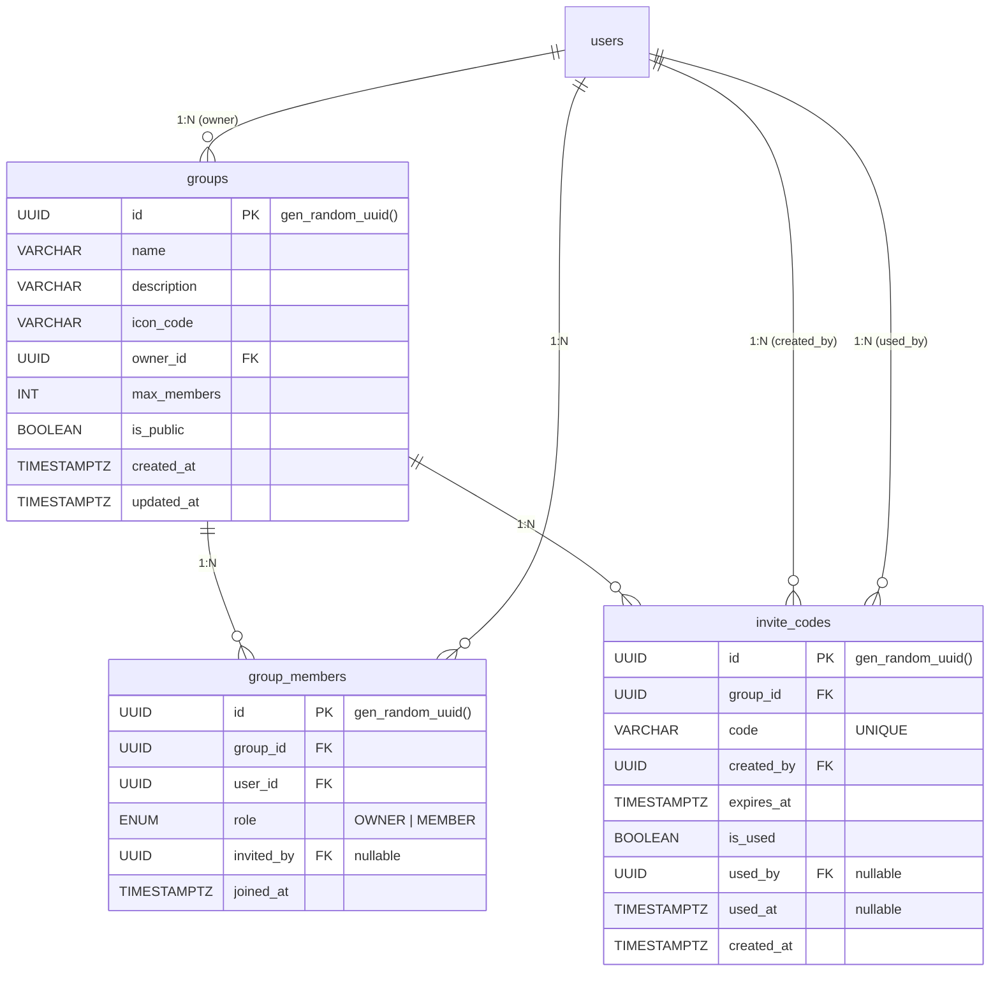

# 모임 관련 테이블 명세

## ER 다이어그램

---

## 1. `groups` — 모임

사용자들이 함께 활동하는 커뮤니티 그룹. 1인 1모임장 규칙이 적용된다.

| 컬럼          | 타입        | 제약조건            | 기본값            | 설명                           |
| ------------- | ----------- | ------------------- | ----------------- | ------------------------------ |
| `id`          | UUID        | **PK**              | gen_random_uuid() | 모임 고유 ID                   |
| `name`        | VARCHAR     | NOT NULL            | —                 | 모임 이름                      |
| `description` | VARCHAR     | NOT NULL            | —                 | 모임 소개                      |
| `icon_code`   | VARCHAR     | NOT NULL            | —                 | 아이콘 코드 (클라이언트 전달)  |
| `owner_id`    | UUID        | **FK** → `users.id` | —                 | 모임장 사용자 ID               |
| `max_members` | INT         | NOT NULL            | —                 | 최대 참여 인원 (서버 설정값)   |
| `is_public`   | BOOLEAN     | NOT NULL            | —                 | 공개 모임 여부 (MVP: 비공개만) |
| `created_at`  | TIMESTAMPTZ | NOT NULL            | now()             | 생성일                         |
| `updated_at`  | TIMESTAMPTZ | NOT NULL            | —                 | 수정일                         |

**인덱스**

| 이름      | 컬럼 | 타입 | 설명 |
| --------- | ---- | ---- | ---- |
| `PRIMARY` | `id` | PK   |      |

**관계**

| 대상 테이블     | 관계 | 설명              |
| --------------- | ---- | ----------------- |
| `users`         | N:1  | 모임장 (owner_id) |
| `group_members` | 1:N  | 모임 멤버 목록    |
| `invite_codes`  | 1:N  | 초대 코드 목록    |
| `events`        | 1:N  | 모임 내 일정      |
| `chat_messages` | 1:N  | 모임 채팅 메시지  |

---

## 2. `group_members` — 모임 멤버

모임과 사용자 간 N:M 관계를 표현하는 중간 테이블. 역할(OWNER/MEMBER)과 초대자 정보를 포함한다.

| 컬럼         | 타입        | 제약조건                      | 기본값            | 설명                      |
| ------------ | ----------- | ----------------------------- | ----------------- | ------------------------- |
| `id`         | UUID        | **PK**                        | gen_random_uuid() | 멤버십 고유 ID            |
| `group_id`   | UUID        | **FK** → `groups.id`          | —                 | 모임 ID                   |
| `user_id`    | UUID        | **FK** → `users.id`           | —                 | 사용자 ID                 |
| `role`       | ENUM        | NOT NULL                      | —                 | 역할 (`OWNER` / `MEMBER`) |
| `invited_by` | UUID        | **FK** → `users.id`, nullable | NULL              | 초대자 ID (생성자는 null) |
| `joined_at`  | TIMESTAMPTZ | NOT NULL                      | now()             | 참여 일시                 |

**인덱스**

| 이름                      | 컬럼                  | 타입   | 설명                     |
| ------------------------- | --------------------- | ------ | ------------------------ |
| `PRIMARY`                 | `id`                  | PK     |                          |
| `idx_group_member_unique` | `group_id`, `user_id` | UNIQUE | 동일 모임 중복 참여 방지 |

**FK 제약**

| 참조                    | ON DELETE | 설명                       |
| ----------------------- | --------- | -------------------------- |
| `groups.id`             | CASCADE   | 모임 삭제 시 멤버도 삭제   |
| `users.id` (user_id)    | CASCADE   | 사용자 삭제 시 멤버십 삭제 |
| `users.id` (invited_by) | SET NULL  | 초대자 삭제 시 null 처리   |

**Enum: `group_member_role`**

| 값       | 설명                         |
| -------- | ---------------------------- |
| `OWNER`  | 모임장 — 모임 관리 권한 보유 |
| `MEMBER` | 일반 참여자                  |

---

## 3. `invite_codes` — 초대 코드

모임 참여를 위한 일회용 초대 코드. 2분 유효, 1회 사용 후 소멸.

| 컬럼         | 타입        | 제약조건                      | 기본값            | 설명                       |
| ------------ | ----------- | ----------------------------- | ----------------- | -------------------------- |
| `id`         | UUID        | **PK**                        | gen_random_uuid() | 코드 고유 ID               |
| `group_id`   | UUID        | **FK** → `groups.id`          | —                 | 대상 모임 ID               |
| `code`       | VARCHAR     | NOT NULL, UNIQUE              | —                 | 초대 코드 문자열 (6-8자리) |
| `created_by` | UUID        | **FK** → `users.id`           | —                 | 코드 생성자 ID             |
| `expires_at` | TIMESTAMPTZ | NOT NULL                      | —                 | 만료 시각 (생성 후 2분)    |
| `is_used`    | BOOLEAN     | NOT NULL                      | —                 | 사용 여부                  |
| `used_by`    | UUID        | **FK** → `users.id`, nullable | NULL              | 코드 사용자 ID             |
| `used_at`    | TIMESTAMPTZ | nullable                      | NULL              | 사용 시각                  |
| `created_at` | TIMESTAMPTZ | NOT NULL                      | now()             | 생성일                     |

**인덱스**

| 이름                    | 컬럼   | 타입   | 설명           |
| ----------------------- | ------ | ------ | -------------- |
| `PRIMARY`               | `id`   | PK     |                |
| `invite_codes_code_key` | `code` | UNIQUE | 코드 중복 방지 |

**FK 제약**

| 참조                    | ON DELETE | 설명                          |
| ----------------------- | --------- | ----------------------------- |
| `groups.id`             | CASCADE   | 모임 삭제 시 초대 코드도 삭제 |
| `users.id` (created_by) | CASCADE   | 생성자 삭제 시 코드도 삭제    |
| `users.id` (used_by)    | —         | 사용자 참조 (nullable)        |
