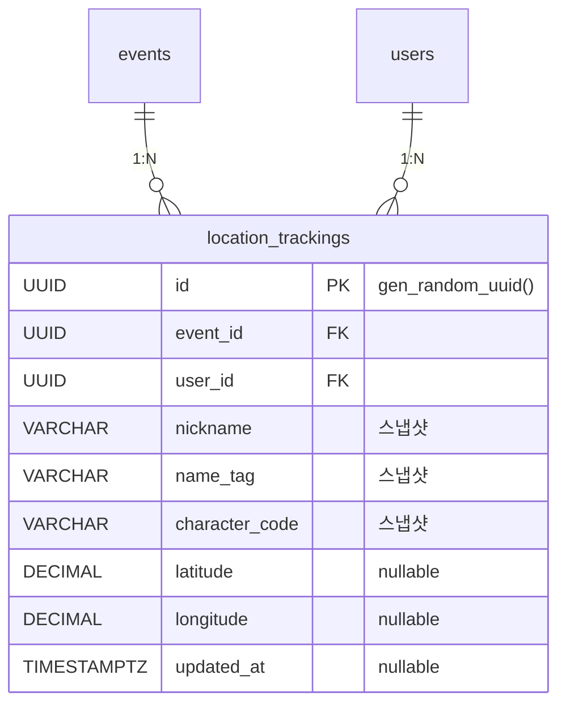

# 위치 추적 관련 테이블 명세

## ER 다이어그램

---

## 1. `location_trackings` — 위치 추적

진행중 일정에서 출발(DEPARTED) 상태 참여자의 실시간 위치를 저장하는 조회 전용 테이블. User 조인 없이 단일 테이블 조회로 완결되도록 비정규화되어 있다. 일정 종료 시 해당 일정의 모든 레코드가 삭제된다.

| 컬럼             | 타입        | 제약조건             | 기본값            | 설명                               |
| ---------------- | ----------- | -------------------- | ----------------- | ---------------------------------- |
| `id`             | UUID        | **PK**               | gen_random_uuid() | 추적 고유 ID                       |
| `event_id`       | UUID        | **FK** → `events.id` | —                 | 일정 ID                            |
| `user_id`        | UUID        | **FK** → `users.id`  | —                 | 참여자 ID                          |
| `nickname`       | VARCHAR     | NOT NULL             | —                 | 사용자 닉네임 (출발 시점 스냅샷)   |
| `name_tag`       | VARCHAR     | NOT NULL             | —                 | 사용자 네임태그 (출발 시점 스냅샷) |
| `character_code` | VARCHAR     | NOT NULL             | —                 | 캐릭터 코드 (출발 시점 스냅샷)     |
| `latitude`       | DECIMAL     | nullable             | NULL              | 현재 위도 (UPSERT로 갱신)          |
| `longitude`      | DECIMAL     | nullable             | NULL              | 현재 경도 (UPSERT로 갱신)          |
| `updated_at`     | TIMESTAMPTZ | nullable             | NULL              | 마지막 위치 업데이트 시각          |

**인덱스**

| 이름                                | 컬럼                  | 타입   | 설명                                |
| ----------------------------------- | --------------------- | ------ | ----------------------------------- |
| `PRIMARY`                           | `id`                  | PK     |                                     |
| `idx_location_trackings_event_user` | `event_id`, `user_id` | UNIQUE | 일정당 참여자 1개 레코드 (UPSERT용) |

**FK 제약**

| 참조        | ON DELETE | 설명                              |
| ----------- | --------- | --------------------------------- |
| `events.id` | CASCADE   | 일정 삭제 시 위치 데이터도 삭제   |
| `users.id`  | CASCADE   | 사용자 삭제 시 위치 데이터도 삭제 |

**비정규화 설계 근거**

| 필드             | 원본 테이블 | 비정규화 이유                              |
| ---------------- | ----------- | ------------------------------------------ |
| `nickname`       | `users`     | 위치 조회 시 User 조인 제거                |
| `name_tag`       | `users`     | 지도 마커에 표시할 정보를 단일 쿼리로 조회 |
| `character_code` | `users`     | 출발 시점 스냅샷으로 진행 중 변경 무시     |
