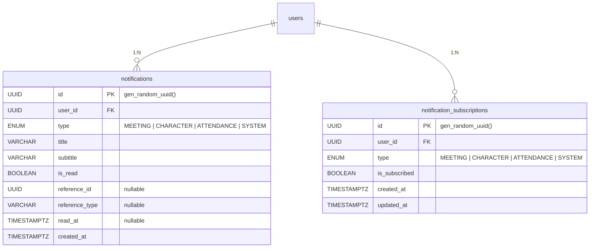

# 알림 관련 테이블 명세

## ER 다이어그램

---

## 1. `notifications` — 알림

사용자에게 발송된 개별 알림. Fan-out on Write 방식으로 수신 대상 유저별 row를 생성한다. 도메인 이벤트 핸들러에서 자동 생성되며, 클라이언트가 직접 생성하지 않는다.

| 컬럼             | 타입        | 제약조건            | 기본값            | 설명                      |
| ---------------- | ----------- | ------------------- | ----------------- | ------------------------- |
| `id`             | UUID        | **PK**              | gen_random_uuid() | 알림 고유 ID              |
| `user_id`        | UUID        | **FK** → `users.id` | —                 | 수신 대상 사용자 ID       |
| `type`           | ENUM        | NOT NULL            | —                 | 알림 유형                 |
| `title`          | VARCHAR     | NOT NULL            | —                 | 알림 제목                 |
| `subtitle`       | VARCHAR     | NOT NULL            | —                 | 알림 부제/설명            |
| `is_read`        | BOOLEAN     | NOT NULL            | —                 | 읽음 여부                 |
| `reference_id`   | UUID        | nullable            | NULL              | 연관 엔티티 ID (딥링크용) |
| `reference_type` | VARCHAR     | nullable            | NULL              | 연관 엔티티 종류          |
| `read_at`        | TIMESTAMPTZ | nullable            | NULL              | 읽음 처리 시각            |
| `created_at`     | TIMESTAMPTZ | NOT NULL            | now()             | 생성 시각                 |

**인덱스**

| 이름                             | 컬럼                                    | 타입         | 설명                                |
| -------------------------------- | --------------------------------------- | ------------ | ----------------------------------- |
| `PRIMARY`                        | `id`                                    | PK           |                                     |
| `idx_notifications_user_created` | `user_id`, `created_at` DESC            | INDEX (복합) | 전체 알림 목록 조회                 |
| `idx_notifications_user_unread`  | `user_id`, `is_read`, `created_at` DESC | INDEX (복합) | 미읽음 개수 카운트 + 전체 읽음 처리 |
| `idx_notifications_user_type`    | `user_id`, `type`, `created_at` DESC    | INDEX (복합) | 타입별 필터 조회                    |

**FK 제약**

| 참조       | ON DELETE | 설명                       |
| ---------- | --------- | -------------------------- |
| `users.id` | CASCADE   | 사용자 삭제 시 알림도 삭제 |

**Enum: `notification_type`**

| 값           | 설명                                              |
| ------------ | ------------------------------------------------- |
| `MEETING`    | 모임 관련 알림 (일정 리마인더, 일정 변경 등)      |
| `CHARACTER`  | 캐릭터 관련 알림 (새 캐릭터 획득, 레벨업 등)      |
| `ATTENDANCE` | 출석 관련 알림 (출석 체크 리마인더, 보상 지급 등) |
| `SYSTEM`     | 시스템/공지 알림 (앱 공지, 점검 안내 등)          |

---

## 2. `notification_subscriptions` — 알림 구독 설정

사용자별 알림 타입에 대한 수신 on/off 설정.

| 컬럼            | 타입        | 제약조건            | 기본값            | 설명         |
| --------------- | ----------- | ------------------- | ----------------- | ------------ |
| `id`            | UUID        | **PK**              | gen_random_uuid() | 구독 고유 ID |
| `user_id`       | UUID        | **FK** → `users.id` | —                 | 사용자 ID    |
| `type`          | ENUM        | NOT NULL            | —                 | 알림 유형    |
| `is_subscribed` | BOOLEAN     | NOT NULL            | —                 | 수신 여부    |
| `created_at`    | TIMESTAMPTZ | NOT NULL            | now()             | 생성일       |
| `updated_at`    | TIMESTAMPTZ | NOT NULL            | —                 | 수정일       |

**인덱스**

| 이름                                          | 컬럼              | 타입   | 설명                     |
| --------------------------------------------- | ----------------- | ------ | ------------------------ |
| `PRIMARY`                                     | `id`              | PK     |                          |
| `notification_subscriptions_user_id_type_key` | `user_id`, `type` | UNIQUE | 사용자당 타입별 1개 설정 |

**FK 제약**

| 참조       | ON DELETE | 설명                            |
| ---------- | --------- | ------------------------------- |
| `users.id` | CASCADE   | 사용자 삭제 시 구독 설정도 삭제 |
