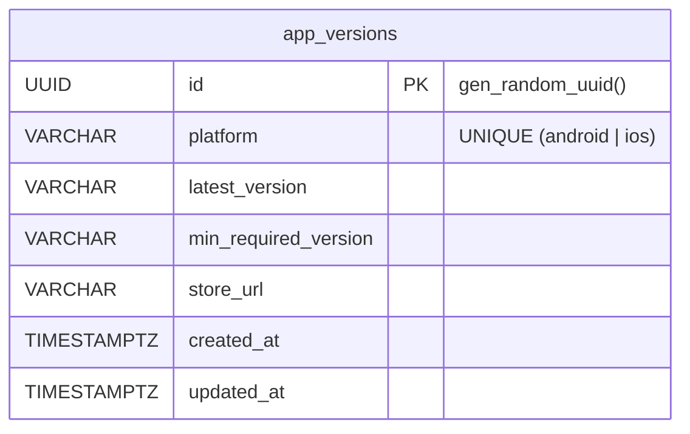

# 시스템 관련 테이블 명세

## ER 다이어그램

---

## 1. `app_versions` — 앱 버전 관리

플랫폼별 앱 최신 버전과 최소 필수 버전을 관리한다. 클라이언트가 앱 실행 시 버전을 확인하여 강제 업데이트 또는 권장 업데이트를 안내한다.

| 컬럼                   | 타입        | 제약조건         | 기본값            | 설명                                   |
| ---------------------- | ----------- | ---------------- | ----------------- | -------------------------------------- |
| `id`                   | UUID        | **PK**           | gen_random_uuid() | 버전 고유 ID                           |
| `platform`             | VARCHAR     | NOT NULL, UNIQUE | —                 | 플랫폼 (android / ios)                 |
| `latest_version`       | VARCHAR     | NOT NULL         | —                 | 최신 버전 (예: 1.2.0)                  |
| `min_required_version` | VARCHAR     | NOT NULL         | —                 | 최소 필수 버전 (미만 시 강제 업데이트) |
| `store_url`            | VARCHAR     | NOT NULL         | —                 | 스토어 URL (Play Store / App Store)    |
| `created_at`           | TIMESTAMPTZ | NOT NULL         | now()             | 생성일                                 |
| `updated_at`           | TIMESTAMPTZ | NOT NULL         | —                 | 수정일                                 |

**인덱스**

| 이름                        | 컬럼       | 타입   | 설명                |
| --------------------------- | ---------- | ------ | ------------------- |
| `PRIMARY`                   | `id`       | PK     |                     |
| `app_versions_platform_key` | `platform` | UNIQUE | 플랫폼당 1개 레코드 |
