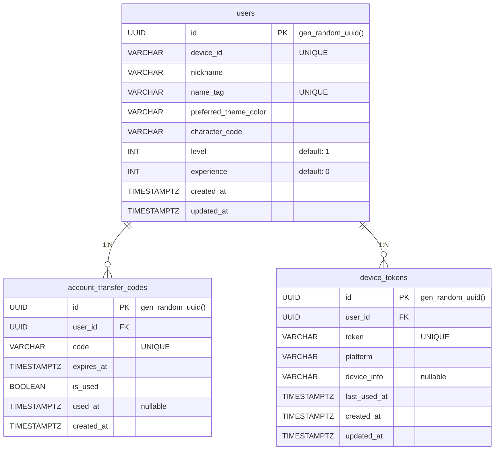

# 사용자 관련 테이블 명세

## ER 다이어그램

---

## 1. `users` — 사용자

디바이스 ID 기반으로 식별되는 앱 사용자. 닉네임, 네임태그, 캐릭터, 레벨/경험치 정보를 보유한다.

| 컬럼                    | 타입        | 제약조건         | 기본값            | 설명                             |
| ----------------------- | ----------- | ---------------- | ----------------- | -------------------------------- |
| `id`                    | UUID        | **PK**           | gen_random_uuid() | 사용자 고유 ID                   |
| `device_id`             | VARCHAR     | NOT NULL, UNIQUE | —                 | 디바이스 고유 식별자 (로그인 키) |
| `nickname`              | VARCHAR     | NOT NULL         | —                 | 닉네임                           |
| `name_tag`              | VARCHAR     | NOT NULL, UNIQUE | —                 | 고유 네임태그 (예: #ABC1234)     |
| `preferred_theme_color` | VARCHAR     | NOT NULL         | —                 | 선호 테마 색상 코드              |
| `character_code`        | VARCHAR     | NOT NULL         | —                 | 현재 장착 캐릭터 코드            |
| `level`                 | INT         | NOT NULL         | 1                 | 사용자 레벨                      |
| `experience`            | INT         | NOT NULL         | 0                 | 누적 경험치                      |
| `created_at`            | TIMESTAMPTZ | NOT NULL         | now()             | 가입일                           |
| `updated_at`            | TIMESTAMPTZ | NOT NULL         | —                 | 수정일                           |

**인덱스**

| 이름                  | 컬럼        | 타입   | 설명               |
| --------------------- | ----------- | ------ | ------------------ |
| `PRIMARY`             | `id`        | PK     |                    |
| `users_device_id_key` | `device_id` | UNIQUE | 디바이스 중복 방지 |
| `users_name_tag_key`  | `name_tag`  | UNIQUE | 네임태그 중복 방지 |

**관계**

| 대상 테이블                  | 관계 | 설명                    |
| ---------------------------- | ---- | ----------------------- |
| `account_transfer_codes`     | 1:N  | 계정 이전 코드          |
| `device_tokens`              | 1:N  | 푸시 알림 디바이스 토큰 |
| `group_members`              | 1:N  | 모임 멤버십             |
| `groups`                     | 1:N  | 소유한 모임             |
| `events`                     | 1:N  | 생성한 일정             |
| `event_participants`         | 1:N  | 일정 참가               |
| `event_results`              | 1:N  | 출석 결과               |
| `chat_messages`              | 1:N  | 채팅 메시지             |
| `invite_codes`               | 1:N  | 생성/사용한 초대 코드   |
| `location_trackings`         | 1:N  | 위치 추적               |
| `notification_subscriptions` | 1:N  | 알림 구독 설정          |
| `notifications`              | 1:N  | 수신 알림               |
| `user_characters`            | 1:N  | 보유 캐릭터             |

---

## 2. `account_transfer_codes` — 계정 이전 코드

디바이스 변경 시 계정을 이전하기 위한 일회용 코드. 유효기간이 있으며 1회 사용 후 소멸한다.

| 컬럼         | 타입        | 제약조건            | 기본값            | 설명             |
| ------------ | ----------- | ------------------- | ----------------- | ---------------- |
| `id`         | UUID        | **PK**              | gen_random_uuid() | 코드 고유 ID     |
| `user_id`    | UUID        | **FK** → `users.id` | —                 | 코드 소유자      |
| `code`       | VARCHAR     | NOT NULL, UNIQUE    | —                 | 이전 코드 문자열 |
| `expires_at` | TIMESTAMPTZ | NOT NULL            | —                 | 만료 시각        |
| `is_used`    | BOOLEAN     | NOT NULL            | —                 | 사용 여부        |
| `used_at`    | TIMESTAMPTZ | nullable            | NULL              | 사용 시각        |
| `created_at` | TIMESTAMPTZ | NOT NULL            | now()             | 생성일           |

**인덱스**

| 이름                              | 컬럼   | 타입   | 설명           |
| --------------------------------- | ------ | ------ | -------------- |
| `PRIMARY`                         | `id`   | PK     |                |
| `account_transfer_codes_code_key` | `code` | UNIQUE | 코드 중복 방지 |

**FK 제약**

| 참조       | ON DELETE | 설명                            |
| ---------- | --------- | ------------------------------- |
| `users.id` | CASCADE   | 사용자 삭제 시 이전 코드도 삭제 |

---

## 3. `device_tokens` — 디바이스 토큰

FCM 푸시 알림 발송을 위한 디바이스 토큰. DB 스키마는 1:N이지만 비즈니스 로직으로 사용자당 1개만 유지한다 (등록 시 기존 토큰 삭제 후 교체).

| 컬럼           | 타입        | 제약조건            | 기본값            | 설명                   |
| -------------- | ----------- | ------------------- | ----------------- | ---------------------- |
| `id`           | UUID        | **PK**              | gen_random_uuid() | 토큰 고유 ID           |
| `user_id`      | UUID        | **FK** → `users.id` | —                 | 토큰 소유자            |
| `token`        | VARCHAR     | NOT NULL, UNIQUE    | —                 | FCM 디바이스 토큰      |
| `platform`     | VARCHAR     | NOT NULL            | —                 | 플랫폼 (android / ios) |
| `device_info`  | VARCHAR     | nullable            | NULL              | 디바이스 정보          |
| `last_used_at` | TIMESTAMPTZ | NOT NULL            | —                 | 마지막 사용 시각       |
| `created_at`   | TIMESTAMPTZ | NOT NULL            | now()             | 등록일                 |
| `updated_at`   | TIMESTAMPTZ | NOT NULL            | —                 | 수정일                 |

**인덱스**

| 이름                             | 컬럼           | 타입   | 설명               |
| -------------------------------- | -------------- | ------ | ------------------ |
| `PRIMARY`                        | `id`           | PK     |                    |
| `device_tokens_token_key`        | `token`        | UNIQUE | 토큰 중복 방지     |
| `idx_device_tokens_user_id`      | `user_id`      | INDEX  | 사용자별 토큰 조회 |
| `idx_device_tokens_last_used_at` | `last_used_at` | INDEX  | 비활성 토큰 정리용 |

**FK 제약**

| 참조       | ON DELETE | 설명                       |
| ---------- | --------- | -------------------------- |
| `users.id` | CASCADE   | 사용자 삭제 시 토큰도 삭제 |
