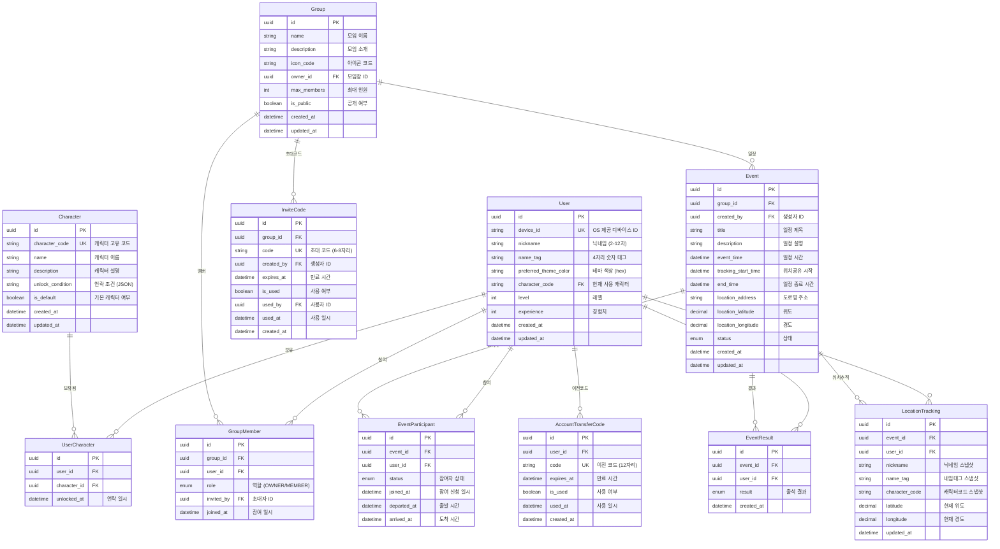

# 데이터베이스 모델링

## 개요

이 문서는 RDV(Rendezvous) 백엔드 시스템의 데이터베이스 모델링을 정의합니다.

### 기술 스택

- **DBMS**: PostgreSQL (Supabase)
- **ORM**: Prisma
- **스키마**: public (단일 스키마)

### 설계 원칙

1. **UUID 기본키**: 모든 테이블은 UUID를 기본키로 사용
2. **Soft Delete 미적용**: 단순성을 위해 Hard Delete 사용
3. **타임스탬프**: 모든 테이블에 `created_at`, `updated_at` 필드 포함
4. **명명 규칙**: snake_case 사용 (Prisma 컨벤션)

---

## ERD (Entity Relationship Diagram)



---

## 엔티티 상세 정의

### 1. User (사용자)

사용자 계정 정보를 저장합니다.

| 컬럼명                | 타입         | 제약조건     | 설명                  | 기본값            |
| --------------------- | ------------ | ------------ | --------------------- | ----------------- |
| id                    | UUID         | PK           | 고유 식별자           | gen_random_uuid() |
| device_id             | VARCHAR(255) | UK, NOT NULL | OS 제공 디바이스 ID   | -                 |
| nickname              | VARCHAR(12)  | NOT NULL     | 닉네임 (2-12자)       | -                 |
| name_tag              | CHAR(4)      | NOT NULL     | 4자리 숫자 네임태그   | -                 |
| preferred_theme_color | VARCHAR(7)   | NOT NULL     | 선호 테마 색상 (hex)  | -                 |
| character_code        | VARCHAR(50)  | NOT NULL     | 현재 사용 캐릭터 코드 | -                 |
| level                 | INTEGER      | NOT NULL     | 사용자 레벨           | 1                 |
| experience            | INTEGER      | NOT NULL     | 보유 경험치           | 0                 |
| created_at            | TIMESTAMPTZ  | NOT NULL     | 생성일                | now()             |
| updated_at            | TIMESTAMPTZ  | NOT NULL     | 수정일                | now()             |

**인덱스**

- `idx_user_device_id`: device_id (UNIQUE)
- `idx_user_nickname_name_tag`: (nickname, name_tag) (UNIQUE)

**비즈니스 규칙**

- nickname + name_tag 조합은 유니크해야 함
- device_id는 1개 계정에만 연결 가능

---

### 2. Character (캐릭터)

게임 내 캐릭터 정보를 저장합니다.

| 컬럼명           | 타입        | 제약조건     | 설명             | 기본값            |
| ---------------- | ----------- | ------------ | ---------------- | ----------------- |
| id               | UUID        | PK           | 고유 식별자      | gen_random_uuid() |
| character_code   | VARCHAR(50) | UK, NOT NULL | 캐릭터 고유 코드 | -                 |
| name             | VARCHAR(50) | NOT NULL     | 캐릭터 이름      | -                 |
| description      | TEXT        | NOT NULL     | 캐릭터 설명      | -                 |
| unlock_condition | JSONB       | NULL         | 언락 조건 (JSON) | NULL              |
| is_default       | BOOLEAN     | NOT NULL     | 기본 캐릭터 여부 | false             |
| created_at       | TIMESTAMPTZ | NOT NULL     | 생성일           | now()             |
| updated_at       | TIMESTAMPTZ | NOT NULL     | 수정일           | now()             |

**인덱스**

- `idx_character_code`: character_code (UNIQUE)
- `idx_character_is_default`: is_default

**비즈니스 규칙**

- is_default가 true인 캐릭터는 시스템에 1개만 존재
- unlock_condition은 클라이언트에 노출하지 않음

---

### 3. UserCharacter (사용자-캐릭터 보유)

사용자가 보유한 캐릭터 목록 (N:M 관계)

| 컬럼명       | 타입        | 제약조건     | 설명        | 기본값            |
| ------------ | ----------- | ------------ | ----------- | ----------------- |
| id           | UUID        | PK           | 고유 식별자 | gen_random_uuid() |
| user_id      | UUID        | FK, NOT NULL | 사용자 ID   | -                 |
| character_id | UUID        | FK, NOT NULL | 캐릭터 ID   | -                 |
| unlocked_at  | TIMESTAMPTZ | NOT NULL     | 언락 일시   | now()             |

**인덱스**

- `idx_user_character_user_id`: user_id
- `idx_user_character_unique`: (user_id, character_id) (UNIQUE)

**외래키**

- user_id → User(id) ON DELETE CASCADE
- character_id → Character(id) ON DELETE CASCADE

**비즈니스 규칙**

- 동일 캐릭터 중복 보유 불가

---

### 4. AccountTransferCode (계정 이전 코드)

기기 변경 시 계정 이전을 위한 일회성 코드

| 컬럼명     | 타입        | 제약조건     | 설명                    | 기본값            |
| ---------- | ----------- | ------------ | ----------------------- | ----------------- |
| id         | UUID        | PK           | 고유 식별자             | gen_random_uuid() |
| user_id    | UUID        | FK, NOT NULL | 사용자 ID               | -                 |
| code       | VARCHAR(14) | UK, NOT NULL | 이전 코드 (ABC-DEF-GHI) | -                 |
| expires_at | TIMESTAMPTZ | NOT NULL     | 만료 시간               | -                 |
| is_used    | BOOLEAN     | NOT NULL     | 사용 여부               | false             |
| used_at    | TIMESTAMPTZ | NULL         | 사용 일시               | NULL              |
| created_at | TIMESTAMPTZ | NOT NULL     | 생성일                  | now()             |

**인덱스**

- `idx_transfer_code_code`: code (UNIQUE)
- `idx_transfer_code_user_id`: user_id
- `idx_transfer_code_expires_at`: expires_at

**외래키**

- user_id → User(id) ON DELETE CASCADE

**비즈니스 규칙**

- 유효기간: 10분
- 1회 사용 후 is_used = true로 변경

---

### 5. Group (모임)

모임 정보를 저장합니다.

| 컬럼명      | 타입         | 제약조건     | 설명                 | 기본값            |
| ----------- | ------------ | ------------ | -------------------- | ----------------- |
| id          | UUID         | PK           | 고유 식별자          | gen_random_uuid() |
| name        | VARCHAR(30)  | NOT NULL     | 모임 이름 (2-30자)   | -                 |
| description | VARCHAR(500) | NOT NULL     | 모임 소개 (10-500자) | -                 |
| icon_code   | VARCHAR(50)  | NOT NULL     | 아이콘 코드          | -                 |
| owner_id    | UUID         | FK, NOT NULL | 모임장 사용자 ID     | -                 |
| max_members | INTEGER      | NOT NULL     | 최대 참여 인원       | 50                |
| is_public   | BOOLEAN      | NOT NULL     | 공개 모임 여부       | false             |
| created_at  | TIMESTAMPTZ  | NOT NULL     | 생성일               | now()             |
| updated_at  | TIMESTAMPTZ  | NOT NULL     | 수정일               | now()             |

**인덱스**

- `idx_group_owner_id`: owner_id

**외래키**

- owner_id → User(id) ON DELETE RESTRICT

**비즈니스 규칙**

- 1인당 1개 모임만 모임장으로 운영 가능
- MVP에서는 비공개 모임만 지원

---

### 6. GroupMember (모임 멤버)

모임 참여자 정보 (N:M 관계)

| 컬럼명     | 타입        | 제약조건     | 설명                | 기본값            |
| ---------- | ----------- | ------------ | ------------------- | ----------------- |
| id         | UUID        | PK           | 고유 식별자         | gen_random_uuid() |
| group_id   | UUID        | FK, NOT NULL | 모임 ID             | -                 |
| user_id    | UUID        | FK, NOT NULL | 사용자 ID           | -                 |
| role       | ENUM        | NOT NULL     | 역할 (OWNER/MEMBER) | MEMBER            |
| invited_by | UUID        | FK, NULL     | 초대자 사용자 ID    | NULL              |
| joined_at  | TIMESTAMPTZ | NOT NULL     | 참여 일시           | now()             |

**Enum: GroupMemberRole**

```
OWNER   - 모임장
MEMBER  - 일반 참여자
```

**인덱스**

- `idx_group_member_group_id`: group_id
- `idx_group_member_user_id`: user_id
- `idx_group_member_unique`: (group_id, user_id) (UNIQUE)

**외래키**

- group_id → Group(id) ON DELETE CASCADE
- user_id → User(id) ON DELETE CASCADE
- invited_by → User(id) ON DELETE SET NULL

**비즈니스 규칙**

- 동일 모임 중복 참여 불가
- role=OWNER인 레코드는 모임당 1개

---

### 7. InviteCode (초대 코드)

모임 참여를 위한 일회성 초대 코드

| 컬럼명     | 타입        | 제약조건     | 설명                | 기본값            |
| ---------- | ----------- | ------------ | ------------------- | ----------------- |
| id         | UUID        | PK           | 고유 식별자         | gen_random_uuid() |
| group_id   | UUID        | FK, NOT NULL | 모임 ID             | -                 |
| code       | VARCHAR(8)  | UK, NOT NULL | 초대 코드 (6-8자리) | -                 |
| created_by | UUID        | FK, NOT NULL | 코드 생성자 ID      | -                 |
| expires_at | TIMESTAMPTZ | NOT NULL     | 만료 시간           | -                 |
| is_used    | BOOLEAN     | NOT NULL     | 사용 여부           | false             |
| used_by    | UUID        | FK, NULL     | 사용자 ID           | NULL              |
| used_at    | TIMESTAMPTZ | NULL         | 사용 일시           | NULL              |
| created_at | TIMESTAMPTZ | NOT NULL     | 생성일              | now()             |

**인덱스**

- `idx_invite_code_code`: code (UNIQUE)
- `idx_invite_code_group_id`: group_id
- `idx_invite_code_expires_at`: expires_at

**외래키**

- group_id → Group(id) ON DELETE CASCADE
- created_by → User(id) ON DELETE CASCADE
- used_by → User(id) ON DELETE SET NULL

**비즈니스 규칙**

- 유효기간: 2분
- 1회 사용 후 is_used = true로 변경

---

### 8. Event (일정)

모임 내 오프라인 일정 정보

| 컬럼명              | 타입          | 제약조건     | 설명                              | 기본값            |
| ------------------- | ------------- | ------------ | --------------------------------- | ----------------- |
| id                  | UUID          | PK           | 고유 식별자                       | gen_random_uuid() |
| group_id            | UUID          | FK, NOT NULL | 모임 ID                           | -                 |
| created_by          | UUID          | FK, NOT NULL | 생성자 사용자 ID                  | -                 |
| title               | VARCHAR(50)   | NOT NULL     | 일정 제목 (2-50자)                | -                 |
| description         | VARCHAR(500)  | NOT NULL     | 일정 설명 (10-500자)              | -                 |
| event_time          | TIMESTAMPTZ   | NOT NULL     | 일정 시작 시간                    | -                 |
| tracking_start_time | TIMESTAMPTZ   | NOT NULL     | 위치 공유 시작 시간               | -                 |
| end_time            | TIMESTAMPTZ   | NOT NULL     | 일정 종료 시간                    | -                 |
| location_address    | VARCHAR(255)  | NOT NULL     | 도로명 주소                       | -                 |
| location_detail     | VARCHAR(255)  | NOT NULL     | 상세 위치 (건물명, 층수, 입구 등) | -                 |
| location_latitude   | DECIMAL(10,8) | NOT NULL     | 위도                              | -                 |
| location_longitude  | DECIMAL(11,8) | NOT NULL     | 경도                              | -                 |
| status              | ENUM          | NOT NULL     | 일정 상태                         | RECRUITING        |
| created_at          | TIMESTAMPTZ   | NOT NULL     | 생성일                            | now()             |
| updated_at          | TIMESTAMPTZ   | NOT NULL     | 수정일                            | now()             |

**Enum: EventStatus**

```
RECRUITING   - 모집중
IN_PROGRESS  - 진행중
ENDED        - 종료됨
```

**인덱스**

- `idx_event_group_id`: group_id
- `idx_event_status`: status
- `idx_event_group_status`: (group_id, status)
- `idx_event_event_time`: event_time
- `idx_event_tracking_start_time`: tracking_start_time

**외래키**

- group_id → Group(id) ON DELETE CASCADE
- created_by → User(id) ON DELETE RESTRICT

**비즈니스 규칙**

- 모집중 일정은 모임당 최대 3개
- tracking_start_time = event_time - 15분
- end_time = event_time + 1분
- event_time은 현재 시간 + 20분 이후여야 함

---

### 9. EventParticipant (일정 참여자)

일정 참여자 정보 (N:M 관계)

| 컬럼명      | 타입        | 제약조건     | 설명           | 기본값            |
| ----------- | ----------- | ------------ | -------------- | ----------------- |
| id          | UUID        | PK           | 고유 식별자    | gen_random_uuid() |
| event_id    | UUID        | FK, NOT NULL | 일정 ID        | -                 |
| user_id     | UUID        | FK, NOT NULL | 사용자 ID      | -                 |
| status      | ENUM        | NOT NULL     | 참여자 상태    | PREPARING         |
| joined_at   | TIMESTAMPTZ | NOT NULL     | 참여 신청 일시 | now()             |
| departed_at | TIMESTAMPTZ | NULL         | 출발 시간      | NULL              |
| arrived_at  | TIMESTAMPTZ | NULL         | 도착 시간      | NULL              |

**Enum: ParticipantStatus**

```
PREPARING  - 준비중
DEPARTED   - 출발
ARRIVED    - 도착
```

**인덱스**

- `idx_event_participant_event_id`: event_id
- `idx_event_participant_user_id`: user_id
- `idx_event_participant_unique`: (event_id, user_id) (UNIQUE)
- `idx_event_participant_status`: status

**외래키**

- event_id → Event(id) ON DELETE CASCADE
- user_id → User(id) ON DELETE CASCADE

**비즈니스 규칙**

- 동일 일정 중복 참여 불가
- 시간이 중복되는 다른 일정 참여 불가

---

### 10. EventResult (출석 결과)

일정 종료 후 출석 결과

| 컬럼명     | 타입        | 제약조건     | 설명        | 기본값            |
| ---------- | ----------- | ------------ | ----------- | ----------------- |
| id         | UUID        | PK           | 고유 식별자 | gen_random_uuid() |
| event_id   | UUID        | FK, NOT NULL | 일정 ID     | -                 |
| user_id    | UUID        | FK, NOT NULL | 사용자 ID   | -                 |
| result     | ENUM        | NOT NULL     | 출석 결과   | -                 |
| created_at | TIMESTAMPTZ | NOT NULL     | 생성일      | now()             |

**Enum: AttendanceResult**

```
ARRIVED  - 도착 (출석)
LATE     - 지각
ABSENT   - 부재
```

**인덱스**

- `idx_event_result_event_id`: event_id
- `idx_event_result_user_id`: user_id
- `idx_event_result_unique`: (event_id, user_id) (UNIQUE)

**외래키**

- event_id → Event(id) ON DELETE CASCADE
- user_id → User(id) ON DELETE CASCADE

**비즈니스 규칙**

- 일정 종료 시 자동 생성
- 한 번 생성된 결과는 수정 불가
- ARRIVED → ARRIVED, DEPARTED → LATE, PREPARING → ABSENT

---

### 11. LocationTracking (위치 추적)

진행중 일정의 실시간 위치 정보 (조회 최적화 테이블)

| 컬럼명         | 타입          | 제약조건     | 설명                   | 기본값            |
| -------------- | ------------- | ------------ | ---------------------- | ----------------- |
| id             | UUID          | PK           | 고유 식별자            | gen_random_uuid() |
| event_id       | UUID          | FK, NOT NULL | 일정 ID                | -                 |
| user_id        | UUID          | FK, NOT NULL | 사용자 ID              | -                 |
| nickname       | VARCHAR(12)   | NOT NULL     | 사용자 닉네임 (스냅샷) | -                 |
| name_tag       | CHAR(4)       | NOT NULL     | 네임태그 (스냅샷)      | -                 |
| character_code | VARCHAR(50)   | NOT NULL     | 캐릭터 코드 (스냅샷)   | -                 |
| latitude       | DECIMAL(10,8) | NOT NULL     | 현재 위도              | -                 |
| longitude      | DECIMAL(11,8) | NOT NULL     | 현재 경도              | -                 |
| updated_at     | TIMESTAMPTZ   | NOT NULL     | 위치 업데이트 시간     | now()             |

**인덱스**

- `idx_location_tracking_event_id`: event_id
- `idx_location_tracking_unique`: (event_id, user_id) (UNIQUE)

**외래키**

- event_id → Event(id) ON DELETE CASCADE
- user_id → User(id) ON DELETE CASCADE

**비즈니스 규칙**

- UPSERT 방식으로 최신 위치만 저장
- 일정 종료 시 해당 일정의 모든 레코드 삭제
- User 조인 없이 단일 테이블 조회로 완결 (비정규화)

---

## Enum 정의

### GroupMemberRole

```sql
CREATE TYPE group_member_role AS ENUM ('OWNER', 'MEMBER');
```

### EventStatus

```sql
CREATE TYPE event_status AS ENUM ('RECRUITING', 'IN_PROGRESS', 'ENDED');
```

### ParticipantStatus

```sql
CREATE TYPE participant_status AS ENUM ('PREPARING', 'DEPARTED', 'ARRIVED');
```

### AttendanceResult

```sql
CREATE TYPE attendance_result AS ENUM ('ARRIVED', 'LATE', 'ABSENT');
```

---

## 관계 요약

### User 중심 관계

| 관계                       | 설명        | 카디널리티      |
| -------------------------- | ----------- | --------------- |
| User → UserCharacter       | 보유 캐릭터 | 1:N             |
| User → AccountTransferCode | 이전 코드   | 1:N             |
| User → GroupMember         | 모임 참여   | 1:N             |
| User → Group (owner)       | 모임장      | 1:N (제한: 1개) |
| User → EventParticipant    | 일정 참여   | 1:N             |
| User → EventResult         | 출석 결과   | 1:N             |
| User → LocationTracking    | 위치 정보   | 1:N             |

### Group 중심 관계

| 관계                | 설명      | 카디널리티 |
| ------------------- | --------- | ---------- |
| Group → GroupMember | 멤버      | 1:N        |
| Group → InviteCode  | 초대 코드 | 1:N        |
| Group → Event       | 일정      | 1:N        |

### Event 중심 관계

| 관계                     | 설명      | 카디널리티 |
| ------------------------ | --------- | ---------- |
| Event → EventParticipant | 참여자    | 1:N        |
| Event → EventResult      | 출석 결과 | 1:N        |
| Event → LocationTracking | 위치 추적 | 1:N        |

---

## 데이터 무결성 규칙

### 1. 사용자 관련

- device_id는 시스템 전체에서 유니크
- nickname + name_tag 조합은 유니크
- 1인당 1개 모임만 모임장 가능

### 2. 모임 관련

- 모임 삭제 시 모임장만 남은 상태여야 함
- 모임장 탈퇴 시 다른 참여자에게 이전 필요

### 3. 일정 관련

- 모집중 일정은 모임당 최대 3개
- 일정 시간은 현재 + 20분 이후
- 시간 중복 일정 참여 불가

### 4. 위치 관련

- 출발(DEPARTED) 상태에서만 위치 전송 가능
- 일정 종료 시 위치 데이터 삭제

---

## 삭제 정책 (CASCADE 규칙)

| 부모 테이블 | 자식 테이블              | 삭제 정책 |
| ----------- | ------------------------ | --------- |
| User        | UserCharacter            | CASCADE   |
| User        | AccountTransferCode      | CASCADE   |
| User        | GroupMember              | CASCADE   |
| User        | EventParticipant         | CASCADE   |
| User        | EventResult              | CASCADE   |
| User        | LocationTracking         | CASCADE   |
| User        | Group (owner)            | RESTRICT  |
| User        | InviteCode (created_by)  | CASCADE   |
| User        | InviteCode (used_by)     | SET NULL  |
| User        | GroupMember (invited_by) | SET NULL  |
| User        | Event (created_by)       | RESTRICT  |
| Character   | UserCharacter            | CASCADE   |
| Group       | GroupMember              | CASCADE   |
| Group       | InviteCode               | CASCADE   |
| Group       | Event                    | CASCADE   |
| Event       | EventParticipant         | CASCADE   |
| Event       | EventResult              | CASCADE   |
| Event       | LocationTracking         | CASCADE   |

---

## 인덱스 전략

### 조회 최적화 인덱스

```sql
-- 사용자 조회
CREATE UNIQUE INDEX idx_user_device_id ON "User"(device_id);
CREATE UNIQUE INDEX idx_user_nickname_name_tag ON "User"(nickname, name_tag);

-- 캐릭터 조회
CREATE UNIQUE INDEX idx_character_code ON "Character"(character_code);
CREATE INDEX idx_character_is_default ON "Character"(is_default) WHERE is_default = true;

-- 모임 멤버 조회
CREATE INDEX idx_group_member_group_id ON "GroupMember"(group_id);
CREATE INDEX idx_group_member_user_id ON "GroupMember"(user_id);

-- 일정 조회
CREATE INDEX idx_event_group_status ON "Event"(group_id, status);
CREATE INDEX idx_event_event_time ON "Event"(event_time);

-- 위치 추적 조회
CREATE INDEX idx_location_tracking_event_id ON "LocationTracking"(event_id);
```

### 복합 유니크 인덱스

```sql
CREATE UNIQUE INDEX idx_user_character_unique ON "UserCharacter"(user_id, character_id);
CREATE UNIQUE INDEX idx_group_member_unique ON "GroupMember"(group_id, user_id);
CREATE UNIQUE INDEX idx_event_participant_unique ON "EventParticipant"(event_id, user_id);
CREATE UNIQUE INDEX idx_event_result_unique ON "EventResult"(event_id, user_id);
CREATE UNIQUE INDEX idx_location_tracking_unique ON "LocationTracking"(event_id, user_id);
```

---

## 성능 고려사항

### 1. LocationTracking 테이블 비정규화

- User 테이블 조인 없이 단일 쿼리로 조회 가능
- nickname, name_tag, character_code를 스냅샷으로 저장
- 일정 종료 시 데이터 삭제로 테이블 크기 관리

### 2. 일정 상태 조회 최적화

- (group_id, status) 복합 인덱스로 모집중 일정 빠른 조회
- status 단일 인덱스로 전체 상태별 조회 지원

### 3. 초대 코드 / 이전 코드 만료 처리

- expires_at 인덱스로 만료 코드 정리 배치 작업 지원
- 또는 조회 시 만료 여부 확인

---

## 참고사항

### Prisma 스키마 작성 시 주의점

1. PostgreSQL의 public 스키마만 사용
2. @map, @@map으로 snake_case 테이블/컬럼명 매핑
3. UUID 기본키는 @default(uuid())
4. TIMESTAMPTZ는 @db.Timestamptz(6)
5. DECIMAL은 @db.Decimal(precision, scale)

### 마이그레이션 순서

1. Enum 타입 생성
2. User, Character 테이블 (독립)
3. UserCharacter, AccountTransferCode 테이블 (User 의존)
4. Group 테이블 (User 의존)
5. GroupMember, InviteCode 테이블 (Group 의존)
6. Event 테이블 (Group 의존)
7. EventParticipant, EventResult, LocationTracking 테이블 (Event 의존)
