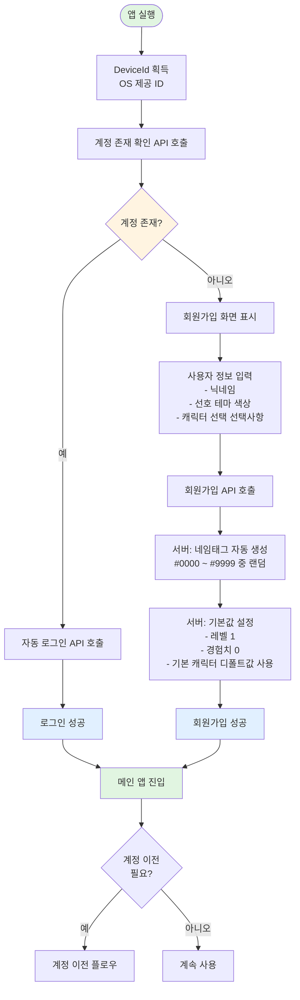
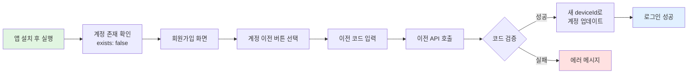

# 사용자 계정 및 인증 시스템 플로우

## 개요

사용자 계정 및 인증 시스템은 **deviceId 기반의 간소화된 회원가입 및 로그인 시스템**입니다.

### 특징

- **DeviceId 기반 인증**: OS 제공 디바이스 ID(iOS IDFV, Android SSAID)로 사용자 식별
- **최소한의 개인정보**: 휴대폰 번호 등 민감 정보 수집 없음 (약관 작성 부담 최소화)
- **자동 로그인**: 기존 사용자는 앱 실행 시 자동 로그인
- **계정 이전 기능**: 코드 기반으로 다른 기기로 계정 이전 가능
- **게이미피케이션 요소**: 레벨, 경험치, 캐릭터 시스템

---

## 시스템 구조

### 역할 (Role)

1. **사용자** (스마트폰 앱 사용자)

### 핵심 개념

- **DeviceId**: OS가 제공하는 영구적인 디바이스 식별자
- **네임태그**: 서버가 자동 생성하는 4자리 숫자 (Discord 스타일, 예: #1234)
- **계정 이전 코드**: 기기 변경 시 계정을 이전하기 위한 일회성 코드

---

## 사용자 데이터 구조

### User 엔티티

| 필드명              | 타입     | 설명                      | 필수 여부 | 기본값      |
| ------------------- | -------- | ------------------------- | --------- | ----------- |
| id                  | UUID     | 사용자 고유 식별자        | 필수      | 자동 생성   |
| deviceId            | String   | OS 제공 디바이스 ID       | 필수      | -           |
| nickname            | String   | 사용자 닉네임             | 필수      | -           |
| nameTag             | String   | 4자리 숫자 네임태그       | 필수      | 서버 생성   |
| preferredThemeColor | String   | 선호 테마 색상 코드 (hex) | 필수      | -           |
| characterCode       | String   | 선택한 캐릭터 코드        | 필수      | 기본 캐릭터 |
| level               | Integer  | 사용자 레벨               | 필수      | 1           |
| experience          | Integer  | 보유 경험치               | 필수      | 0           |
| createdAt           | DateTime | 계정 생성일               | 필수      | 자동 생성   |
| updatedAt           | DateTime | 마지막 수정일             | 필수      | 자동 갱신   |

---

## 전체 플로우

### 플로우 다이어그램



---

## 주요 플로우

### 1. 앱 최초 실행 및 계정 확인

#### 1.1 DeviceId 획득

- **시점**: 앱 실행 시 (스플래시 화면 등)
- **동작**: OS가 제공하는 디바이스 ID 획득
  - **iOS**: IDFV (Identifier For Vendor)
  - **Android**: SSAID (Android ID)
- **특징**: 앱 재설치 시에도 동일한 ID 유지 (OS 레벨 식별자)

#### 1.2 계정 존재 확인

- **API 호출**: 계정 존재 확인 API 호출
- **전달 데이터**: deviceId
- **응답**: 계정 존재 여부 (exists: true/false)

---

### 2. 기존 사용자 - 자동 로그인

#### 2.1 로그인 API 호출

- **시점**: 계정 존재 확인 후 `exists: true`인 경우
- **API 호출**: 로그인 API 호출
- **전달 데이터**: deviceId
- **응답**: 사용자 정보, 인증 토큰 (accessToken, refreshToken)

#### 2.2 토큰 저장 및 앱 진입

- 클라이언트: accessToken, refreshToken을 안전한 저장소에 보관
- 메인 앱 화면으로 전환

---

### 3. 신규 사용자 - 회원가입

#### 3.1 회원가입 화면 표시

**시점**: 계정 존재 확인 후 `exists: false`인 경우

**입력 필드**

1. **닉네임** (필수)
   - 최소 2자, 최대 12자
   - 중복 허용 (네임태그로 구분)

2. **선호 테마 색상** (필수)
   - 색상 팔레트에서 선택
   - Hex 코드 형식 (예: #FF5733)

3. **캐릭터 선택** (선택)
   - 기본 캐릭터 목록에서 선택
   - 선택하지 않으면 기본 캐릭터 자동 설정

#### 3.2 회원가입 API 호출

- **API 호출**: 회원가입 API 호출
- **전달 데이터**:
  - deviceId
  - nickname (닉네임)
  - preferredThemeColor (선호 테마 색상)
  - characterCode (선택사항, 미입력 시 기본 캐릭터)

**서버 처리 로직**

1. DeviceId 중복 확인 (이미 존재하면 에러)
2. **네임태그 자동 생성**
   - 형식: 4자리 숫자 (#0000 ~ #9999)
   - 닉네임 + 네임태그 조합이 유니크하도록 생성
   - 충돌 시 다른 네임태그 재생성
3. 기본값 설정
   - level: 1
   - experience: 0
   - characterCode: 입력값 또는 기본 캐릭터
4. 사용자 엔티티 생성 및 저장
5. JWT 토큰 생성 (accessToken, refreshToken)

- **응답**: 생성된 사용자 정보, 인증 토큰

#### 3.3 회원가입 완료 및 앱 진입

- 클라이언트: 토큰 저장
- 환영 메시지 또는 튜토리얼 표시 (선택)
- 메인 앱 화면으로 전환

---

### 4. 계정 이전 플로우

#### 개요

**목적**: 기기 변경, 분실 등의 상황에서 기존 계정을 새 기기로 이전

**방식**: 코드 기반 일회성 이전

---

#### 4.1 이전 코드 생성 (기존 기기)


- **API 호출**: 이전 코드 생성 API 호출 (인증 필요)

**서버 처리 로직**

1. 12자리 랜덤 코드 생성 (예: ABC-DEF-GHI)
2. 코드 DB 저장 또는 Redis에 캐싱
   - userId 매핑
   - 유효기간: 10분
   - 사용 횟수: 1회
3. 코드 반환

- **응답**: 생성된 이전 코드, 유효기간 정보

**UI 표시**

- 코드를 크게 표시
- 복사 버튼 제공
- 유효기간 카운트다운
- 주의사항 안내

---

#### 4.2 계정 이전 실행 (새 기기)



- **API 호출**: 계정 이전 실행 API 호출
- **전달 데이터**:
  - transferCode (이전 코드)
  - newDeviceId (새 기기 ID)

**서버 처리 로직**

1. 코드 검증
   - 존재 여부
   - 유효기간 확인
   - 사용 여부 확인
2. newDeviceId 중복 확인
   - 이미 다른 계정에 사용 중이면 에러
3. 기존 계정의 deviceId를 newDeviceId로 업데이트
4. 코드 무효화 (사용 완료 처리)
5. JWT 토큰 생성
6. **기존 기기 로그아웃 처리** (기존 토큰 무효화)

- **응답**: 성공 메시지, 사용자 정보, 인증 토큰

**주요 에러 케이스**

- 유효하지 않은 이전 코드
- 이전 코드 만료
- 이미 등록된 기기 (새 deviceId가 다른 계정에 사용 중)

---

## 주요 규칙

### 네임태그 생성 규칙

1. **형식**: 4자리 숫자 (#0000 ~ #9999)
2. **유니크 조합**: 동일 닉네임 + 동일 네임태그 조합 불가
3. **충돌 처리**: 랜덤 생성 후 중복 확인, 충돌 시 재생성
4. **최대 시도**: 10회 시도 후 실패 시 에러 반환
5. **예시**:
   - 사용자A: "홍길동#1234"
   - 사용자B: "홍길동#5678" (동일 닉네임, 다른 태그 → 허용)

### DeviceId 관리 규칙

1. **1 DeviceId = 1 계정**: 하나의 디바이스 ID는 하나의 계정에만 연결
2. **계정 이전 시**: 기존 deviceId는 해제되고 새 deviceId로 업데이트
3. **기존 기기 로그아웃**: 계정 이전 시 기존 기기는 자동 로그아웃
4. **재설치 대응**: OS 제공 ID 사용으로 재설치 시에도 동일 계정 유지

### 토큰 관리 규칙

1. **AccessToken**: 유효기간 1시간 (조정 가능)
2. **RefreshToken**: 유효기간 30일 (조정 가능)
3. **자동 갱신**: AccessToken 만료 시 RefreshToken으로 자동 갱신
4. **보안 저장**: 클라이언트는 토큰을 안전한 저장소에 보관
   - iOS: Keychain
   - Android: EncryptedSharedPreferences

### 계정 이전 규칙

1. **코드 유효기간**: 10분
2. **1회 사용**: 코드는 1번만 사용 가능
3. **기존 기기 영향**: 이전 완료 시 기존 기기는 자동 로그아웃
4. **중복 기기 방지**: 새 deviceId가 이미 다른 계정에 등록되어 있으면 실패

---

## 보안 고려사항

### DeviceId 보안

- **위변조 방지**: 서버는 deviceId의 형식 검증 (OS별 형식 확인)
- **무단 접근 방지**: JWT 토큰과 함께 사용하여 2단계 검증
- **계정 탈취 방지**: 계정 이전 시 코드 기반 인증으로 소유권 확인

### 토큰 보안

- **HTTPS 통신**: 모든 API 통신은 HTTPS로 암호화
- **토큰 암호화**: JWT 페이로드에 민감 정보 미포함
- **만료 처리**: 토큰 만료 시 자동 갱신 또는 재로그인
- **무효화 처리**: 계정 이전 시 기존 토큰 즉시 무효화

### 개인정보 보호

- **최소 수집**: 닉네임, 색상, 캐릭터 등 최소한의 정보만 수집
- **민감정보 미수집**: 휴대폰 번호, 이메일 등 민감 정보 수집 안 함
- **익명성 보장**: 네임태그로 동일 닉네임 사용자 구분, 개인 식별 어려움

---

## UI/UX 고려사항

### 회원가입 화면

**레이아웃**

- 간결하고 친근한 디자인
- 단계별 입력 또는 한 화면에 모든 필드 표시

**입력 필드**

1. **닉네임 입력**
   - 플레이스홀더: "닉네임을 입력하세요 (2-6자)"
   - 실시간 글자 수 표시
   - 유효성 검사 피드백

2. **테마 색상 선택**
   - 색상 팔레트 (8-12개 색상)
   - 선택된 색상 미리보기
   - 또는 색상 피커 제공

3. **캐릭터 선택**
   - 캐릭터 아이콘 그리드
   - 선택된 캐릭터 강조 표시
   - 기본 캐릭터 표시

**제출 버튼**

- "시작하기" 또는 "계정 만들기"
- 로딩 상태 표시

**하단 링크**

- "이미 계정이 있으신가요? 계정 이전하기"

---

### 자동 로그인 화면

**스플래시 화면**

- 로고 또는 브랜드 이미지
- 로딩 인디케이터
- "로그인 중..." 메시지

**전환**

- 자연스러운 애니메이션으로 메인 화면 진입

---

### 계정 이전 화면

#### 이전 코드 생성 (기존 기기)

**화면 구성**

- 제목: "계정 이전하기"
- 설명: "새 기기에서 이 코드를 입력하여 계정을 이전할 수 있습니다"
- **코드 표시 영역**
  - 큰 글씨로 코드 표시 (예: ABC-DEF-GHI)
  - 복사 버튼
- **유효기간**
  - 카운트다운 타이머 (예: "9분 30초 남음")
  - 만료 시 재생성 버튼 표시
- **주의사항**
  - "코드는 1회만 사용 가능합니다"
  - "이전 완료 시 이 기기에서 자동 로그아웃됩니다"

#### 이전 코드 입력 (새 기기)

**화면 구성**

- 제목: "계정 이전하기"
- 설명: "기존 기기에서 생성한 이전 코드를 입력하세요"
- **코드 입력 필드**
  - 3개의 입력 필드 (ABC - DEF - GHI)
  - 자동 하이픈 처리
  - 자동 포커스 이동
- **제출 버튼**: "계정 이전하기"
- **하단 링크**: "새 계정 만들기"

**성공 메시지**

- "계정 이전 완료!" 모달 또는 토스트
- 메인 화면으로 자동 전환

**에러 메시지**

- "유효하지 않은 코드입니다"
- "코드가 만료되었습니다"
- "이미 등록된 기기입니다"

---

## 확장 가능성

### 향후 추가 가능 기능

1. **소셜 로그인 연동**
   - Google, Apple, Kakao 등 소셜 계정 연결
   - DeviceId + 소셜 계정 복합 인증

2. **프로필 편집**
   - 닉네임 변경 (횟수 제한 또는 쿨타임)
   - 테마 색상 변경
   - 캐릭터 변경 (레벨 조건 등)

3. **친구 시스템**
   - 닉네임#네임태그로 친구 검색
   - 친구 요청 및 수락

4. **업적 시스템**
   - 특정 조건 달성 시 경험치 획득
   - 레벨업 보상

5. **푸시 알림**
   - 레벨업 알림
   - 이벤트 알림

6. **다중 기기 지원**
   - 여러 deviceId를 하나의 계정에 연결
   - 기기별 로그인 이력 관리
   - 의심스러운 로그인 감지

7. **계정 복구**
   - 이메일 또는 전화번호 연결 (선택)
   - 긴급 복구 코드 생성

---

## 시간 순서 예시

### 신규 사용자 - 회원가입

```mermaid
gantt
    title 신규 사용자 회원가입 플로우 타임라인
    dateFormat HH:mm:ss
    axisFormat %H:%M:%S

    section 클라이언트
    앱 실행                    :done, app1, 00:00:00, 1s
    DeviceId 획득             :done, device1, 00:00:01, 1s
    계정 확인 API 호출         :done, check1, 00:00:02, 500ms

    section 서버
    계정 존재 확인 처리        :done, server1, 00:00:02, 300ms
    응답: exists false        :milestone, m1, 00:00:02.3, 0s

    section 클라이언트
    회원가입 화면 표시         :active, ui1, 00:00:03, 30s
    사용자 정보 입력           :done, input1, 00:00:03, 25s
    회원가입 API 호출          :crit, register1, 00:00:28, 500ms

    section 서버
    회원가입 처리             :done, server2, 00:00:28, 400ms
    네임태그 생성             :done, tag1, 00:00:28.1, 100ms
    기본값 설정               :done, default1, 00:00:28.2, 100ms
    토큰 생성                 :done, token1, 00:00:28.3, 100ms
    응답: 성공                :milestone, m2, 00:00:28.4, 0s

    section 클라이언트
    토큰 저장                 :done, save1, 00:00:29, 500ms
    메인 앱 진입              :done, main1, 00:00:29.5, 1s
```

### 기존 사용자 - 자동 로그인

```mermaid
gantt
    title 기존 사용자 자동 로그인 플로우 타임라인
    dateFormat HH:mm:ss
    axisFormat %H:%M:%S

    section 클라이언트
    앱 실행                    :done, app2, 00:00:00, 1s
    DeviceId 획득             :done, device2, 00:00:01, 1s
    계정 확인 API 호출         :done, check2, 00:00:02, 500ms

    section 서버
    계정 존재 확인 처리        :done, server3, 00:00:02, 200ms
    응답: exists true         :milestone, m3, 00:00:02.2, 0s

    section 클라이언트
    로그인 API 호출            :crit, login2, 00:00:02.5, 500ms

    section 서버
    로그인 처리               :done, server4, 00:00:02.5, 300ms
    토큰 생성                 :done, token2, 00:00:02.7, 100ms
    응답: 성공                :milestone, m4, 00:00:02.8, 0s

    section 클라이언트
    토큰 저장                 :done, save2, 00:00:03, 500ms
    메인 앱 진입              :done, main2, 00:00:03.5, 1s
```

### 계정 이전

```mermaid
gantt
    title 계정 이전 플로우 타임라인
    dateFormat HH:mm:ss
    axisFormat %H:%M:%S

    section 기존 기기
    설정 메뉴 접근            :done, setting1, 00:00:00, 2s
    이전 코드 생성 API        :crit, generate1, 00:00:02, 500ms

    section 서버
    코드 생성 및 저장         :done, server5, 00:00:02, 300ms
    응답: ABC-DEF-GHI        :milestone, m5, 00:00:02.3, 0s

    section 기존 기기
    코드 표시                 :active, display1, 00:00:03, 10m

    section 새 기기
    앱 설치 및 실행           :done, install1, 00:01:00, 10s
    계정 이전 화면            :done, transfer1, 00:01:10, 5s
    코드 입력                 :done, input2, 00:01:15, 10s
    이전 API 호출             :crit, execute1, 00:01:25, 500ms

    section 서버
    코드 검증                 :done, verify1, 00:01:25, 200ms
    DeviceId 업데이트        :done, update1, 00:01:25.2, 200ms
    기존 토큰 무효화          :done, invalidate1, 00:01:25.4, 100ms
    새 토큰 생성              :done, token3, 00:01:25.5, 100ms
    응답: 성공                :milestone, m6, 00:01:25.6, 0s

    section 새 기기
    토큰 저장                 :done, save3, 00:01:26, 500ms
    메인 앱 진입              :done, main3, 00:01:26.5, 1s

    section 기존 기기
    자동 로그아웃             :done, logout1, 00:01:26, 500ms
    로그인 화면 표시          :done, login3, 00:01:26.5, 1s
```

---

## 참고사항

### DeviceId 선택 이유

- **간편성**: 별도 인증 절차 없이 앱 설치만으로 계정 생성
- **개인정보 최소화**: 휴대폰 번호, 이메일 등 민감 정보 불필요
- **재설치 대응**: OS 제공 ID로 재설치 시에도 동일 계정 유지
- **약관 간소화**: 개인정보 수집 최소화로 약관 작성 및 관리 부담 감소

### 네임태그 시스템

- **Discord 방식**: 동일 닉네임 허용, 네임태그로 구분
- **사용자 경험**: 원하는 닉네임 자유롭게 사용 가능
- **충돌 회피**: 10,000개 조합으로 충분한 네임스페이스 확보
- **표시 형식**: "닉네임#1234" 형태로 전체 표시

### 게이미피케이션

- **레벨 시스템**: 사용자 참여 동기 부여
- **경험치**: 다양한 활동에 대한 보상
- **캐릭터**: 개성 표현 및 커스터마이징
- **테마 색상**: UI 개인화

### 법적 고려사항

- **개인정보보호법**: 최소한의 정보 수집으로 법적 부담 감소
- **이용약관**: 간단한 이용약관 및 개인정보 처리방침
- **데이터 보관**: 계정 삭제 요청 시 즉시 처리 가능 (민감 정보 없음)
